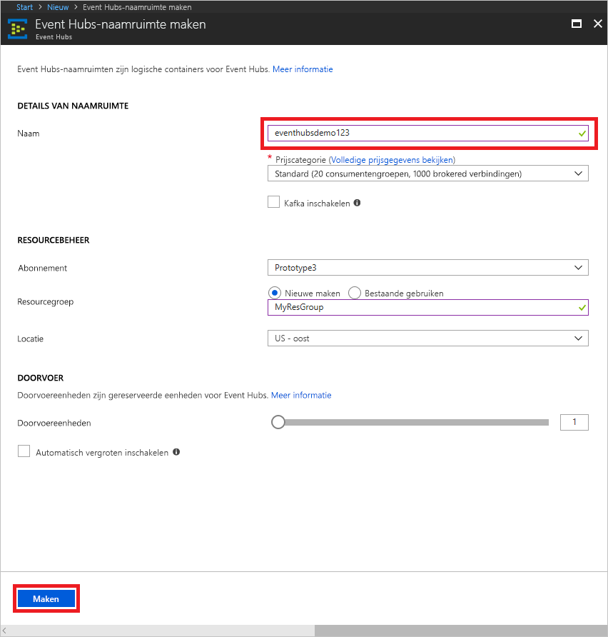
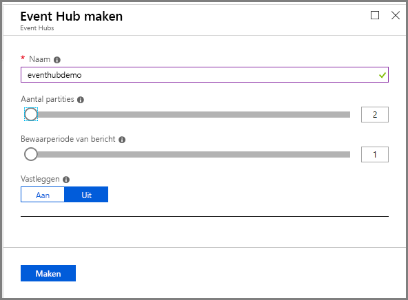
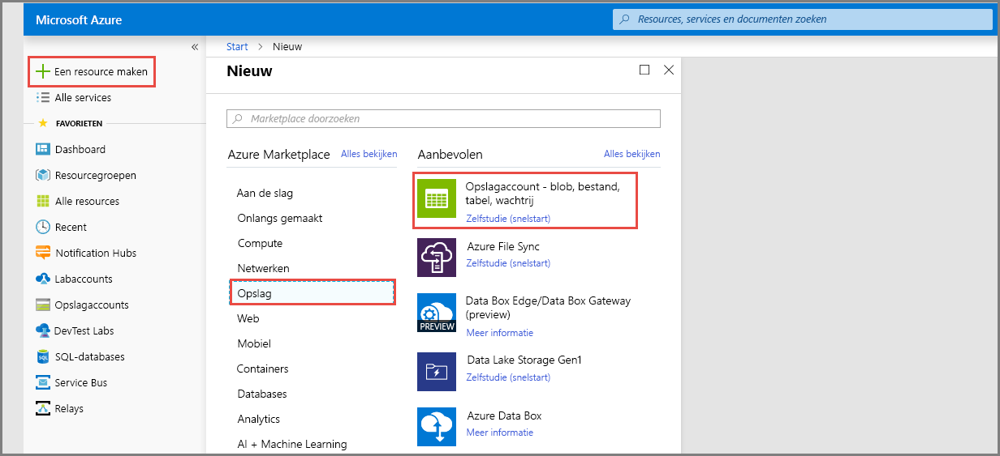
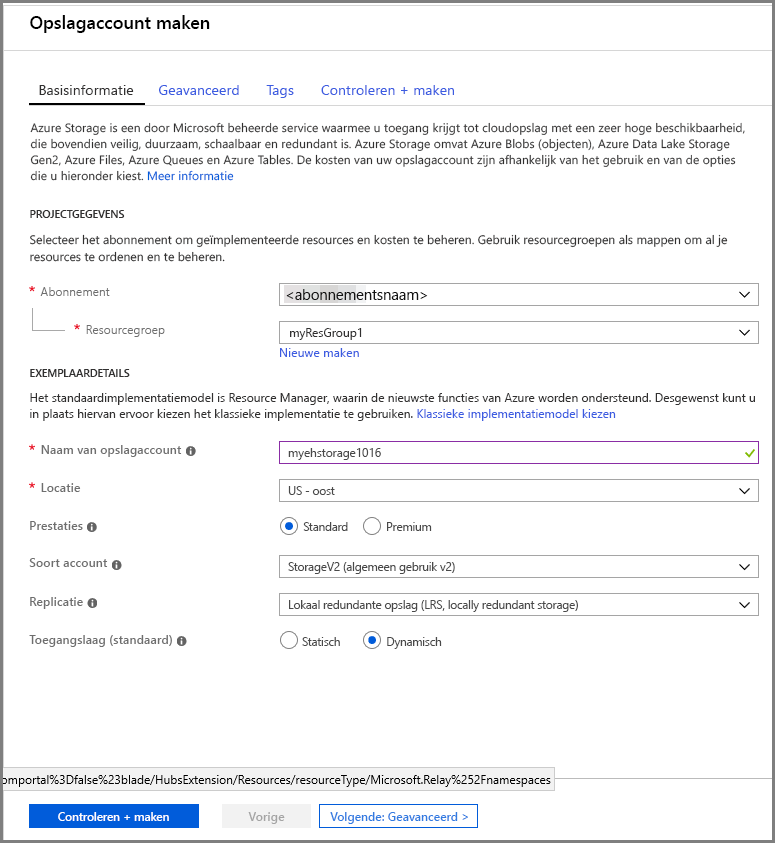

# Snelstart: Een event hub maken met behulp van Azure Portal

Azure Event Hubs is een uiterst schaalbaar platform voor het streamen van gegevens en een opneemservice die miljoenen gebeurtenissen per seconde kan opnemen en verwerken. Deze snelstart laat zien hoe u een Event Hub maakt met behulp van [Azure Portal](https://portal.azure.com) en vervolgens verzendt naar en ontvangt van een Event Hub met behulp van de .NET Standard SDK.

U hebt een Azure-abonnement nodig om deze snelstart te voltooien. Als u nog geen abonnement hebt, [maakt u een gratis account][] voordat u begint.

## Vereisten

Zorg ervoor dat u over het volgende beschikt om deze snelstart te voltooien:

- [Visual Studio 2017 update 3 (versie 15.3, 26730.01)](http://www.visualstudio.com/vs) of later.
- [.NET Standard SDK](https://www.microsoft.com/net/download/windows), versie 2.0 of later.

## Een resourcegroep maken

Een resourcegroep is een logische verzameling Azure-resources. Alle resources worden geïmplementeerd en beheerd in een resourcegroep. Ga als volgt te werk om een resourcegroep te maken:

1. Kik in het linkernavigatievenster op **Resourcegroepen**. Klik vervolgens op **Toevoegen**.

   ![][1]

2. Typ een unieke naam voor de resourcegroep. Het systeem controleert onmiddellijk of de naam beschikbaar is in het momenteel geselecteerde Azure-abonnement.

3. Klik in **Abonnement** op de naam van het Azure-abonnement waarin u de resourcegroep wilt maken.

4. Selecteer een geografische locatie voor de resourcegroep.

5. Klik op **Maken**.

   ![][2]

## Een Event Hubs-naamruimte maken

Een Event Hubs-naamruimte biedt een unieke scopingcontainer, waarnaar wordt verwezen met de volledig gekwalificeerde domeinnaam (FQDN), waarin u een of meer Event Hubs maakt. Ga als volgt te werk om een ​​naamruimte in uw resourcegroep te maken met behulp van de portal:

1. Meld u aan bij [Azure Portal][] en klik op **Een resource maken** linksboven in het scherm.

2. Klik op **Internet of Things** en vervolgens op **Event Hubs**.

3. Voer in **Naamruimte maken** een naam in voor de naamruimte. In het systeem wordt onmiddellijk gecontroleerd of de naam beschikbaar is.

   

4. Nadat u hebt gecontroleerd of de naam van de naamruimte beschikbaar is, kiest u de prijscategorie (Basic of Standard). Kies ook een Azure-abonnement, resourcegroep en locatie voor het maken van de resource.
 
5. Klik op **Maken** om de naamruimte te maken. U moet een paar minuten wachten voordat het systeem de resources volledig heeft ingericht.

6. Klik in de portallijst met naamruimten op de zojuist gemaakte naamruimte.

7. Klik op **Beleid voor gedeelde toegang** en vervolgens op **RootManageSharedAccessKey**.
    
8. Klik op de knop voor kopiëren om de verbindingsreeks **RootManageSharedAccessKey** naar het Klembord te kopiëren. Bewaar deze verbindingsreeks op een tijdelijke locatie, zoals Kladblok, om later te gebruiken.
    
## Een Event Hub maken

Ga als volgt te werk om een Event Hub in de naamruimte te maken:

1. Klik in de lijst met naamruimten van Event Hubs op de zojuist gemaakte naamruimte.      
   
     

2. Klik in het naamruimtevenster op **Event Hubs**.
   
    

1. Klik op **+ Event Hub toevoegen** bovenaan het venster.
   
    
1. Typ een naam voor uw Event Hub en klik vervolgens op **Maken**.
   
    

Gefeliciteerd! U hebt de portal gebruikt om een ​​Event Hubs-naamruimte en een Event Hub binnen die naamruimte te maken.

## Een opslagaccount voor Event Processor Host maken

De Event Processor Host is een intelligente agent die het ontvangen van gebeurtenissen van Event Hubs vereenvoudigt door permanente controlepunten en parallelle ontvangsten te beheren. Voor controlepunten heeft de Event Processor Host een opslagaccount nodig. In het volgende voorbeeld ziet u hoe u een opslagaccount maakt en hoe u de sleutels krijgt voor toegang:

1. Meld u aan bij [Azure Portal][Azure Portal] en klik op **Nieuw** linksboven in het scherm.

2. Klik op **Opslag** en klik vervolgens op **Opslagaccount**.
   
    

3. Typ in **Opslagaccount maken** een naam voor het opslagaccount. Kies een Azure-abonnement, resourcegroep en locatie voor het maken van de resource. Klik vervolgens op **Maken**.
   
    

4. Klik in de lijst met opslagaccounts op het zojuist gemaakte opslagaccount.

5. Klik in het venster van het opslagaccount op **Toegangssleutels**. Kopieer de waarde van **key1** voor later gebruik.
   
    

## De voorbeelden downloaden en uitvoeren

De volgende stap is het uitvoeren van de voorbeeldcode die gebeurtenissen naar een Event Hub verzendt en die gebeurtenissen ontvangt met behulp van de Event Processor Host. 

Download eerst de voorbeelden [ SampleSender ](https://github.com/Azure/azure-event-hubs/tree/master/samples/DotNet/Microsoft.Azure.EventHubs/SampleSender) en [ SampleEphReceiver ](https://github.com/Azure/azure-event-hubs/tree/master/samples/DotNet/Microsoft.Azure.EventHubs/SampleEphReceiver) van GitHub, of kloon de [azure-event-hubs opslagplaats](https://github.com/Azure/azure-event-hubs).

### Afzender

1. Open Visual Studio en klik in het menu **Bestand** op **Openen** en vervolgens op **Project/oplossing**.

2. Zoek de voorbeeldmap van **SampleSender** die u eerder hebt gedownload en dubbelklik op het bestand SampleSender.sln om het project in Visual Studio te laden.

3. Dubbelklik in Solution Explorer op het bestand Program.cs om dit te openen in de Visual Studio-editor.

4. Vervang de waarde `EventHubConnectionString` door de verbindingsreeks die u hebt verkregen bij het maken van de naamruimte.

5. Vervang `EventHubName` door de naam van de Event Hub die u in die naamruimte hebt gemaakt.

6. Klik in het menu **Bouwen** op **Oplossing opbouwen** om te controleren of er geen fouten zijn.

### Ontvanger

1. Open Visual Studio en klik in het menu **Bestand** op **Openen** en vervolgens op **Project/oplossing**.

2. Zoek de voorbeeldmap van **SampleEphReceiver** die u in stap 1 hebt gedownload en dubbelklik op het bestand SampleEphReceiver.sln om het project in Visual Studio te laden.

3. Dubbelklik in Solution Explorer op het bestand Program.cs om dit te openen in de Visual Studio-editor.

4. Vervang de waarden van de volgende variabelen:
    1. `EventHubConnectionString`: vervang door de verbindingsreeks die u hebt verkregen bij het maken van de naamruimte.
    2. `EventHubName`: de naam van de Event Hub die u in die naamruimte hebt gemaakt.
    3. `StorageContainerName`: de naam van een opslagcontainer. Geef deze een unieke naam en de container wordt voor u gemaakt wanneer u de app uitvoert.
    4. `StorageAccountName`: de naam van het opslagaccount dat u hebt gemaakt.
    5. `StorageAccountKey`: de opslagaccountsleutel die u hebt verkregen via Azure Portal.

5. Klik in het menu **Bouwen** op **Oplossing opbouwen** om te controleren of er geen fouten zijn.

### De apps uitvoeren

Voer eerst de **SampleSender** toepassing uit en neem waar dat er 100 berichten worden verzonden. Druk op **Enter** om het programma te beëindigen.

![][3]

Voer de app **SampleEphReceiver** app uit en bekijk de berichten die worden ontvangen van de Event Processor Host.

![][4]
 
## Resources opschonen

U kunt de portal gebruiken om het opslagaccount, de naamruimte en de Event Hub te verwijderen. 

1. Klik vanuit Azure Portal op **Alle resources** in het linkerdeelvenster. 
2. Klik op het opslagaccount of de naamruimte die u wilt verwijderen. Als u de naamruimte verwijdert, worden ook alle Event Hubs daarin verwijderd.
3. Klik op de menubalk bovenaan het scherm op **Verwijderen**. Bevestig de verwijdering. 

## Volgende stappen

In dit artikel hebt u de Event Hubs-naamruimte en andere resources gemaakt die zijn vereist voor het verzenden en ontvangen van gebeurtenissen van uw Event Hub. Ga verder met de volgende zelfstudie voor meer informatie:

> [!div class="nextstepaction"]
> [Gegevensafwijkingen visualiseren in Event Hubs-gegevensstromen](event-hubs-tutorial-visualize-anomalies.md)

[maakt u een gratis account]: https://azure.microsoft.com/free/?ref=microsoft.com&utm_source=microsoft.com&utm_medium=docs&utm_campaign=visualstudio
[Azure Portal]: https://portal.azure.com/
[1]: ./media/event-hubs-quickstart-portal/resource-groups1.png
[2]: ./media/event-hubs-quickstart-portal/resource-groups2.png
[3]: ./media/event-hubs-quickstart-portal/sender1.png
[4]: ./media/event-hubs-quickstart-portal/receiver1.png
