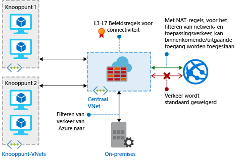

# Wat is Azure Firewall?

Azure Firewall is een beheerde, cloudgebaseerde netwerkbeveiligingsservice die uw Azure Virtual Network-resources beschermt. Het is een volledige stateful firewall als een service met ingebouwde hoge beschikbaarheid en onbeperkte cloudschaalbaarheid. 

[!INCLUDE [firewall-preview-notice](../../includes/firewall-preview-notice.md)]

U kunt beleid voor toepassings- en netwerkconnectiviteit centraal maken, afdwingen en registreren voor abonnementen en virtuele netwerken. Azure Firewall maakt gebruik van een statisch openbaar IP-adres voor uw virtuele-netwerkresources zodat externe firewalls verkeer dat afkomstig is van uw virtuele netwerk kunnen identificeren.  De service is volledig geïntegreerd met Azure Monitor voor registratie en analyses.

## Functies

De openbare preview van Azure Firewall biedt de volgende functies:

### Ingebouwde hoge beschikbaarheid
Hoge beschikbaarheid is ingebouwd, zodat er geen extra load balancers vereist zijn en u niets hoeft te configureren.

### Onbeperkte cloudschaalbaarheid 
U kunt Azure Firewall omhoog schalen zoveel als nodig is om te voldoen aan veranderende netwerkverkeersstromen, zodat u geen budget hoeft te reserveren voor het drukste verkeer.

### Filteren op FQDN 
U kunt uitgaand HTTP/S-verkeer beperken tot een opgegeven lijst met volledig gekwalificeerde domeinnamen (FQDN), inclusief jokertekens. Deze functie vereist geen SSL-beëindiging.

### Regels voor het filteren van netwerkverkeer

U kunt de netwerkfilterregels *toestaan* of *weigeren* centraal maken op IP-adres van bron en doel, poort en protocol. Azure Firewall is volledig stateful, wat betekent dat het legitieme pakketten voor verschillende soorten verbindingen kan onderscheiden. Regels worden afgedwongen en vastgelegd voor meerdere abonnementen en virtuele netwerken.

### Ondersteuning voor uitgaande SNAT

Alle uitgaande IP-adressen van virtueel netwerkverkeer worden geconverteerd naar de openbare IP van Azure Firewall (Source Network Address Translation). U kunt verkeer dat afkomstig is uit uw virtuele netwerk naar externe internetbestemmingen identificeren en toestaan.

### Logboekregistratie van Azure Monitor

Alle gebeurtenissen zijn geïntegreerd met Azure Monitor, zodat u logboeken kunt archiveren in een opslagaccount, gebeurtenissen kunt streamen naar uw Event Hub of deze kunt verzenden naar Log Analytics.

## Bekende problemen

De openbare preview van Azure Firewall heeft de volgende bekende problemen:

|Probleem  |Beschrijving  |Oplossing  |
|---------|---------|---------|
|Interoperabiliteit met NSG's     |Als een netwerkbeveiligingsgroep (NSG) wordt toegepast op het subnet van de firewall, kan het uitgaande internetverbindingen blokkeren, zelfs als de NSG is geconfigureerd voor het toestaan van uitgaande internettoegang. Uitgaande internetverbindingen zijn gemarkeerd als afkomstig van een VirtualNetwork en de bestemming is internet. Voor een NSG is VirtualNetwork to VirtualNetwork standaard ingesteld op *toestaan*, maar niet wanneer het doel internet is.|Voeg om dit probleem op de lossen de volgende inkomende regel toe aan de NSG die is toegepast op het subnet van de firewall:  Bron: VirtualNetwork-bronpoorten: alle   Doel: alle doelpoorten: alle   Protocol: alle toegang: toestaan|
|Conflict met de JIT-functie (Just-in-Time) van Azure Security Center (ASC)|Als een virtuele machine wordt geopend met behulp van JIT en zich in een subnet bevindt met een door de gebruiker gedefinieerde route die naar Azure Firewall als een standaardgateway verwijst, werkt ASC JIT niet. Dit is het gevolg van asymmetrische routering: er komt een pakket binnen via de openbare IP van de virtuele machine (JIT geopend voor toegang), maar het retourpad gaat via de firewall, die het pakket weigert omdat er geen sessie tot stand is gebracht op de firewall.|Om dit probleem te omzeilen, plaatst u de virtuele JIT-machines op een apart subnet dat geen door de gebruiker gedefinieerde route naar de firewall bevat.|
|Hub-en-spoke met wereldwijde peering werkt niet|Het hub-en-spoke-model, waar de hub en de firewall zijn geïmplementeerd in een Azure-regio en de spokes zich in een andere Azure-regio bevinden, dat met de hub is verbonden via wereldwijde peering, wordt niet ondersteund.|Zie voor meer informatie [Peering voor het virtuele netwerk maken, wijzigen of verwijderen](https://docs.microsoft.com/en-us/azure/virtual-network/virtual-network-manage-peering#requirements-and-constraints)|
Netwerkfilterregels voor niet-TCP/UDP-protocollen (bijvoorbeeld ICMP) werken niet voor internetverkeer|Netwerkfilterregels voor niet-TCP/UDP-protocollen werken niet met SNAT naar uw openbare IP-adres. Niet-TCP/UDP-protocollen worden ondersteund tussen spoke-subnetten en VNets.|Azure Firewall maakt gebruik van de standaardversie van Standard Load Balancer, [die momenteel geen ondersteuning biedt voor SNAT voor IP-protocollen](https://docs.microsoft.com/en-us/azure/load-balancer/load-balancer-standard-overview#limitations). We onderzoeken mogelijkheden om dit scenario in een toekomstige release te ondersteunen.

## Volgende stappen

- [Zelfstudie: Azure Firewall implementeren en configureren met Azure Portal](tutorial-firewall-deploy-portal.md)
- [Azure Firewall implementeren met behulp van een sjabloon](deploy-template.md)
- [Een Azure Firewall-testomgeving maken](scripts/sample-create-firewall-test.md)

