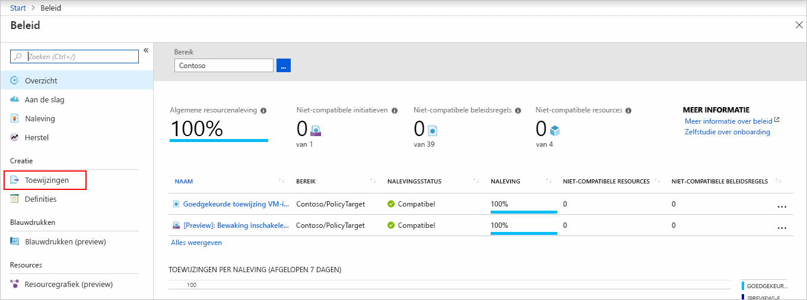
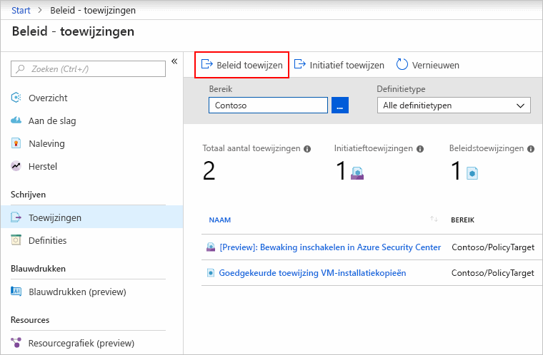
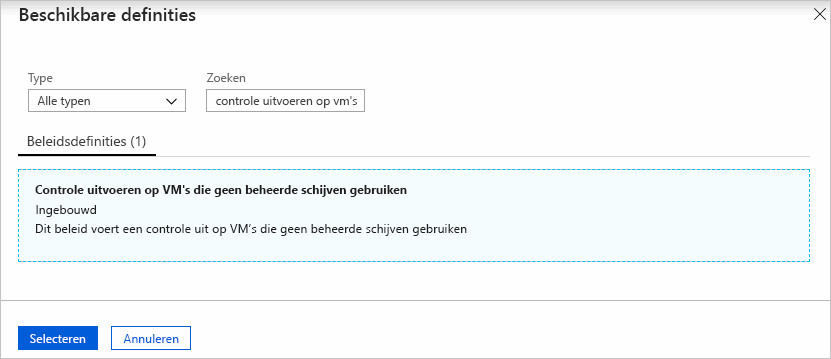
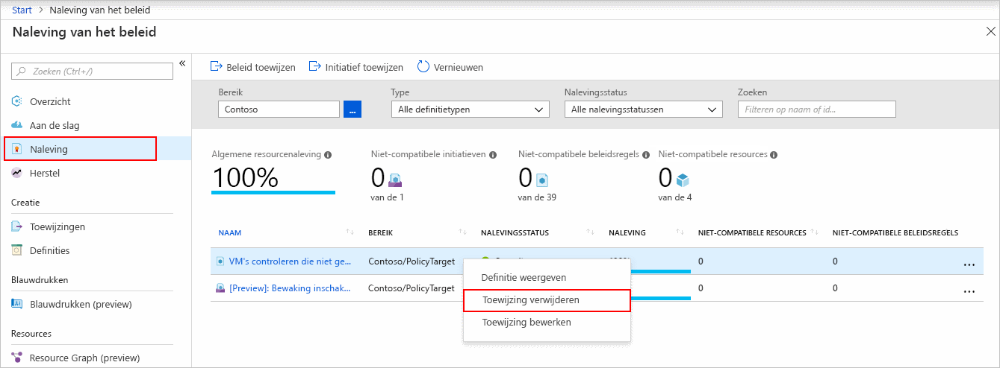

# Een beleidstoewijzing maken om niet-compatibele resources te identificeren in uw Azure-omgeving

De eerste stap in het begrijpen van naleving in Azure is het identificeren van de status van uw resources.
In deze quickstart gaat u een beleidstoewijzing maken voor het identificeren van virtuele machines die geen beheerde schijven gebruiken.

Als u dit proces helemaal hebt doorlopen, kunt u virtuele machines identificeren die geen beheerde schijven gebruiken. Deze zijn *niet-compatibel* met de beleidstoewijzing.

Als u nog geen Azure-abonnement hebt, maakt u een [gratis account](https://azure.microsoft.com/free/) voordat u begint.

## Een beleidstoewijzing maken

In deze snelstartgids maakt u een beleidstoewijzing en wijst u de beleidsdefinitie *Virtuele machines zonder beheerde schijven controleren* toe.

1. Start de Azure Policy-service in Azure Portal door **Alle services** te selecteren en dan **Beleid** te zoeken en te selecteren.

   

1. Selecteer **Toewijzingen** in het linkerdeelvenster van de Azure Policy-pagina. Een toewijzing is een beleid dat is toegewezen om te worden toegepast binnen een bepaald bereik.

   

1. Selecteer **Beleid toewijzen** boven in de pagina **Beleidstoewijzingen**.

   

1. Selecteer op de pagina **Beleid toewijzen** het **bereik** door te klikken op het beletselteken en een beheergroep of abonnement te selecteren. U kunt ook een resourcegroep selecteren. Het bereik bepaalt op welke resources of groep resources de beleidstoewijzing wordt afgedwongen.  Klik vervolgens op **Selecteren** aan de onderkant van de pagina **Bereik**.

   In dit voorbeeld wordt het abonnement **Contoso** gebruikt. U hebt waarschijnlijk een ander abonnement.

1. Resources kunnen worden uitgesloten op basis van het **bereik**.  **Uitsluitingen** starten op één niveau lager dan het niveau van het **bereik**. **Uitsluitingen** zijn optioneel, dus laat dit veld nu nog leeg.

1. Selecteer het weglatingsteken **Beleidsdefinitie** om de lijst van beschikbare definities te openen. Azure Policy wordt geleverd met ingebouwde beleidsdefinities die u kunt gebruiken. Er zijn allerlei definities beschikbaar, zoals:

   - Tag en waarde afdwingen
   - Tag en waarde toepassen
   - SQL Server-versie 12.0 vereisen

   Zie [Voorbeelden van beleid](./samples/index.md) voor een volledige lijst met alle beschikbare ingebouwde beleidsregels.

1. Doorzoek uw beleidsdefinities en zoek de definitie *Controleren van virtuele machines die geen beheerde schijven gebruiken*. Klik op dit beleid en vervolgens op **Selecteren**.

   

1. De **Toewijzingsnaam** wordt automatisch ingevuld met de naam van het beleid dat u hebt geselecteerd, maar u kunt dit wijzigen. In dit geval gebruiken we *Controleren van virtuele machines die geen beheerde schijven gebruiken*. U kunt ook een optionele **Beschrijving** opgeven. De beschrijving bevat details over deze beleidstoewijzing. **Toegewezen door** wordt automatisch gevuld op basis van de persoon die is aangemeld. Dit veld is optioneel, dus u kunt aangepaste waarden invoeren.

1. Laat **Beheerde identiteit maken** uitgeschakeld. Deze optie _moet_ worden ingeschakeld wanneer het beleid of initiatief dat wordt toegewezen een beleidsregel bevat met het effect [deployIfNotExists](./concepts/effects.md#deployifnotexists). Omdat het beleid dat voor deze zelfstudie wordt gebruikt deze regel niet bevat, laat u deze optie uitgeschakeld. Zie [Beheerde identiteiten](../../active-directory/managed-identities-azure-resources/overview.md) en [Hoe herstelbeveiliging werkt](./how-to/remediate-resources.md#how-remediation-security-works) voor meer informatie.

1. Klik op **Toewijzen**.

U bent er nu klaar voor om niet-compatibele resources te identificeren om inzicht te krijgen in de nalevingsstatus van uw omgeving.

## Niet-compatibele resources identificeren

Selecteer **Naleving** aan de linkerkant van de pagina en zoek de beleidstoewijzing **Controleren van virtuele machines die geen beheerde schijven gebruiken** die u hebt gemaakt.

Als er bestaande resources zijn die niet compatibel zijn met deze nieuwe toewijzing, worden deze weergegeven bij **Niet-compatibele resources**.

Als een voorwaarde wordt geëvalueerd ten opzichte van uw bestaande resources en deze waar blijkt te zijn, worden deze resources gemarkeerd als niet-compatibel met het beleid. In de volgende tabel ziet u hoe verschillende beleidsacties werken met de evaluatie van voorwaarden voor de resulterende nalevingsstatus. U kunt de evaluatielogica niet zien in Azure Portal, maar de resultaten voor de nalevingsstatus worden wel weergegeven. Het resultaat voor de nalevingsstatus is compatibel of niet-compatibel.

| **Resourcestatus** | **Effect** | **Beleidsevaluatie** | **Nalevingsstatus** |
| --- | --- | --- | --- |
| Bestaat | Weigeren, Controleren, Toevoegen\*, DeployIfNotExist\*, AuditIfNotExist\* | True | Niet-compatibel |
| Bestaat | Weigeren, Controleren, Toevoegen\*, DeployIfNotExist\*, AuditIfNotExist\* | False | Compatibel |
| Nieuw | Controleren, AuditIfNotExist\* | True | Niet-compatibel |
| Nieuw | Controleren, AuditIfNotExist\* | False | Compatibel |

\*Voor de acties Toevoegen, DeployIfNotExist en AuditIfNotExist moet de IF-instructie TRUE zijn. De acties vereisen ook dat de bestaansvoorwaarde FALSE is om niet-compatibel te zijn. Indien TRUE, activeert de IF-voorwaarde de evaluatie van de bestaansvoorwaarde voor de gerelateerde resources.

## Resources opschonen

Andere handleidingen in deze verzameling zijn op deze quickstart gebaseerd. Als u door wilt gaan met andere zelfstudies, verwijdert u de resources die u in deze quickstart hebt gemaakt, niet. Als u niet wilt doorgaan, gebruikt u de volgende stappen om alle resources te verwijderen die tijdens deze Quick Start in Azure Portal zijn gemaakt.

1. Selecteer **Naleving** (of **Toewijzingen**) aan de linkerkant van de pagina Azure Policy en zoek de beleidstoewijzing **Controleren van virtuele machines die geen beheerde schijven gebruiken** die u hebt gemaakt.

1. Klik met de rechtermuisknop op de beleidstoewijzing **Controleren van virtuele machines die geen beheerde schijven gebruiken** en selecteer **Toewijzing verwijderen**

   

## Volgende stappen

In deze snelstart wijst u een beleidsdefinitie toe aan een bereik en evalueert u het rapport voor naleving. De beleidsdefinitie controleert of alle resources in het bereik compatibel zijn en identificeert welke dit niet zijn.

Voor meer informatie over het toewijzen van beleid om er voor te zorgen dat **toekomstige** resources die worden gemaakt compatibel zijn, gaat u verder met de zelfstudie voor:

> [!div class="nextstepaction"]
> [Beleid maken en beheren](./tutorials/create-and-manage.md)