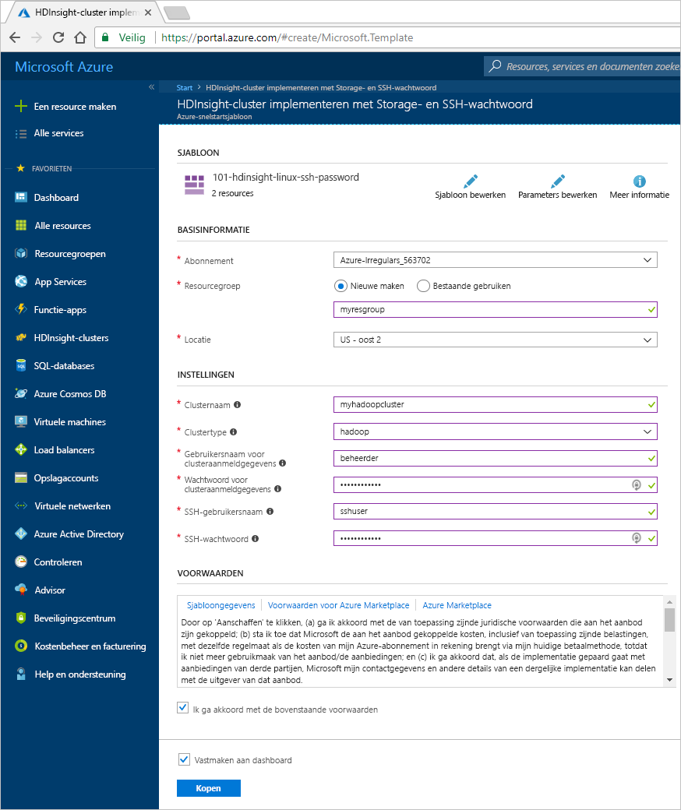
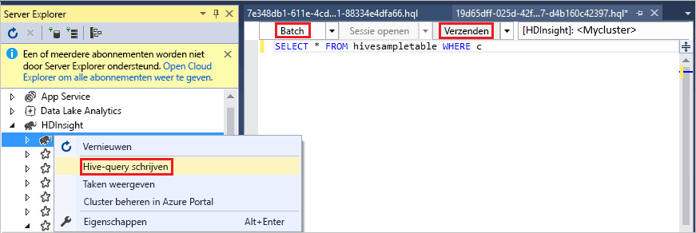
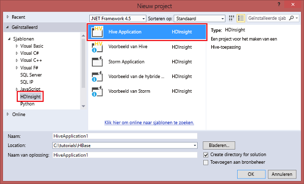
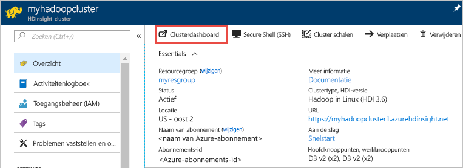
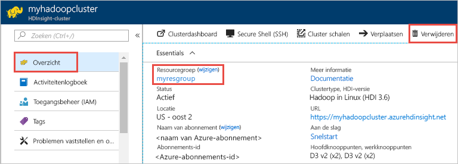

# <a name="quickstart-get-started-with-apache-hadoop-and-apache-hive-in-azure-hdinsight-using-resource-manager-template"></a>Snelstart: aan de slag met Apache Hadoop en Apache Hive in Azure HDInsight met behulp van een Resource Manager-sjabloon

In dit artikel leert u hoe u [Apache Hadoop](http://hadoop.apache.org/)-clusters maakt in HDInsight met behulp van een Resource Manager-sjabloon en hoe u vervolgens Hive-taken uitvoert in HDInsight. De meeste Hadoop-taken zijn batchtaken. U maakt een cluster, voert enkele taken uit en verwijdert het cluster vervolgens. In dit artikel gaat u al deze drie taken uitvoeren.

In deze snelstart gebruikt u Resource Manager-sjabloon voor het maken van een Hadoop-cluster in HDInsight. U kunt ook een cluster maken met behulp van [Azure Portal](apache-hadoop-linux-create-cluster-get-started-portal.md).

Op dit moment wordt HDInsight geleverd met [zeven verschillende clustertypen](./apache-hadoop-introduction.md#cluster-types-in-hdinsight). Elk clustertype ondersteunt een andere set onderdelen. Alle clustertypen ondersteunen Hive. Zie voor een lijst van ondersteunde onderdelen in HDInsight [Wat is er nieuw in de Hadoop-clusterversies geleverd door HDInsight?](../hdinsight-component-versioning.md)  

Als u geen abonnement op Azure hebt, maakt u een [gratis account](https://azure.microsoft.com/free/) voordat u begint.

<a name="create-cluster"></a>
## <a name="create-a-hadoop-cluster"></a>Een Hadoop-cluster maken

In deze sectie maakt u een Hadoop-cluster in HDInsight met behulp van een Azure Resource Manager-sjabloon. Het maken van een Azure Resource Manager-sjabloon is niet vereist voor dit artikel. 

1. Klik op de knop **Deploy to Azure** (Implementeren in Azure) hieronder om u aan te melden bij Azure en de Resource Manager-sjabloon te openen in Azure Portal. 
   
    <a href="https://portal.azure.com/#create/Microsoft.Template/uri/https%3A%2F%2Fraw.githubusercontent.com%2FAzure%2Fazure-quickstart-templates%2Fmaster%2F101-hdinsight-linux-ssh-password%2Fazuredeploy.json" target="_blank"></a>

2. Typ of selecteer de waarden zoals voorgesteld in de volgende schermafbeelding:

    > [!NOTE]
    > De opgegeven waarden moeten uniek zijn en moeten voldoen aan deze richtlijnen voor naamgeving. De sjabloon voert geen validatiecontroles uit. Als de waarden die u opgeeft, al in gebruik zijn of niet aan de richtlijnen voldoen, krijgt u een foutmelding nadat u de sjabloon hebt verzonden.       
    > 
    >
    
    

    Typ of selecteer de volgende waarden:
    
    |Eigenschap  |Beschrijving  |
    |---------|---------|
    |**Abonnement**     |  Selecteer uw Azure-abonnement. |
    |**Resourcegroep**     | Maak een resourcegroep of selecteer een bestaande resourcegroep.  Een resourcegroep is een container met Azure-onderdelen.  In dit geval bevat de resourcegroep het HDInsight-cluster en het afhankelijke Azure Storage-account. |
    |**Locatie**     | Selecteer een Azure-locatie waar u het cluster wilt maken.  Kies een locatie zo dicht mogelijk bij u in de buurt voor betere prestaties. |
    |**Clustertype**     | Selecteer **hadoop**. |
    |**Clusternaam**     | Voer een naam in voor het Hadoop-cluster. Omdat alle clusters in HDInsight dezelfde DNS-naamruimte delen, moet deze naam uniek zijn. De naam mag bestaan uit maximaal 59 tekens, inclusief letters, cijfers en afbreekstreepjes. De eerste en laatste tekens van de naam mogen geen streepjes zijn. |
    |**Gebruikersnaam/Wachtwoord voor clusteraanmeldgegevens**     | De standaardaanmeldingsnaam is **admin**. Het wachtwoord moet uit minstens tien tekens bestaan en moet minstens één cijfer, één hoofdletter, één kleine letter en één niet-alfanumeriek teken bevatten (uitgezonderd ' " ` \). Zorg ervoor dat u **geen makkelijk te raden** wachtwoorden gebruikt, zoals 'Pass@word1'.|
    |**SSH-gebruikersnaam en SSH-wachtwoord**     | De standaardgebruikersnaam is **sshuser**.  U kunt de SSH-gebruikersnaam wijzigen.  Voor het SSH-gebruikerswachtwoord gelden dezelfde vereisten als voor het aanmeldingswachtwoord voor het cluster.|
       
    Sommige eigenschappen zijn vastgelegd in de sjabloon.  U kunt deze waarden uit de sjabloon configureren. Raadpleeg voor meer uitleg over deze eigenschappen [Hadoop-clusters maken in HDInsight](../hdinsight-hadoop-provision-linux-clusters.md).

3. Selecteer **Ik ga akkoord met de bovenstaande voorwaarden** en **Vastmaken aan dashboard**, en selecteer vervolgens **Kopen**. U ziet een nieuwe tegel met de mededeling dat **de implementatie wordt verzonden**. Het duurt ongeveer 20 minuten om een cluster te maken.

    

4. Als het cluster is gemaakt, wordt de ondertiteling van de tegel gewijzigd in de opgegeven naam van de resourcegroep. De tegel bevat ook het HDInsight-cluster dat binnen de resourcegroep is gemaakt. 
   
    
    
5. De tegel bevat ook de standaardopslag die aan het cluster is gekoppeld. Elk cluster is afhankelijk van een [Azure Storage-account](../hdinsight-hadoop-use-blob-storage.md) of een [Azure Data Lake-account](../hdinsight-hadoop-use-data-lake-store.md). Dit wordt het standaardopslagaccount genoemd. HDInsight-cluster en het standaard opslagaccount moeten samen in dezelfde Azure-regio worden geplaatst. Het opslagaccount wordt niet verwijderd wanneer er clusters worden verwijderd.
    

> [!NOTE]
> Zie [HDInsight-clusters maken](../hdinsight-hadoop-provision-linux-clusters.md) voor andere methoden om clusters te maken en inzicht te krijgen in de eigenschappen die worden gebruikt in deze zelfstudie.       
> 
>

## <a name="use-vscode-to-run-hive-queries"></a>VSCode gebruiken om Hive-query's uit te voeren

Zie [Azure HDInsight-hulpprogramma's voor Visual Studio Code gebruiken](../hdinsight-for-vscode.md) voor informatie over het ophalen van HDInsight-hulpprogramma's in VSCode.

### <a name="submit-interactive-hive-queries"></a>Interactieve Hive-query's verzenden

Met HDInsight-hulpprogramma’s voor VSCode kunt u interactieve Hive-query’s verzenden naar interactieve HDInsight-queryclusters.

1. Maak een nieuwe werkmap en een nieuw Hive-scriptbestand, als u deze nog niet hebt.

2. Maak verbinding met uw Azure-account en configureer vervolgens het standaardcluster, als u dit nog niet hebt gedaan.

3. Kopieer en plak de volgende code in het Hive-bestand en sla het bestand op.

    ```hiveql
    SELECT * FROM hivesampletable;
    ```
4. Klik met de rechtermuisknop op de scripteditor en selecteer vervolgens **HDInsight: Hive Interactive** om de query te verzenden. Met de hulpprogramma’s kunt u ook een codeblok verzenden in plaats van het hele scriptbestand, met behulp van het contextmenu. Kort hierna worden de queryresultaten weergegeven op een nieuw tabblad.

   

    - Paneel **RESULTATEN**: u kunt het hele resultaat op een lokaal pad opslaan als een CSV-, JSON- of Excel-bestand, of gewoon meerdere regels selecteren.

    - Paneel **BERICHTEN**: wanneer u **Regelnummer** selecteert, gaat u naar de eerste regel van het actieve script.

Het uitvoeren van de interactieve query kost veel minder tijd dan het [uitvoeren van een Hive-batchtaak](#submit-hive-batch-scripts).

### <a name="submit-hive-batch-scripts"></a>Hive-batchscripts verzenden

1. Maak een nieuwe werkmap en een nieuw Hive-scriptbestand, als u deze nog niet hebt.

2. Maak verbinding met uw Azure-account en configureer vervolgens het standaardcluster, als u dit nog niet hebt gedaan.

3. Kopieer en plak de volgende code in het Hive-bestand en sla het bestand op.

    ```hiveql
    SELECT * FROM hivesampletable;
    ```
4. Klik met de rechtermuisknop op de scripteditor en selecteer vervolgens **HDInsight: Hive Batch** om een Hive-taak te verzenden. 

5. Selecteer het cluster waarnaar u de taak wilt verzenden.  

    Nadat u de Hive-taak hebt verzonden, worden de taak-id en informatie over het slagen van de verzending weergegeven in het paneel **UITVOER**. Met de Hive-taak wordt ook de **WEBBROWSER** geopend, waarin de realtimetaaklogboeken en de status worden weergegeven.

   

[Het verzenden van interactieve Hive-query’s](#submit-interactive-hive-queries) gaat veel sneller dan het verzenden van een batchtaak.

## <a name="use-visualstudio-to-run-hive-queries"></a>Visual Studio gebruiken om Hive-query’s uit te voeren

Zie [Data Lake-hulpprogramma's voor Visual Studio gebruiken](./apache-hadoop-visual-studio-tools-get-started.md) voor informatie over het ophalen van HDInsight-hulpprogramma's in VSCode.

### <a name="run-hive-queries"></a>Hive-query's uitvoeren

U hebt twee opties voor het maken en uitvoeren van Hive-query's:

* Ad-hocquery's maken
* Een Hive-toepassing maken

Ad-hocquery's maken en uitvoeren:

1. In **Server Explorer** selecteert u **Azure** > **HDInsight-clusters**.

2. Klik met de rechtermuisknop op het cluster waar u de query wilt uitvoeren en selecteer **Write a Hive Query** (Een Hive-query schrijven).  

3. Voer de Hive-query's in 

    De Hive-editor ondersteunt IntelliSense. Data Lake Tools voor Visual Studio biedt ondersteuning voor het laden van externe metagegevens wanneer u het Hive-script bewerkt. Wanneer u bijvoorbeeld **SELECT * FROM** typt, geeft IntelliSense alle voorgestelde tabelnamen weer. Wanneer een tabelnaam wordt opgegeven, geeft IntelliSense de kolomnamen weer. De hulpprogramma's ondersteunen de meeste DML-instructies, subquery's en ingebouwde UDF's van Hive.
   
    
   
    
   
   > [!NOTE]
   > IntelliSense suggereert alleen de metagegevens van het cluster dat in de HDInsight-werkbalk is geselecteerd.
   > 
   
4. Selecteer **Verzenden** of **Verzenden (geavanceerd)**. 
   
    

   Als u de optie voor geavanceerd verzenden selecteert, configureert u de **Taaknaam**, **Argumenten**, **Aanvullende configuraties** en **Statusmap** voor het script:

    

   Interactieve Hive-query's uitvoeren

   * klik op de pijl-omlaag om **Interactief** te kiezen. 
   
   * Klik op **Uitvoeren**.

   

Een Hive-oplossing maken en uitvoeren:

1. Selecteer in het menu **Bestand** de optie **Nieuw** en selecteer vervolgens **Project**.
2. Selecteer **HDInsight** in het linkerdeelvenster. Selecteer **Hive-toepassing** in het middelste deelvenster. Voer de eigenschappen in en selecteer **OK**.
   
    
3. Dubbelklik in **Solution Explorer** op **Script.hql** om het script te openen.
4. Voer de Hive-query’s in en klik op Verzenden. (Raadpleeg stappen 3 en 4 hierboven)  


## <a name="run-hive-queries"></a>Hive-query's uitvoeren

[Apache Hive](hdinsight-use-hive.md) is het meest populaire onderdeel dat in HDInsight wordt gebruikt. Er zijn veel manieren om Hive-taken uit te voeren in HDInsight. In deze zelfstudie gebruikt u de Ambari Hive-weergave in de portal. Voor andere methoden voor het indienen van Hive-taken raadpleegt u [Hive gebruiken in HDInsight](hdinsight-use-hive.md).

1. Als u Ambari wilt openen, selecteert u **Clusterdashboard** in de vorige schermafbeelding.  U kunt ook bladeren naar **https://&lt;ClusterName>. azurehdinsight.net**, waarbij &lt;ClusterName> het cluster is dat u in de vorige sectie hebt gemaakt.

    

2. Voer de gebruikersnaam en het wachtwoord voor Hadoop in die u hebt opgegeven tijdens het maken van het cluster. De standaardgebruikersnaam **admin**.

3. Open **Hive-weergave** zoals weergegeven in de volgende schermafbeelding:
   
    

4. Plak in het tabblad **QUERY** de volgende HiveQL-instructies in het werkblad:
   
        SHOW TABLES;

    
   
   > [!NOTE]
   > Puntkomma is vereist voor Hive.       
   > 
   > 

5. Selecteer **Uitvoeren**. Er wordt een tabblad **RESULTATEN** weergegeven onder het tabblad **QUERY** met informatie over de taak. 
   
    Nadat de query is voltooid, worden de resultaten van de bewerking weergegeven op het tabblad **QUERY**. U ziet één tabel met de naam **hivesampletable**. Deze Hive-voorbeeldtabel is bij alle HDInsight-clusters inbegrepen.
   
    

6. Herhaal stap 4 en 5 om de volgende query uit te voeren:
   
        SELECT * FROM hivesampletable;
   
7. U kunt de resultaten van de query ook opslaan. Selecteer de menuknop aan de rechterkant en geef aan of u de resultaten wilt downloaden als een CSV-bestand of deze wilt opslaan in het opslagaccount dat aan het cluster is gekoppeld.

    

Nadat u een Hive-taak hebt voltooid, kunt u [de resultaten exporteren naar een Azure SQL-database of een SQL Server-database](apache-hadoop-use-sqoop-mac-linux.md). U kunt ook [de resultaten weergeven in Excel](apache-hadoop-connect-excel-power-query.md). Zie voor meer informatie over het gebruik van Hive in HDInsight [Hive en HiveQL gebruiken met Hadoop in HDInsight voor het analyseren van een voorbeeldbestand van de Apache-log4j](hdinsight-use-hive.md).

## <a name="troubleshoot"></a>Problemen oplossen

Zie [Vereisten voor toegangsbeheer](../hdinsight-administer-use-portal-linux.md#create-clusters) als u problemen ondervindt met het maken van HDInsight-clusters.

## <a name="clean-up-resources"></a>Resources opschonen
Nadat u het artikel hebt voltooid, kunt u het cluster verwijderen. Met HDInsight worden uw gegevens opgeslagen in Azure Storage zodat u een cluster veilig kunt verwijderen wanneer deze niet wordt gebruikt. Voor een HDInsight-cluster worden ook kosten in rekening gebracht, zelfs wanneer het niet wordt gebruikt. Aangezien de kosten voor het cluster vaak zoveel hoger zijn dan de kosten voor opslag, is het financieel gezien logischer clusters te verwijderen wanneer ze niet worden gebruikt. 

> [!NOTE]
> Als u *meteen* verder wilt gaan met de volgende zelfstudie om te leren hoe u ETL-bewerkingen uitvoert met behulp van Hadoop in HDInsight, kunt u het cluster beter behouden. In die zelfstudie hebt u namelijk ook een Hadoop-cluster nodig. Als u echter niet direct verdergaat met de volgende zelfstudie, moet u het cluster nu verwijderen.
> 
> 

**Het cluster en/of het standaardopslagaccount verwijderen**

1. Ga terug naar het browsertabblad voor Azure Portal. U komt terecht op de overzichtspagina voor het cluster. Selecteer **Verwijderen** als u alleen het cluster wilt verwijderen maar het standaardopslagaccount wilt behouden.

    

2. Als u het cluster en het standaardopslagaccount wilt verwijderen, selecteert u de naam van de resourcegroep (gemarkeerd in de vorige schermafbeelding) om de pagina van de resourcegroep te openen.

3. Selecteer **Resourcegroep verwijderen** om de resourcegroep te verwijderen. De groep bevat zowel het cluster als het standaardopslagaccount. Als u de resourcegroep verwijdert, wordt ook het opslagaccount verwijderd. Als u het opslagaccount wilt behouden, verwijdert u alleen het cluster.

## <a name="next-steps"></a>Volgende stappen
In dit artikel hebt u geleerd hoe u een HDInsight-cluster op basis van Linux maakt met behulp van een Resource Manager-sjabloon, en hoe u eenvoudige Hive-query's uitvoert. In het volgende artikel leert u hoe u een ETL-bewerking (Extraction, Transformation, Loading) uitvoert met behulp van Hadoop in HDInsight.

> [!div class="nextstepaction"]
>[Gegevens uitpakken, transformeren en laden met Apache Hive in HDInsight ](../hdinsight-analyze-flight-delay-data-linux.md)

Als u klaar bent om te gaan werken met uw eigen gegevens en meer wilt weten over hoe HDInsight gegevens opslaat of hoe u gegevens in HDInsight krijgt, raadpleegt u de volgende artikelen:

* Zie [Azure Storage gebruiken met HDInsight](../hdinsight-hadoop-use-blob-storage.md) voor meer informatie over hoe HDInsight Azure Storage gebruikt.
* Zie [Snelstart: Clusters instellen in HDInsight](../../storage/data-lake-storage/quickstart-create-connect-hdi-cluster.md) voor meer informatie over het maken van een HDInsight-cluster met Data Lake Storage
* Zie [Gegevens uploaden naar HDInsight](../hdinsight-upload-data.md) voor meer informatie over het uploaden van gegevens naar HDInsight.

Zie de volgende artikelen voor meer informatie over het analyseren van gegevens met HDInsight:

* Zie [Hive gebruiken met HDInsight](hdinsight-use-hive.md) voor meer informatie over het gebruik van Hive met HDInsight, waaronder over het uitvoeren van Hive-query's vanuit Visual Studio.
* Zie [Pig gebruiken met HDInsight](hdinsight-use-pig.md) voor meer informatie over Pig, een taal die wordt gebruikt voor het omzetten van gegevens.
* Zie [MapReduce gebruiken met HDInsight](hdinsight-use-mapreduce.md) voor meer informatie over MapReduce, een middel om programma's te schrijven die gegevens verwerken op Hadoop.
* Zie voor meer informatie over het gebruik van de HDInsight-hulpprogramma's voor Visual Studio om gegevens op HDInsight te analyseren [Aan de slag met Visual Studio Hadoop-hulpprogramma's voor HDInsight](apache-hadoop-visual-studio-tools-get-started.md).
* Zie [Azure HDInsight-hulpprogramma’s voor Visual Studio Code gebruiken](../hdinsight-for-vscode.md) voor meer informatie over het gebruik van de HDInsight-hulpprogramma's voor VSCode om gegevens te analyseren in HDInsight.


Als u meer informatie wilt over het maken of beheren van een HDInsight-cluster, raadpleegt u de volgende artikelen:

* Zie voor meer informatie over het beheren van uw HDInsight-cluster op basis van Linux [HDInsight-clusters beheren met Ambari](../hdinsight-hadoop-manage-ambari.md).
* Zie voor meer informatie over de opties die u kunt selecteren bij het maken van een HDInsight-cluster [HDInsight op Linux maken met aangepaste opties](../hdinsight-hadoop-provision-linux-clusters.md).


[1]: ../HDInsight/apache-hadoop-visual-studio-tools-get-started.md

[hdinsight-provision]: hdinsight-provision-linux-clusters.md
[hdinsight-upload-data]: hdinsight-upload-data.md
[hdinsight-use-hive]: hdinsight-use-hive.md
[hdinsight-use-pig]: hdinsight-use-pig.md


