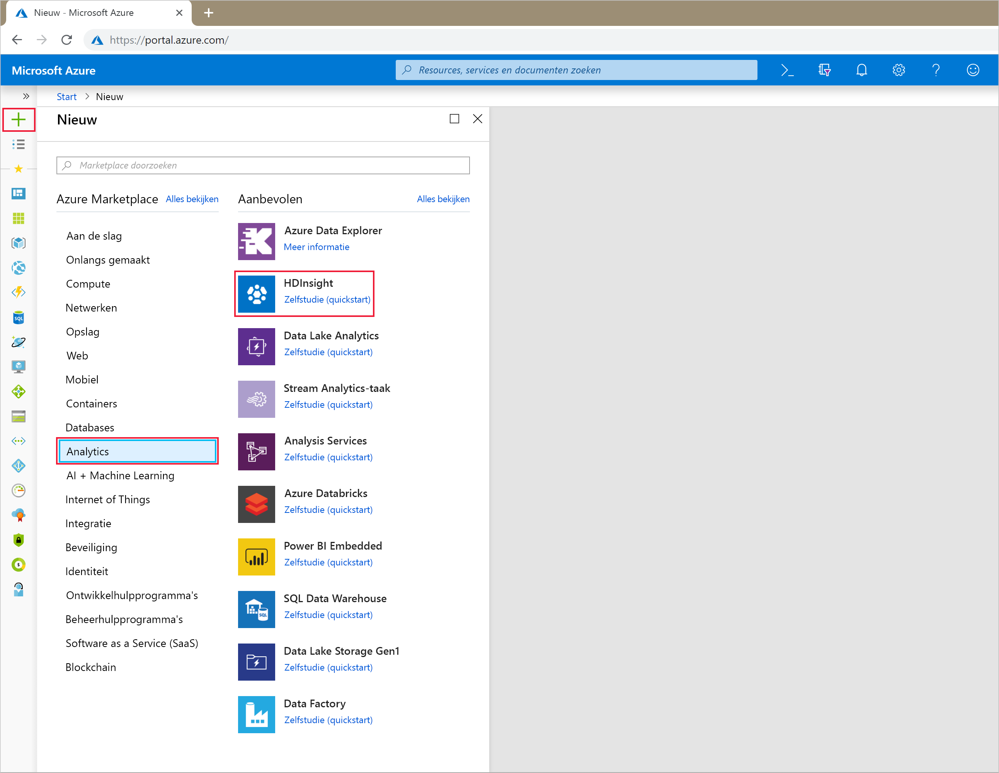
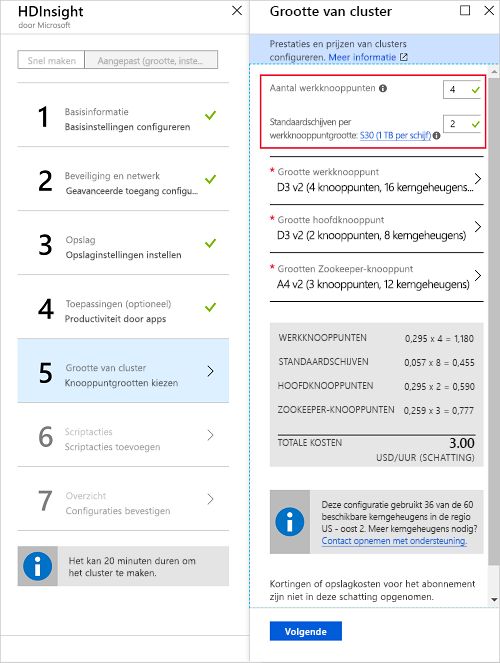

# <a name="start-with-apache-kafka-on-hdinsight"></a>Met Apache Kafka in HDInsight beginnen

Informatie over het maken en gebruiken van een [Apache Kafka](https://kafka.apache.org)-cluster in Azure HDInsight. Kafka is een open-source, gedistribueerd streamingplatform dat beschikbaar is met HDInsight. Het wordt vaak gebruikt als een berichtenbroker, omdat het een functionaliteit biedt die vergelijkbaar is met een publicatie-/abonnementswachtrij voor berichten. Kafka wordt vaak in combinatie met Apache Spark en Apache Storm gebruikt voor berichten, activiteitentracering, stroomaggregatie of gegevenstransformatie.

[!INCLUDE [delete-cluster-warning](../../../includes/hdinsight-delete-cluster-warning.md)]

## <a name="create-a-kafka-cluster"></a>Een Kafka-cluster maken

Gebruik de volgende stappen om een Kafka te maken in een HDInsight-cluster:

1. In de [Azure Portal](https://portal.azure.com) selecteert u **+ Een resource maken**, **Gegevens en analyses** en vervolgens **HDInsight**.
   
    

2. Voer bij **Basisbeginselen** de volgende informatie in:

    * **Clusternaam**: de naam van het HDInsight-cluster. Deze naam moet uniek zijn.
    * **Abonnement**: selecteer het abonnement dat u wilt gebruiken.
    * **Clustertype**: selecteer deze vermelding en stel bij **Clusterconfiguratie** de volgende waarden in:

        * **Clustertype**: Kafka
        * **Versie**: Kafka 0.10.0 (HDI 3.6)

        Gebruik de knop **Selecteren** om de instellingen voor het clustertype op te slaan.

        

    * **Aanmeldingsgebruikersnaam** en -**wachtwoord** van cluster: de aanmeldingsgegevens voor toegang tot het cluster via HTTPS. U gebruikt deze referenties voor toegang tot services als de Ambari-webinterface of de REST-API.
    * **SSH-gebruikersnaam (Secure Shell)**: de aanmeldingsgegevens voor toegang tot het cluster via SSH. Het wachtwoord is standaard hetzelfde als het aanmeldingswachtwoord van het cluster.
    * **Resourcegroep**: de resourcegroep waarin het cluster wordt gemaakt.
    * **Locatie**: de Azure-regio waarin het cluster wordt gemaakt.

        > [!IMPORTANT]
        > Voor hoge beschikbaarheid van gegevens wordt u geadviseerd om een locatie (regio) in te stellen die __drie foutdomeinen__ heeft. Zie de sectie [Hoge beschikbaarheid van gegevens](#data-high-availability) voor meer informatie.
   
 

3. Gebruik de knop __Volgende__ om de basisconfiguratie te voltooien.

4. Selecteer of maak bij **Opslag** een opslagaccount. Voor de stappen in dit document laat u de andere velden op de standaardwaarden ingesteld. Gebruik de knop __Volgende__ om de opslagconfiguratie op te slaan.

    

5. Selecteer bij __Toepassingen (optioneel)__ de optie __Volgende__ om door te gaan. Er zijn geen toepassingen vereist voor dit voorbeeld.

6. Selecteer bij __Clustergrootte__ de optie __Volgende__ om door te gaan.

    > [!WARNING]
    > Om beschikbaarheid van Kafka op HDInsight te garanderen, moet uw cluster ten minste drie werkknooppunten bevatten. Zie de sectie [Hoge beschikbaarheid van gegevens](#data-high-availability) voor meer informatie.

    

    > [!IMPORTANT]
    > De waarde voor de **schijven per werkknooppunt** configureert de schaalbaarheid van Kafka in HDInsight. Kafka in HDInsight maakt gebruik van de lokale schijf van de virtuele machines in het cluster. Omdat Kafka veel gebruikmaakt van invoer/uitvoer, wordt [Azure Managed Disks](../../virtual-machines/windows/managed-disks-overview.md) gebruikt voor een hoge doorvoer en meer opslag per knooppunt. Het type beheerde schijf is __Standaard__ (HDD) of __Premium__ (SSD). Premium-schijven worden gebruikt met virtuele machines uit de DS- en GS-reeks. Alle andere VM-typen gebruiken standaardschijven.

7. Selecteer bij __Geavanceerde instellingen__ de optie __Volgende__ om door te gaan.

8. Controleer bij **Samenvatting** de configuratie van het cluster. Gebruik de koppeling __Bewerken__ om onjuiste instellingen te wijzigen. Gebruik tot slot de knop __Maken__ om het cluster te maken.
   
    
   
    > [!NOTE]
    > Het kan tot 20 minuten duren om het cluster te maken.

## <a name="connect-to-the-cluster"></a>Verbinding maken met het cluster

> [!IMPORTANT]
> Wanneer u de volgende stappen uitvoert, moet u een SSH-client gebruiken. Zie het document [SSH gebruiken met HDInsight](../hdinsight-hadoop-linux-use-ssh-unix.md) voor meer informatie.

Als u verbinding met het cluster wilt maken via SSH, moet u de naam van het SSH-gebruikersaccount en de naam van uw cluster opgeven. Vervang `sshuser` en `clustername` in het volgende voorbeeld door uw account- en clusternaam:

```ssh sshuser@clustername-ssh.azurehdinsight.net```

Voer het wachtwoord van het SSH-account in wanneer hierom wordt gevraagd.

Zie [SSH-sleutels gebruiken met HDInsight](../hdinsight-hadoop-linux-use-ssh-unix.md) voor informatie.

## <a id="getkafkainfo"></a>Informatie over Zookeeper- en brokerhosts ophalen

Als u met Kafka werkt, moet u de *Zookeeper*-hosts en de *broker*hosts kennen. Deze hosts worden gebruikt met de Kafka-API en veel van de hulpprogramma's die bij Kafka worden meegeleverd.

Gebruik de volgende stappen om de omgevingsvariabelen te maken die de hostinformatie bevatten:

1. Wanneer er een SSH-verbinding is gemaakt met het cluster, gebruikt u de volgende opdracht om het hulpprogramma `jq` te installeren. Dit hulpprogramma wordt gebruikt om JSON-documenten te parseren en is handig bij het ophalen van informatie van de brokerhost:
   
    ```bash
    sudo apt -y install jq
    ```

2. Gebruik de volgende opdracht om een omgevingsvariabele in te stellen op de clusternaam:

    ```bash
    read -p "Enter the HDInsight cluster name: " CLUSTERNAME
    ```

3. Gebruik de volgende opdracht om een omgevingsvariabele in te stellen met hostinformatie van Zookeeper:

    ```bash
    export KAFKAZKHOSTS=`curl -sS -u admin -G https://$CLUSTERNAME.azurehdinsight.net/api/v1/clusters/$CLUSTERNAME/services/ZOOKEEPER/components/ZOOKEEPER_SERVER | jq -r '["\(.host_components[].HostRoles.host_name):2181"] | join(",")' | cut -d',' -f1,2`
    ```

    Geef desgevraagd het wachtwoord voor het account voor clusteraanmelding (beheerder) op.

4. Gebruik de volgende opdracht om te controleren of de omgevingsvariabele juist is ingesteld:

    ```bash
     echo '$KAFKAZKHOSTS='$KAFKAZKHOSTS
    ```

    Met deze opdracht wordt informatie geretourneerd die lijkt op de volgende tekst:

    `zk0-kafka.eahjefxxp1netdbyklgqj5y1ud.ex.internal.cloudapp.net:2181,zk2-kafka.eahjefxxp1netdbyklgqj5y1ud.ex.internal.cloudapp.net:2181`

5. Gebruik de volgende opdracht om een omgevingsvariabele in te stellen met brokerhostinformatie van Kafka:

    ```bash
    export KAFKABROKERS=`curl -sS -u admin -G https://$CLUSTERNAME.azurehdinsight.net/api/v1/clusters/$CLUSTERNAME/services/KAFKA/components/KAFKA_BROKER | jq -r '["\(.host_components[].HostRoles.host_name):9092"] | join(",")' | cut -d',' -f1,2`
    ```

    Geef desgevraagd het wachtwoord voor het account voor clusteraanmelding (beheerder) op.

6. Gebruik de volgende opdracht om te controleren of de omgevingsvariabele juist is ingesteld:

    ```bash   
    echo '$KAFKABROKERS='$KAFKABROKERS
    ```

    Met deze opdracht wordt informatie geretourneerd die lijkt op de volgende tekst:
   
    `wn1-kafka.eahjefxxp1netdbyklgqj5y1ud.cx.internal.cloudapp.net:9092,wn0-kafka.eahjefxxp1netdbyklgqj5y1ud.cx.internal.cloudapp.net:9092`
   
> [!WARNING]
> Ga er niet van uit dat de informatie die uit deze sessie naar voren komt altijd accuraat is. Wanneer u het cluster schaalt, worden er nieuwe brokers toegevoegd of verwijderd. Als er een fout optreedt en een knooppunt is vervangen, kan de hostnaam van het knooppunt veranderen.
>
> Haal de informatie over de Zookeeper- en brokerhosts pas op kort voordat u ze gebruikt, om er zeker van te zijn dat de gegevens geldig zijn.

## <a name="create-a-topic"></a>Een onderwerp maken

Kafka slaat gegevensstromen op in categorieën, zogenaamde *onderwerpen*. Wanneer er een SSH-verbinding is gemaakt met het hoofdknooppunt van het cluster, gebruikt u een script dat bij Kafka is meegeleverd om een onderwerp te maken:

```bash
/usr/hdp/current/kafka-broker/bin/kafka-topics.sh --create --replication-factor 3 --partitions 8 --topic test --zookeeper $KAFKAZKHOSTS
```

Met deze opdracht brengt u een verbinding met Zookeeper tot stand met behulp van de hostinformatie die is opgeslagen in `$KAFKAZKHOSTS`. Vervolgens wordt er een Kafka-onderwerp gemaakt met de naam **test**. U kunt controleren of het onderwerp is gemaakt door met het volgende script een lijst van de onderwerpen te genereren:

```bash
/usr/hdp/current/kafka-broker/bin/kafka-topics.sh --list --zookeeper $KAFKAZKHOSTS
```

Met deze opdracht krijgt u een lijst van Kafka-onderwerpen over het cluster.

## <a name="produce-and-consume-records"></a>Records maken en gebruiken

Kafka slaat *records* op in onderwerpen. Records worden geproduceerd door *producenten* en worden gebruikt door *consumenten*. Producenten maken records voor Kafka-*brokers*. Elk werkrolknooppunt in uw HDInsight-cluster is een Kafka-broker.

Gebruik de volgende stappen om records op te slaan in het testonderwerp dat u eerder hebt gemaakt. Lees deze vervolgens met behulp van een verbruiker:

1. Gebruik tijdens de SSH-sessie een script dat bij Kafka is meegeleverd om records te schrijven naar het onderwerp:
   
    ```bash
    /usr/hdp/current/kafka-broker/bin/kafka-console-producer.sh --broker-list $KAFKABROKERS --topic test
    ```
   
    Na deze opdracht komt u aan bij een lege regel.

2. Typ een tekstbericht op de lege regel en druk op Enter. Voer op deze manier enkele berichten in en gebruik vervolgens **Ctrl + C** om terug te keren naar de normale prompt. Elke regel wordt als afzonderlijke record naar het Kafka-onderwerp verzonden.

3. Gebruik een script dat bij Kafka is meegeleverd om records in het onderwerp te lezen:
   
    ```bash
    /usr/hdp/current/kafka-broker/bin/kafka-console-consumer.sh --bootstrap-server $KAFKABROKERS --topic test --from-beginning
    ```
   
    Met deze opdracht haalt u de records van het onderwerp op en geeft u deze weer. Met `--from-beginning` wordt de consument gevraagd om bij het begin van de stream te beginnen, zodat alle records worden opgehaald.

    > [!NOTE]
    > Vervang `--bootstrap-server $KAFKABROKERS` door `--zookeeper $KAFKAZKHOSTS` als u een oudere versie van Kafka gebruikt.

4. Gebruik __Ctrl + C__ om de consument te stoppen.

U kunt ook programmatisch producenten en consumenten maken. Zie het document [Producer and Consumer API van Kafka met HDInsight](apache-kafka-producer-consumer-api.md) voor een voorbeeld van het gebruik van deze API.

## <a name="data-high-availability"></a>Hoge beschikbaarheid van gegevens

Elke Azure-regio (locatie) heeft _foutdomeinen_. Een foutdomein is een logische groepering van de onderliggende hardware in een Azure-datacenter. Elk foutdomein deelt een algemene voedingsbron en netwerkswitch. De virtuele machines en beheerde schijven die de knooppunten in een HDInsight-cluster implementeren zijn verdeeld over deze foutdomeinen. Deze architectuur beperkt de potentiële impact van problemen met de fysieke hardware.

Raadpleeg het document [Beschikbaarheid van virtuele Linux-machines](../../virtual-machines/windows/manage-availability.md#use-managed-disks-for-vms-in-an-availability-set) voor informatie over het aantal foutdomeinen in een regio.

> [!IMPORTANT]
> Gebruik, indien mogelijk, een Azure-regio die drie foutdomeinen bevat en maak onderwerpen met een replicatiefactor van 3.

Als u een regio met slechts twee foutdomeinen gebruikt, kies dan een replicatiefactor van 4 om de replica's gelijkmatig over de twee foutdomeinen te verdelen.

### <a name="kafka-and-fault-domains"></a>Kafka en foutdomeinen

Kafka is niet bekend met foutdomeinen. Bij het maken van partitiereplica's voor onderwerpen worden replica's mogelijk niet goed gedistribueerd voor hoge beschikbaarheid. Gebruik het [partitieherverdelingsprogramma van Kafka](https://github.com/hdinsight/hdinsight-kafka-tools) voor gegarandeerde hoge beschikbaarheid. Dit hulpprogramma moet vanaf een SSH-sessie naar het hoofdknooppunt van het Kafka-cluster worden uitgevoerd.

Om de hoogst mogelijke beschikbaarheid van uw Kafka-gegevens te waarborgen, moet u de partitiereplica's voor uw onderwerp opnieuw indelen wanneer:

* U een nieuw onderwerp of nieuwe partitie maakt

* U een cluster omhoog schaalt

## <a name="delete-the-cluster"></a>Het cluster verwijderen

[!INCLUDE [delete-cluster-warning](../../../includes/hdinsight-delete-cluster-warning.md)]

## <a name="troubleshoot"></a>Problemen oplossen

Zie [Vereisten voor toegangsbeheer](../hdinsight-administer-use-portal-linux.md#create-clusters) als u problemen ondervindt met het maken van HDInsight-clusters.

## <a name="next-steps"></a>Volgende stappen

In dit document hebt u de basisbeginselen geleerd van hoe u met Apache Kafka in HDInsight werkt. Gebruik de volgende documenten voor meer informatie over het werken met Kafka:

* [Kafka-logboekbestanden analyseren](apache-kafka-log-analytics-operations-management.md)
* [Gegevens repliceren tussen Kafka-clusters](apache-kafka-mirroring.md)
* [Producer and Consumer API van Kafka met HDInsight](apache-kafka-producer-consumer-api.md)
* [Streams API van Kafka met HDInsight](apache-kafka-streams-api.md)
* [Apache Spark-streaming (DStream) gebruiken met Kafka in HDInsight](../hdinsight-apache-spark-with-kafka.md)
* [Apache Spark Structured Streaming met Kafka in HDInsight](../hdinsight-apache-kafka-spark-structured-streaming.md)
* [Apache Spark Structured Streaming gebruiken om gegevens te verplaatsen van Kafka in HDInsight naar Cosmos DB](../apache-kafka-spark-structured-streaming-cosmosdb.md)
* [Apache Storm gebruiken met Kafka in HDInsight](../hdinsight-apache-storm-with-kafka.md)
* [Verbinding maken met Kafka via een Azure Virtual Network](apache-kafka-connect-vpn-gateway.md)
* [Kafka gebruiken met Azure Container Service](apache-kafka-azure-container-services.md)
* [Kafka gebruiken met Azure Functie-apps](apache-kafka-azure-functions.md)
