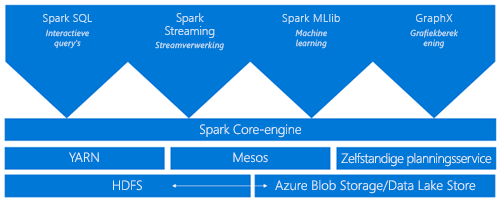
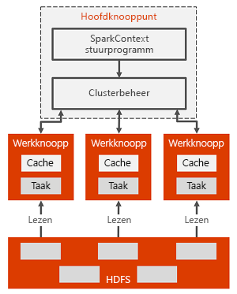

# Wat is Apache Spark in Azure HDInsight?

*Apache Spark* is een framework voor parallelle verwerking dat ondersteuning biedt voor in-memory verwerking om de prestaties van toepassingen voor de analyse van big data te verbeteren. Apache Spark in Azure HDInsight is Microsoft's implementatie van Apache Hadoop in de cloud. Met HDInsight kunt u eenvoudiger Spark-clusters maken en configureren in Azure. Spark-clusters in HDInsight zijn compatibel met Azure Storage en Azure Data Lake Store. Dit betekent dat u HDInsight Spark-clusters kunt gebruiken om gegevens te verwerken die zijn opgeslagen in Azure. Zie [Wat zijn de onderdelen en versies die beschikbaar met HDInsight?](../hdinsight-component-versioning.md) voor informatie over de onderdelen en versies.

## Wat is Spark?

Spark biedt primitieve typen voor in-memory clustercomputing. Een Spark-taak kan gegevens laden en in het geheugen cachen en er herhaaldelijk query’s op uitvoeren. Verwerkingen in het geheugen (in-memory) zijn veel sneller dan toepassingen die op schijf worden uitgevoerd, zoals Hadoop, dat gegevens deelt via HDFS. Spark kan ook worden geïntegreerd met de programmeertaal Scala waarmee u gedistribueerde gegevenssets zoals lokale verzamelingen kunt bewerken. Het is niet nodig om alles te structureren als toewijzings- en verminderingsbewerkingen.

Spark-clusters in HDInsight bieden een volledig beheerde Spark-service. Dit zijn de voordelen van het maken van een Spark-cluster in HDInsight.

| Functie | Beschrijving |
| --- | --- |
| Eenvoudig te maken |U kunt binnen enkele minuten een nieuw Spark-cluster in HDInsight maken met Azure Portal, Azure PowerShell of de .NET-SDK voor HDInsight. Zie [Aan de slag met Spark-clusters in HDInsight](apache-spark-jupyter-spark-sql.md) |
| Gebruiksgemak |Spark-cluster in HDInsight bevat Jupyter- en Zeppelin-notebooks. U kunt deze notebooks gebruiken voor interactieve gegevensverwerking en visualisatie.|
| REST-API’s |Spark-clusters in HDInsight omvatten [Livy](https://github.com/cloudera/hue/tree/master/apps/spark/java#welcome-to-livy-the-rest-spark-server), een Spark-taakserver op basis van een REST-API om op afstand taken te verzenden en te controleren. |
| Ondersteuning voor Azure Data Lake Store | Spark-clusters in HDInsight kunnen Azure Data Lake Store gebruiken als de primaire opslag of als extra opslag. Zie [Overzicht van Azure Data Lake Store](../../data-lake-store/data-lake-store-overview.md) voor meer informatie over Data Lake Store. |
| Integratie met Azure-services |Spark-clusters in HDInsight worden geleverd met een connector voor Azure Event Hubs. Met behulp van Event Hubs kunt u ook andere streamingtoepassingen bouwen, naast [Kafka](http://kafka.apache.org/), dat al beschikbaar is als onderdeel van Spark. |
| Ondersteuning voor ML Server | Ondersteuning voor ML Server in HDInsight wordt geleverd als het clustertype **ML Services**. U kunt een ML Services-cluster instellen om gedistribueerde R-berekeningen uit te voeren met de snelheden van een Spark-cluster. Zie [Aan de slag met ML Server in HDInsight](../r-server/r-server-get-started.md) voor meer informatie. |
| Integratie met IDE's van derden | HDInsight biedt verschillende IDE-invoegtoepassingen die handig zijn voor het maken en verzenden van toepassingen naar een HDInsight Spark-cluster. Zie [Azure-toolkit voor IntelliJ IDEA gebruiken](apache-spark-intellij-tool-plugin.md), [HDInsight voor VSCode gebruiken](../hdinsight-for-vscode.md) en [Azure-toolkit voor Eclipse gebruiken](apache-spark-eclipse-tool-plugin.md) voor meer informatie.|
| Gelijktijdige query's |Spark-clusters in HDInsight ondersteunen gelijktijdige query's. Hierdoor kunnen meerdere query's van één gebruiker of meerdere query's van verschillende gebruikers en toepassingen dezelfde clusterresources delen. |
| Opslaan in cache in SSD's |U kunt gegevens in het geheugen of in aan de clusterknooppunten gekoppelde SSD's cachen. Cachen in het geheugen biedt de beste queryprestaties, maar kan duur zijn. Cachen op SSD's is een goed alternatief voor het verbeteren van de prestaties van query's zonder dat er een cluster hoeft te worden gemaakt dat zo groot is dat de volledige gegevensset in het geheugen past. |
| Integratie met BI-tools |Spark-clusters in HDInsight bieden connectors voor BI-tools zoals [Power BI](http://www.powerbi.com/) voor gegevensanalyse. |
| Vooraf geladen Anaconda-bibliotheken |Spark-clusters in HDInsight worden geleverd met Anaconda-bibliotheken die vooraf zijn geïnstalleerd. [Anaconda](http://docs.continuum.io/anaconda/) voorziet in bijna 200 bibliotheken voor machine learning, data-analyse, visualisatie, enzovoort. |
| Schaalbaarheid | In HDInsight kunt u het aantal clusterknooppunten wijzigen. Bovendien kunnen Spark-clusters zonder gegevensverlies worden verwijderd, omdat alle gegevens zijn opgeslagen in Azure Storage of Data Lake Store. |
| SLA |Spark-clusters in HDInsight worden geleverd met 24/7 ondersteuning en een SLA met een beschikbaarheid van 99,9%. |

Spark-clusters in HDInsight omvatten de volgende onderdelen die standaard beschikbaar zijn in de clusters.

* [Spark Core](https://spark.apache.org/docs/1.5.1/). Omvat Spark Core, Spark SQL, Spark-streaming-API's, GraphX en MLlib.
* [Anaconda](http://docs.continuum.io/anaconda/)
* [Livy](https://github.com/cloudera/hue/tree/master/apps/spark/java#welcome-to-livy-the-rest-spark-server)
* [Jupyter-notebook](https://jupyter.org)
* [Zeppelin-notebook](http://zeppelin-project.org/)

Spark-clusters in HDInsight bieden ook een [ODBC-stuurprogramma](http://go.microsoft.com/fwlink/?LinkId=616229) voor verbinding met Spark-clusters in HDInsight vanuit BI-tools zoals Microsoft Power BI.

## Architectuur van Spark-cluster

De onderdelen van Spark zijn gemakkelijker te begrijpen als u weet hoe Spark wordt uitgevoerd in HDInsight-clusters.

Spark-toepassingen worden als onafhankelijke sets processen uitgevoerd in een cluster, gecoördineerd door het SparkContext-object in uw hoofdprogramma (het zogenaamde stuurprogramma).

De SparkContext kan verbinding maken met verschillende typen clustermanagers, die resources toewijzen voor toepassingen. Voorbeelden van clustermanagers zijn Apache Mesos, Apache YARN en de clustermanager van Spark. In HDInsight wordt Spark uitgevoerd met behulp van de YARN-clustermanager. Als er verbinding is, verkrijgt Spark executors op werkknooppunten in het cluster. Dit zijn processen die berekeningen uitvoeren en gegevens opslaan voor uw toepassing. Vervolgens wordt de code van uw toepassing (gedefinieerd in JAR- of Python-bestanden die worden doorgegeven aan SparkContext) verstuurd naar de executor. Ten slotte verzendt SparkContext taken naar de executors om uit te voeren.

SparkContext voert de hoofdfunctie van de gebruiker uit en voert de verschillende parallelle bewerkingen uit op de werkknooppunten. Vervolgens verzamelt SparkContext de resultaten van de bewerkingen. De werkrolknooppunten lezen en schrijven gegevens van en naar het HDFS (Hadoop Distributed File System). De werkrolknooppunten plaatsen getransformeerde gegevens ook in het geheugen als RDD’s (Resilient Distributed Datasets).

SparkContext maakt verbinding met de Spark-master en is verantwoordelijk voor het converteren van een toepassing naar een geleide grafiek (DAG) van afzonderlijke taken die worden uitgevoerd binnen een executorproces op de werkknooppunten. Elke toepassing krijgt zijn eigen executorprocessen, die voor de duur van de gehele toepassing blijven en taken uitvoeren in meerdere threads.

## Gebruiksscenario's voor Spark in HDInsight

Spark-clusters in HDInsight maken de volgende belangrijke scenario's mogelijk:

- Interactieve gegevensanalyse en BI

    Met Apache Spark in HDInsight worden gegevens opgeslagen in Azure Storage of Azure Data Lake Store. Zakelijke deskundigen en besluitvormers kunnen die gegevens analyseren, erover rapporteren en Microsoft Power BI gebruiken voor het maken van interactieve rapporten van de geanalyseerde gegevens. Analisten kunnen beginnen met ongestructureerde/semi-gestructureerde gegevens in clusteropslag, een schema voor de gegevens definiëren met behulp van notebooks, en vervolgens gegevensmodellen bouwen met behulp van Microsoft Power BI. Spark-clusters in HDInsight bieden ook ondersteuning voor een aantal BI-tools van derden, zoals Tableau, waardoor gegevensanalisten, bedrijfsdeskundigen en besluitvormers meer mogelijkheden krijgen.

    [Zelfstudie: Spark-gegevens visualiseren met behulp van Power BI](apache-spark-use-bi-tools.md)
- Machine Learning in Spark

    Apache Spark wordt geleverd met [MLlib](http://spark.apache.org/mllib/), een bibliotheek voor machine learning die boven op Spark is gebouwd. U kunt deze bibliotheek gebruiken vanuit een Spark-cluster in HDInsight. Spark-clusters in HDInsight bevatten ook Anaconda, een Python-distributie met allerlei pakketten voor machine learning. Gecombineerd met ingebouwde ondersteuning voor Jupyter- en Zeppelin-notebooks beschikt u hiermee over een omgeving voor het maken van machine learning-toepassingen.

    [Zelfstudie: Apache Spark-toepassingen voor machine learning bouwen in Azure HDInsight](apache-spark-ipython-notebook-machine-learning.md) [Zelfstudie: Spark MLlib gebruiken voor het bouwen van een toepassing voor machine learning en het analyseren van een gegevensset](apache-spark-machine-learning-mllib-ipython.md)    
- Streaming en realtime gegevensanalyse in Spark

    Spark-clusters in HDInsight bieden uitgebreide ondersteuning voor het bouwen van realtime analyseoplossingen. Spark omvat al connectors om gegevens op te halen uit diverse bronnen, zoals Kafka-, Flume-, Twitter-, ZeroMQ- en TCP-sockets, en HDInsight Spark voegt eersteklas ondersteuning toe voor het ophalen van gegevens uit Azure Event Hubs. Event Hubs is de meest gebruikte wachtrijservice in Azure. Dankzij out-of-the-box-ondersteuning voor Event Hubs zijn Spark-clusters in HDInsight een ideaal platform voor het bouwen van een realtime analysepijplijn.
    
## Waar moet ik beginnen?

Raadpleeg de volgende artikelen voor meer informatie over Spark in HDInsight:

- [Snelstart: een Spark-cluster maken in HDInsight en een interactieve query uitvoeren met Jupyter](./apache-spark-jupyter-spark-sql.md)
- [Zelfstudie: Een Spark-taak uitvoeren met Jupyter](./apache-spark-load-data-run-query.md)
- [Zelfstudie: Gegevens analyseren met BI-tools](./apache-spark-use-bi-tools.md)
- [Zelfstudie: machine learning met Spark](./apache-spark-ipython-notebook-machine-learning.md)
- [Zelfstudie: Een Scala Maven-toepassing maken met behulp van IntelliJ](./apache-spark-create-standalone-application.md)

## Volgende stappen

In dit overzicht hebt u algemene informatie gekregen over het gebruik van Apache Spark in Azure HDInsight. Ga naar het volgende artikel voor meer informatie over het maken van een HDInsight Spark-cluster en het uitvoeren van enkele Spark-query's:

- [Een Spark-cluster maken in HDInsight](./apache-spark-jupyter-spark-sql.md)

