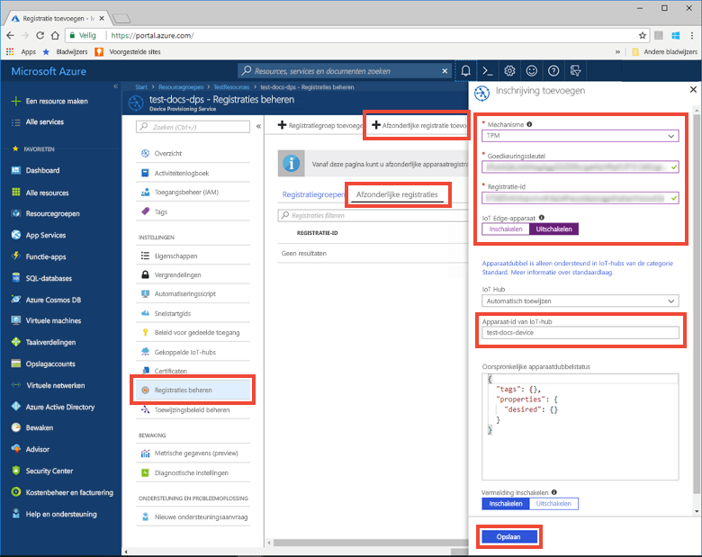

# <a name="create-and-provision-a-simulated-device-using-iot-hub-device-provisioning-service-preview"></a>Een gesimuleerd apparaat maken en inrichten met IoT Hub Device Provisioning Service (preview)

In deze stappen wordt getoond hoe u een gesimuleerd apparaat maakt op een ontwikkelcomputer met Windows OS, de Windows TPM-simulator uitvoert als de [HSM (Hardware Security Module)](https://azure.microsoft.com/blog/azure-iot-supports-new-security-hardware-to-strengthen-iot-security/) van het apparaat en het codevoorbeeld gebruikt om dit gesimuleerde apparaat te verbinden met Device Provisioning Service en uw IoT-hub. 

Voltooi de stappen in [IoT Hub Device Provisioning Service instellen](./quick-setup-auto-provision.md) voordat u verdergaat.

<a id="setupdevbox"></a>
## <a name="prepare-the-development-environment"></a>De ontwikkelomgeving voorbereiden 

1. Op uw computer moet Visual Studio 2015 of [Visual Studio 2017](https://www.visualstudio.com/vs/) zijn geïnstalleerd. 

2. Download en installeer het [CMake-bouwsysteem](https://cmake.org/download/).

3. Zorg ervoor dat `git` op de computer wordt geïnstalleerd en toegevoegd aan de omgevingsvariabelen die voor het opdrachtvenster toegankelijk zijn. Zie [Software Freedom Conservancy's Git client tools](https://git-scm.com/download/) (Git-clienthulpprogramma's van Software Freedom Conservancy) om de nieuwste versie van `git`-hulpprogramma's te installeren, waaronder **Git Bash**, de opdrachtregel-app die u kunt gebruiken voor interactie met de lokale Git-opslagplaats. 

4. Open een opdrachtprompt of Git Bash. Kloon het codevoorbeeld voor de GitHub-opslagplaats voor apparaatsimulatie:
    
    ```cmd/sh
    git clone https://github.com/Azure/azure-iot-sdk-c.git --recursive
    ```

5. Maak een map in de lokale kopie van deze GitHub-opslagplaats voor het CMake-bouwproces. 

    ```cmd/sh
    cd azure-iot-device-auth
    mkdir cmake
    cd cmake
    ```

6. In het codevoorbeeld wordt een Windows TPM-simulator gebruikt. Voer de volgende opdracht uit om SAS-tokenverificatie in te schakelen. Er wordt ook een Visual Studio-oplossing voor het gesimuleerde apparaat gegenereerd.

    ```cmd/sh
    cmake -Ddps_auth_type=tpm_simulator ..
    ```

7. Ga door middel van een aparte opdrachtprompt naar de hoofdmap van GitHub en voer de [TPM](https://docs.microsoft.com/windows/device-security/tpm/trusted-platform-module-overview)-simulator uit. Deze luistert via een socket op poorten 2321 en 2322. Sluit dit opdrachtvenster niet; de simulator moet actief blijven tot u deze Snelstartgids hebt voltooid. 

    ```cmd/sh
    .\azure-iot-device-auth\dps_client\deps\utpm\tools\tpm_simulator\Simulator.exe
    ```

## <a name="create-a-device-enrollment-entry-in-the-device-provisioning-service"></a>Een vermelding voor apparaatinschrijving maken in Device Provisioning Service

1. Open de in de map *cmake* gemaakt oplossing met de naam `azure_iot_sdks.sln` en bouw deze in Visual Studio.

2. Klik met de rechtermuisknop op het **tpm_device_provision**-project en selecteer **Set as Startup Project**. Voer de oplossing uit. In het uitvoervenster worden de voor apparaatinschrijving vereiste **_goedkeuringssleutel_** en **_registratie-id_** weergegeven. Noteer deze waarden. 

3. Meld u aan bij Azure Portal, klik in het linkermenu op de knop **All resources** en open uw Device Provisioning-service.

4. Selecteer **Manage enrollments** in de overzichtsblade van Device Provisioning Service. Selecteer het tabblad **Individual Enrollments** en klik bovenaan op de knop **Add**. Selecteer **TPM** als *mechanisme* voor identity attestation en voer de *Registration ID* en *Endorsement Key* in, zoals vereist door de blade. Klik op de knop **Save** als u klaar bent. 

      

   Als het apparaat is ingeschreven, wordt de *Registration ID* ervan weergegeven in de lijst onder het tabblad *Individual Enrollments*. 

<a id="firstbootsequence"></a>
## <a name="simulate-first-boot-sequence-for-the-device"></a>Eerste opstartvolgorde voor het apparaat simuleren

1. In Azure Portal selecteert u de blade **Overview** voor uw Device Provisioning-service en noteert u de waarden **_Global device endpoint_** en **_ID Scope_**.

     

2. Selecteer in Visual Studio op de computer het voorbeeldproject met de naam **dps_client_sample** en open het bestand **dps_client_sample.c**.

3. Wijs de waarde _ID Scope_ aan de `dps_scope_id`-variabele toe. De `dps_uri`-variabele heeft dezelfde waarde als _Global device endpoint_. 

    ```c
    static const char* dps_uri = "global.azure-devices-provisioning.net";
    static const char* dps_scope_id = "[DPS Id Scope]";
    ```

4. Klik met de rechtermuisknop op het **dps_client_sample**-project en selecteer **Set as Startup Project**. Voet het voorbeeld uit. De gegevens van uw IoT-hub leest u in de berichten die het opstarten van het apparaat en het verbinding maken met Device Provisioning Service simuleren. Als het gesimuleerde apparaat is ingericht met de IoT-hub die is gekoppeld met de provisioningservice, wordt de apparaat-id weergegeven op de blade **Device Explorer** van de hub. 

     


## <a name="clean-up-resources"></a>Resources opschonen

Als u wilt blijven doorwerken met het voorbeeld van de apparaatclient en deze beter wilt leren kennen, wis de resources die in deze Snelstartgids zijn gemaakt dan niet. Als u niet wilt doorgaan, gebruikt u de volgende stappen om alle resources die via deze Snelstartgids zijn gemaakt, te verwijderen.

1. Sluit het uitvoervenster van het voorbeeld van de apparaatclient op de computer.
1. Sluit het TPM-simulatorvenster op de computer.
1. Klik in het linkermenu in Azure Portal op **All resources** en selecteer uw Device Provisioning-service. Klik bovenaan de blade **All resources** op **Delete**.  
1. Klik in het linkermenu in Azure Portal op **All resources** en selecteer uw IoT-hub. Klik bovenaan de blade **All resources** op **Delete**.  

## <a name="next-steps"></a>Volgende stappen

In deze Snelstartgids hebt u een gesimuleerd TPM-apparaat op de computer gemaakt en het ingericht voor uw IoT-hub met Azure IoT Hub Device Provisioning Service. Voor meer informatie over device provisioning, gaat u verder met de zelfstudie voor het instellen van Device Provisioning Service in Azure Portal. 

> [!div class="nextstepaction"]
> [Zelfstudies over Azure IoT Hub Device Provisioning Service](./tutorial-set-up-cloud.md)

