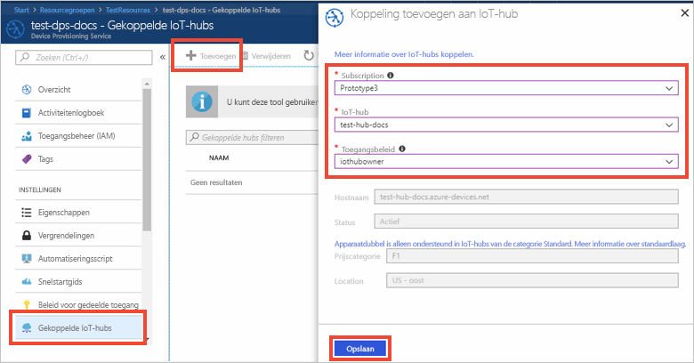

# IoT Hub Device Provisioning Service instellen met Azure Portal

Deze stappen laten zien hoe u de Azure-cloudresources in de portal instelt voor het inrichten van uw apparaten. Dit artikel omvat stappen voor het maken van uw IoT-hub, het maken van een nieuwe IoT Hub Device Provisioning Service en het aan elkaar koppelen van de twee services. 

Als u nog geen abonnement op Azure hebt, maak dan een [gratis account](https://azure.microsoft.com/free/?WT.mc_id=A261C142F) aan voordat u begint.

## Een IoT Hub maken

[!INCLUDE [iot-hub-quickstarts-create-hub](../../includes/iot-hub-quickstarts-create-hub.md)]

## Een nieuw exemplaar van de IoT Hub Device Provisioning Service maken

1. Klik op de knop **Een resource maken** in de linkerbovenhoek van Azure Portal.

2. *Zoek op de marketplace* naar de **Device Provisioning Service**. Selecteer **IoT Hub Device Provisioning Service** en klik op de knop **Maken**. 

3. Geef de volgende informatie op voor uw nieuwe exemplaar van de Device Provisioning Service en klik op **Maken**.

    * **Naam:** geef een unieke naam op voor uw nieuwe instantie van de Device Provisioning Service. Als de door u opgegeven naam beschikbaar is, verschijnt er een groen vinkje.
    * **Abonnement**: kies het abonnement dat u wilt gebruiken om deze instantie van de Device Provisioning Service te maken.
    * **Resourcegroep:** dit veld kunt u gebruiken om een nieuwe resourcegroep te maken of het nieuwe exemplaar aan een bestaande resourcegroep toe te voegen. Kies dezelfde resourcegroep als die de IoT-hub bevat die u hierboven hebt gemaakt, zoals **TestResources**. Door alle gerelateerde resources samen in een groep te plaatsen, kunt u ze samen beheren. Als u bijvoorbeeld de resourcegroep verwijdert, worden alle resources verwijderd die deze groep bevat. Zie [Resourcegroepen gebruiken om Azure-resources te beheren](../azure-resource-manager/resource-group-portal.md) voor meer informatie.
    * **Locatie**: selecteer de locatie die het dichtst bij uw apparaten in de buurt is.
    * **Vastmaken aan dashboard:** selecteer deze optie om het exemplaar vast te maken aan uw dashboard, zodat u het exemplaar eenvoudiger kunt vinden.

      

4. Zodra de service is geïmplementeerd, wordt de blade samenvatting automatisch geopend.

## De IoT-hub en uw Device Provisioning Service koppelen

In deze sectie voegt u een configuratie toe aan het Device Provisioning Service-exemplaar. Deze configuratie bepaalt welke IoT-hub wordt ingericht voor welke apparaten.

1. Klik op de knop **Alle resources** in het menu links in de Azure Portal. Selecteer het Device Provisioning Service-exemplaar dat u in de voorgaande sectie hebt gemaakt.  

2. Selecteer **Gekoppelde IoT-hubs** in de overzichtsblade van de Device Provisioning Service. Klik op de knop **+ Toevoegen** bovenaan. 

3. Geef, op de pagina **Koppeling toevoegen aan IoT-hub**, de volgende informatie op om uw nieuwe instantie van de Device Provisioning Service te koppelen aan een IoT-hub. Klik vervolgens op **Opslaan**. 

    * **Abonnement:** selecteer het abonnement dat de IoT-hub bevat die u wilt koppelen aan uw nieuwe Device Provisioning Service-exemplaar.
    * **IoT-hub:** selecteer de IoT-hub die u wilt koppelen aan uw nieuwe Device Provisioning Service-exemplaar.
    * **Toegangsbeleid:** selecteer **iothubowner** als de referenties om de koppeling met de IoT-hub tot stand te brengen.  

      

3. Nu ziet u de geselecteerde hub onder de blade **Gekoppelde IoT-hubs**. Mogelijk moet u op **Vernieuwen** klikken om **Gekoppelde IoT-hubs** weer te geven.

## Resources opschonen

Andere Quick Starts in deze verzameling zijn op deze Quick Start gebaseerd. Als u van plan bent om door te gaan met andere snelstartgidsen of met de zelfstudies, verwijdert u de resources die u in deze snelstartgids hebt gemaakt niet. Als u niet wilt doorgaan, gebruikt u de volgende stappen om alle resources te verwijderen die tijdens deze snelstartgids in de Azure Portal zijn gemaakt.

1. Klik in het linkermenu in de Azure Portal op **Alle resources** en selecteer uw Device Provisioning Service. Klik bovenaan de blade **Alle resources** op **Verwijderen**.  
2. Klik in het linkermenu in de Azure Portal op **Alle resources** en selecteer vervolgens uw IoT-hub. Klik bovenaan de blade **Alle resources** op **Verwijderen**.  

## Volgende stappen

In deze snelstart hebt u een IoT-hub en een Device Provisioning Service-exemplaar geïmplementeerd en de twee resources gekoppeld. Als u wilt weten hoe u deze instellingen gebruikt voor het inrichten van een gesimuleerd apparaat, gaat u verder met de rest van de snelstartgids voor het maken van een gesimuleerd apparaat.

> [!div class="nextstepaction"]
> [Snelstartgids voor het maken van een gesimuleerd apparaat](./quick-create-simulated-device.md)
