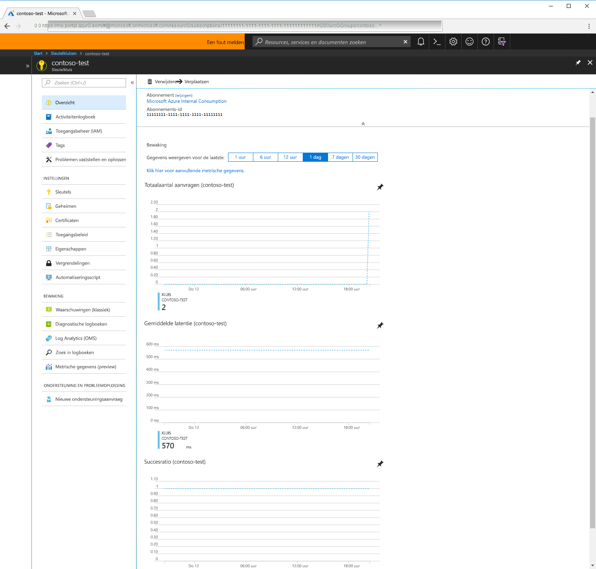

# Wat is Azure Sleutelkluis?

Azure Key Vault is een cloudservice die werkt als een beveiligd geheimenarchief.

U hebt wachtwoorden, verbindingsreeksen en andere stukjes informatie die nodig zijn om uw toepassingen aan de praat te houden. U wilt ervoor zorgen dat deze informatie niet alleen beschikbaar, maar ook beveiligd is. En daar biedt Azure Key Vault uitkomst. Azure Key Vault kan u helpen bij het veilig opslaan en beheren van toepassingsgeheimen.

Met Key Vault kunt u meerdere beveiligde containers maken, die kluizen worden genoemd. Deze kluizen worden ondersteund door hardware security modules (HSM's). Kluizen verminderen de kans op onbedoeld verlies van beveiligingsinformatie door de opslag van toepassingsgeheimen te centraliseren. Sleutelkluizen regelen en registreren ook de toegang tot alles wat erin is opgeslagen. Azure Key Vault kan het aanvragen en vernieuwen van Transport Layer Security-certificaten (TLS) verwerken, met behulp van de functies die vereist zijn voor een robuuste oplossing voor het beheren van de levenscyclus van certificaten.

 Azure Key Vault is ontworpen ter ondersteuning van toepassingssleutels en -geheimen. Key Vault is niet bedoeld als archief voor wachtwoorden van gebruikers.

## Waarom zou ik Azure Key Vault gebruiken?

### Toepassingsgeheimen centraliseren

Door de opslag van toepassingsgeheimen te centraliseren in Azure Key Vault kunt u de verdeling ervan bepalen. Dat vermindert aanzienlijk de kans dat geheimen per ongeluk worden gelekt. Bij gebruik van Key Vault hoeven ontwikkelaars van toepassingen geen beveiligingsinformatie meer in de toepassing zelf op te slaan. Daardoor hoeft deze informatie geen deel van de code uit te maken. Een toepassing wil bijvoorbeeld verbinding maken met een database. In plaats van de verbindingsreeks op te slaan in de app-codes, bewaart u deze veilig in Key Vault.

Uw toepassingen hebben veilig toegang tot de gegevens die ze nodig hebben door gebruik te maken van URI's waarmee ze specifieke versies van een geheim kunnen ophalen nadat de sleutel of het geheim van de toepassing is opgeslagen in Azure Key Vault. Dit gebeurt zonder dat u aangepaste code moet schrijven om de geheime informatie te beveiligen.

### Geheimen veilig opslaan

Sleutels worden beveiligd door Azure. Hiervoor wordt gebruikgemaakt van algoritmen, sleutellengten en HSM's die voldoen aan de industriestandaard. De gebruikte HSM's zijn Federal Information Processing Standards (FIPS) 140-2 Level 2 gevalideerd.

Voor toegang tot een sleutelkluis is de juiste verificatie en autorisatie vereist voordat een aanroeper (gebruiker of toepassing) toegang kan krijgen. Met verificatie wordt de identiteit van de aanroeper vastgesteld, terwijl autorisatie bepaalt welke bewerkingen de aanroeper mag uitvoeren.

Verificatie wordt uitgevoerd via Azure Active Directory. Autorisatie kan worden uitgevoerd via op rollen gebaseerd toegangsbeheer (RBAC) of Key Vault-toegangsbeleid. RBAC wordt gebruikt bij het beheren van de kluizen. Toegangsbeleid tot sleutelkluizen wordt gebruikt bij pogingen om toegang te krijgen tot gegevens in een kluis.

Sleutelkluizen van Azure kunnen software- of hardware-HSM beveiligd zijn. Voor situaties waar extra zekerheid is vereist, kunt u sleutels in HSM's (Hardware Security Modules) importeren of genereren die nooit verdergaan dan de HSM-grens. Microsoft gebruikt Thales-hardwarebeveiligingsmodules. U kunt Thales-hulpprogramma's gebruiken om een sleutel te verplaatsen van uw HSM naar Azure Key Vault.

Tot slot is Azure Key Vault zodanig ontworpen dat Microsoft uw sleutels niet kan zien of extraheren.

### Toegang tot en gebruik van controles

Nadat u enkele sleutelkluizen hebt gemaakt, kunt u controleren hoe en wanneer er toegang tot uw sleutels en geheimen is gezocht. U kunt dit doen door registratie voor Key Vault in te schakelen. U kunt Azure Key Vault voor het volgende configureren:

- Archiveren naar een opslagaccount.
- Streamen naar een Event Hub.
- De logboeken verzenden naar Log Analytics.

U hebt de controle over uw logboeken en kunt ze beveiligen door de toegang te beperken. Bovendien kunt u logboeken verwijderen die u niet meer nodig hebt.

### Vereenvoudigd beheer van toepassingsgeheimen

Bij het opslaan van waardevolle gegevens moet u verschillende stappen uitvoeren. Beveiligingsinformatie moet worden beschermd, moet een bepaalde levenscyclus volgen en moet maximaal beschikbaar zijn. Azure Key Vault vereenvoudigt veel hiervan door:

- Het elimineren van de noodzaak van interne kennis van HSM's.
- Het op korte termijn omhoog schalen om de gebruikspieken van uw organisatie aan te kunnen.
- Het repliceren van de inhoud van uw Key Vault binnen een regio en naar een secundaire regio. Dat zorgt voor een maximale beschikbaarheid en de beheerder hoeft geen actie te ondernemen om de failover te activeren.
- Het bieden van standaard Azure-beheeropties via de portal, Azure CLI en PowerShell.
- Het automatiseren van bepaalde taken voor certificaten die u aanschaft bij openbare CA's, zoals registreren en verlengen.

Bovendien kunt u met sleutelkluizen van Azure toepassingsgeheimen van elkaar scheiden. Toepassingen krijgen alleen toegang tot de kluis die ze mogen benaderen en ze mogen alleen specifieke bewerkingen uitvoeren. U kunt een Azure-sleutelkluis per toepassing maken en de geheimen die in een bepaalde sluitelkleus zijn opgeslagen beperken tot een specifieke toepassing en team van ontwikkelaars.

### Integreren met andere Azure-services

Als een beveiligd archief in Azure wordt Key Vault gebruikt voor het vereenvoudigen van scenario's zoals [Azure Disk Encryption](../security/azure-security-disk-encryption.md), de [altijd versleuteld]( https://docs.microsoft.com/sql/relational-databases/security/encryption/always-encrypted-database-engine)-functionaliteit in SQL Server en Azure SQL [Azure-web-apps]( https://docs.microsoft.com/azure/app-service/web-sites-purchase-ssl-web-site). Key Vault zelf kan worden geïntegreerd met opslagaccounts, Event Hubs en Log Analytics.

## Volgende stappen

- [Snelstart: Een Azure-sleutelkluis maken met behulp van de CLI](quick-create-cli.md)
- [Een Azure-webtoepassing configureren zodat deze een geheim vanuit een sleutelkluis kan lezen](tutorial-web-application-keyvault.md)