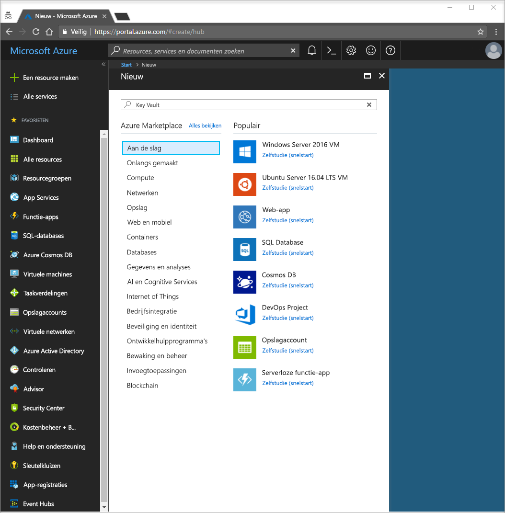
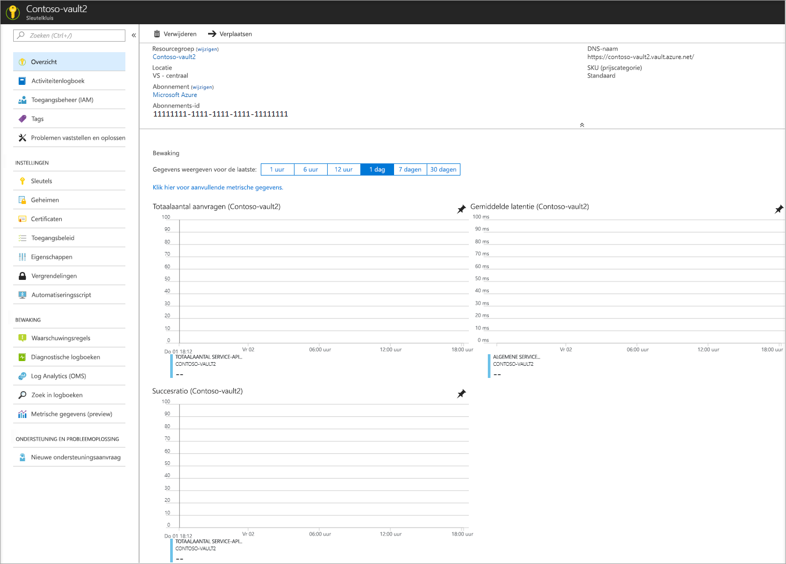

# Snelstart: Een geheim uit Azure Key Vault instellen en ophalen met behulp van de Azure Portal

Azure Key Vault is een cloudservice die werkt als een beveiligd geheimenarchief. U kunt veilig sleutels, wachtwoorden, certificaten en andere geheime informatie opslaan. U kunt het [Overzicht](key-vault-overview.md) raadplegen voor meer informatie over Key Vault. Azure-sleutelkluizen kunnen worden gemaakt en beheerd via Azure Portal. In deze snelstart maakt u een sleutelkluis. Nadat u dat hebt gedaan, gaat u een geheim opslaan.

Als u nog geen abonnement op Azure hebt, maak dan een [gratis account](https://azure.microsoft.com/free/?WT.mc_id=A261C142F) aan voordat u begint.

## Aanmelden bij Azure

Meld u aan bij Azure Portal op http://portal.azure.com.

## Een kluis maken

1. Selecteer de optie **Een resource maken** in de linkerbovenhoek van Azure Portal

    
2. Typ **Sleutelkluis** in het zoekvak.
3. Kies **Sleutelkluis** in de lijst met resultaten.
4. Kies **Maken** in de sectie Sleutelkluis.
5. Geef in de sectie **Sleutelkluis maken** de volgende gegevens op:
    - **Naam:** voor deze snelstart gebruiken we **Contoso-vault2**. U moet in de test een unieke naam opgeven.
    - **Abonnement**: kies het abonnement dat u wilt gebruiken voor deze snelstart.
    - Kies **Nieuw** bij **Resourcegroep** en voer de naam van een resourcegroep in.
    - Kies een locatie in de vervolgkeuzelijst **Locatie**.
    - Schakel het selectievakje bij **Vastmaken aan dashboard** in.
    - Houd voor de overige opties de standaardwaarden aan.
6. Selecteer na het opgeven van de bovenstaande gegevens **Maken**.

Let op de onderstaande twee eigenschappen:

* **Kluisnaam**: in het voorbeeld is dat **Contoso-Vault2**. U gebruikt deze naam voor andere stappen.
* **Kluis-URI**: in het voorbeeld is dat https://contoso-vault2.vault.azure.net/. Toepassingen die via de REST API gebruikmaken van uw kluis, moeten deze URI gebruiken.

Vanaf dit punt is uw Azure-account nu als enige gemachtigd om bewerkingen op deze nieuwe kluis uit te voeren.

## Een geheim toevoegen aan Key Vault

Als u een geheim wilt toevoegen aan de kluis, hoeft u maar een paar extra stappen uit te voeren. In dit geval voegen we een wachtwoord toe dat door een toepassing kan worden gebruikt. Het wachtwoord is **ExamplePassword** en we slaan de waarde van **Pa$$w0rd** hier in op.

1. Selecteer op de eigenschappenpagina van de sleutelkluis **Geheimen**.
2. Klik op **Genereren/importeren**.
3. Kies in het scherm **Een geheim maken** het volgende:
    - **Uploadopties**: Handmatig.
    - **Naam**: ExamplePassword.
    - **Waarde**: Pa$$w0rd.
    - Houd voor de overige waarden de standaardwaarden aan. Klik op **Create**.

Zodra u het bericht ontvangt dat het geheim met succes is gemaakt, kunt u erop klikken in de lijst. Vervolgens ziet u enkele van de eigenschappen. Als u op de huidige versie klikt, ziet u de waarde die u hebt opgegeven in de vorige stap.

## Resources opschonen

Andere Key Vault-snelstarts en zelfstudies bouwen voort op deze snelstart. Als u van plan bent om verder te gaan met volgende snelstarts en zelfstudies, kunt u deze resources intact laten.
Als u die niet meer nodig hebt, verwijdert u de resourcegroep; hierdoor worden ook de sleutelkluis en de gerelateerde resources verwijderd. De resourcegroep verwijderen via de portal:

1. Voer de naam van uw resourcegroep in het vak Zoeken bovenaan de portal in. Wanneer u de in deze snelstart gebruikte resourcegroep in de zoekresultaten ziet, selecteert u deze.
2. Selecteer **Resourcegroep verwijderen**.
3. Typ in het vak **TYP DE NAAM VAN DE RESOURCEGROEP** de naam van de resourcegroep en selecteer **Verwijderen**.

## Volgende stappen

In deze snelstart hebt u een sleutelkluis gemaakt en een geheim opgeslagen. Meer informatie over Key Vault en hoe u dat kunt gebruiken samen met uw toepassingen is te vinden in de zelfstudie voor webtoepassingen die geschikt zijn voor Key Vault.

> [!div class="nextstepaction"]
> Ga door met de volgende zelfstudie [Een Azure-webtoepassing configureren om een Key Vault-geheim te lezen](quick-create-net.md) voor informatie over het lezen van een Key Vault-geheim van een webtoepassing met behulp van beheerde service-id’s.
