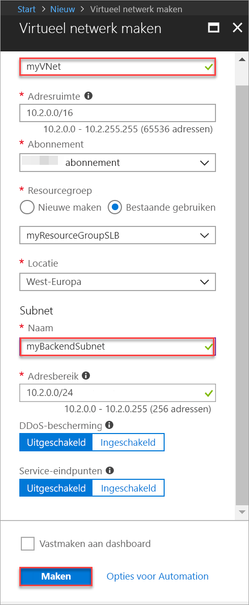
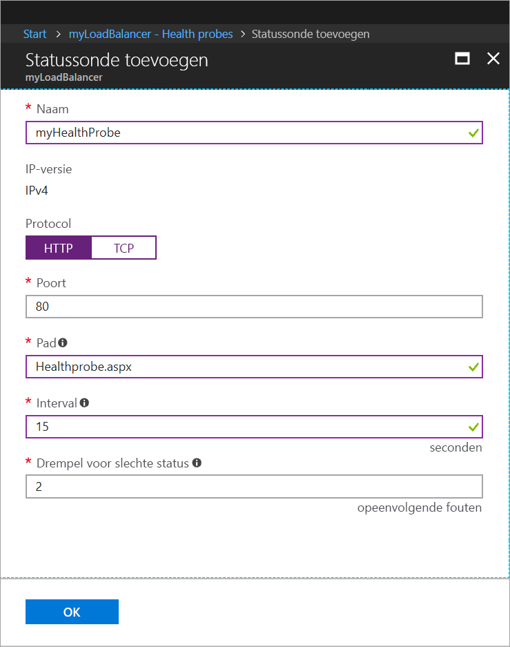
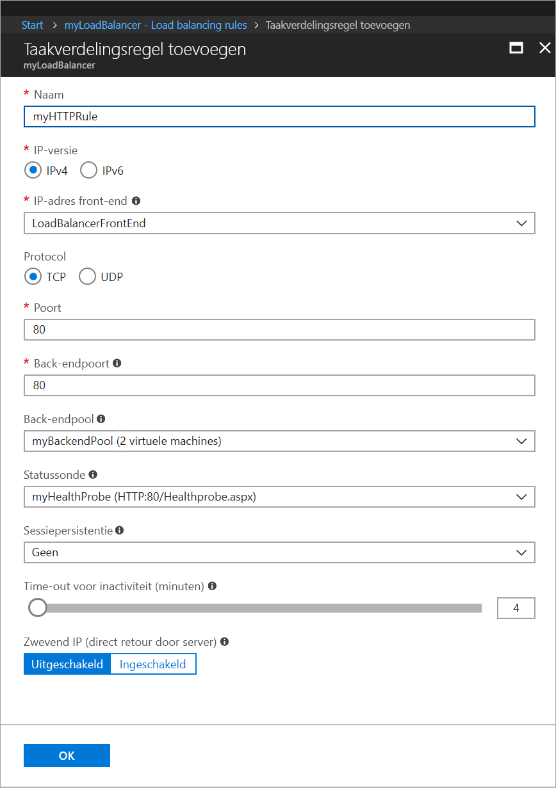
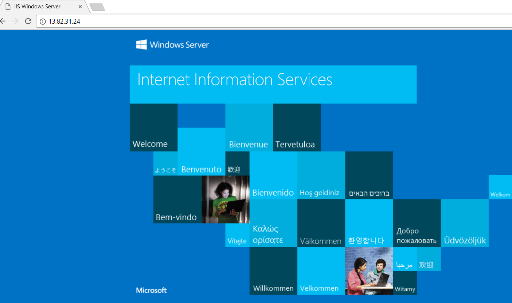

# Snelstart: Een standaard load balancer maken om taken van VM's te verdelen via Azure Portal

Taakverdeling zorgt voor een hogere beschikbaarheid en betere schaalbaarheid door binnenkomende aanvragen te spreiden over meerdere virtuele machines. U kunt in Azure Portal een load balancer maken om taken van virtuele machines (VM's) te verdelen. In deze snelstart wordt getoond hoe u taken van VM's kunt verdelen met een Standard Load Balancer.

Als u nog geen abonnement op Azure hebt, maak dan een [gratis account](https://azure.microsoft.com/free/?WT.mc_id=A261C142F) aan voordat u begint. 

## Meld u aan bij Azure.

Meld u aan bij de Azure-portal op [http://portal.azure.com](http://portal.azure.com).

## Openbare load balancer maken

In deze sectie maakt u een openbare load balancer die helpt bij het laden van virtuele machines. Standard Load Balancer biedt alleen ondersteuning voor een standaard, openbaar IP-adres. Als u een Standard Load Balancer maakt, moet u ook een nieuw, standaard, openbaar IP-adres maken dat als de front-end (standaard *LoadBalancerFrontend* genoemd) wordt geconfigureerd voor de Standard Load Balancer. 

1. Klik linksboven in het scherm op **Een resource maken** > **Netwerken** > **Load balancer**.
2. Voer op de pagina **Een load balancer maken** deze waarden in voor de load balancer:
    - *myLoadBalancer* als naam van de load balancer.
    - **Openbaar** als het type load balancer.
     - *myPublicIP* voor het **nieuwe**, openbare IP-adres dat u maakt.
    - *myResourceGroupSLB* als naam van de **nieuwe** resourcegroep die u wilt maken.
    - **westeurope** als locatie.
3. Klik op **Maken** om de load balancer te maken.
   
    

## Back-endservers maken

In deze sectie maakt u een virtueel netwerk, twee virtuele machines voor de back-endpool van de load balancer en installeert u IIS op de virtuele machines om de load balancer te testen.

### Een virtueel netwerk maken
1. Klik linksboven in het scherm op **Nieuw** > **Netwerken** > **Virtueel netwerk** en voer deze waarden in voor het virtuele netwerk:
    - *myVnet* als naam van het virtuele netwerk.
    - *myResourceGroupSLB* als naam van de bestaande resourcegroep
    - *myBackendSubnet* als naam van het subnet.
2. Klik op **Maken** om het virtuele netwerk te maken.

    

### Virtuele machines maken

1. Klik linksboven in het scherm op **Nieuw** > **Compute** > **Windows Server 2016 Datacenter** en voer deze waarden in voor de virtuele machine:
    - *myVM1* als naam van de virtuele machine.        
    - *azureuser* als gebruikersnaam van de beheerder.    
    - *myResourceGroupSLB*: voor **Resource group** selecteert u **Bestaande gebruiken** en vervolgens *myResourceGroupSLB*.
2. Klik op **OK**.
3. Selecteer **DS1_V2** als grootte van de virtuele machine en klik op **Selecteren**.
4. Voer deze waarden in voor de instellingen van de VM:
    - *myAvailabilitySet* als naam van de nieuwe beschikbaarheidsset die u maakt.
    -  *myVNet*: controleer of dit als virtueel netwerk is geselecteerd.
    - *myBackendSubnet*: controleer of dit als subnet is geselecteerd.
    - *myNetworkSecurityGroup* als naam van de nieuwe netwerkbeveiligingsgroep (firewall) die u moet maken.
5. Klik op **Uitgeschakeld** om diagnostische gegevens over opstarten uit te schakelen.
6. Klik op **OK** om de instellingen op de overzichtspagina te controleren en klik op **Maken**.
7. Maak een tweede VM met de naam *VM2*, met *myAvailibilityset* als beschikbaarheidsset, *myVnet* als het virtuele netwerk, *myBackendSubnet* als het subnet en**myNetworkSecurityGroup* als de netwerkbeveiligingsgroep via stap 1 t/m 6. 

### NSG-regels maken

In deze sectie maakt u NSG-regels om inkomende verbindingen via HTTP en RDP toe te staan.

1. Klik in het linkermenu op **Alle resources** en klik in de lijst met resources op **myNetworkSecurityGroup**, die zich in de resourcegroep **myResourceGroupSLB** bevindt.
2. Klik onder **Instellingen** op **Inkomende beveiligingsregels** en vervolgens op **Toevoegen**.
3. Voer deze waarden in voor de inkomende beveiligingsregel met de naam *myHTTPRule* om een binnenkomende HTTP-verbinding via poort 80 toe te staan:
    - *Service Tag* bij **Bron**.
    - *Internet* bij **Bronservicetag**
    - *80* bij **Poortbereiken van doel**
    - *TCP* bij **Protocol**
    - *Allow* bij **Actie**
    - *100* bij **Prioriteit**
    - *myHTTPRule* als naam
    - *Allow HTTP* als beschrijving
4. Klik op **OK**.
 
 
5. Herhaal stap 2 t/m 4 om nog een regel te maken (*myRDPRule*) om een binnenkomende RDP-verbinding toe te staan via poort 3389 met de volgende waarden:
    - *Service Tag* bij **Bron**.
    - *Internet* bij **Bronservicetag**
    - *3389* bij **Poortbereiken van doel**
    - *TCP* bij **Protocol**
    - *Allow* bij **Actie**
    - *200* bij **Prioriteit**
    - *myRDPRule* als naam
    - *Allow RDP* als beschrijving

### IIS installeren

1. Klik in het linkermenu op **Alle resources** en klik in de lijst met resources op **myVM1**, die zich in de resourcegroep *myResourceGroupLB* bevindt.
2. Klik op de pagina **Overzicht** op **Verbinding maken** om extern verbinding te maken met de VM.
3. Meld u aan bij de VM met gebruikersnaam *azureuser*.
4. Ga op de serverdesktop naar **Windows Systeembeheer**>**Serverbeheer**.
5. Klik in Serverbeheer op **Rollen en functies toevoegen**.
6. Gebruik in de **wizard Rollen en functies toevoegen** de volgende waarden:
    - Klik op de pagina **Type installatie selecteren** op **Installatie die op de functie of het onderdeel is gebaseerd**.
    - Klik op de pagina **De doelserver selecteren** op **myVM1**
    - Klik op de pagina **Een serverfunctie selecteren** op **Webserver (IIS)**
    - Volg de aanwijzingen om de rest van de wizard te voltooien 
7. Herhaal stap 1 t/m 6 voor virtuele machine *myVM2*.

## Resources voor load balancer maken

In deze sectie configureert u de instellingen voor de load balancer voor een back-endadresgroep en een statustest en geeft u regels voor de load balancer en NAT-regels op.

### Een back-endadresgroep maken

Om verkeer te distribueren naar de VM's bevat een back-end-adresgroep de IP-adressen van de virtuele netwerkinterfacekaarten (NIC's) die zijn verbonden met de load balancer. Maak de back-endadresgroep *myBackendPool* om *VM1* en *VM2* op te nemen.

1. Klik in het linkermenu op **Alle resources** en vervolgens in de lijst met resources op **myLoadBalancer**.
2. Klik onder **Instellingen** op **Back-endpools** en vervolgens op **Toevoegen**.
3. Ga als volgt te werk op de pagina **Een back-endpool toevoegen**:
    - Typ *myBackEndPool voor de naam van uw back-endpool.
    - Klik voor **Gekoppeld aan** in de vervolgkeuzelijst op **Beschikbaarheidsset**
    - Klik voor **Beschikbaarheidsset** op **myAvailabilitySet**.
    - Klik op **Een doelnetwerk-IP-configuratie toevoegen** om elke virtuele machine die u hebt gemaakt (*myVM1* & *myVM2*), toe te voegen aan de back-endpool.
    - Klik op **OK**.

    

3. Controleer of de instelling voor de back-endpool van de load balancer beide VM's (**VM1** en **VM2**) weergeeft.

### Een statustest maken

U gebruikt een statustest om de load balancer de status van uw app te laten bewaken. De statustest voegt dynamisch VM's toe aan de load balancer-rotatie of verwijdert ze, op basis van hun reactie op statuscontroles. Maak een statustest (*myHealthProbe*) om de status van de VM's te bewaken.

1. Klik in het linkermenu op **Alle resources** en vervolgens in de lijst met resources op **myLoadBalancer**.
2. Klik onder **Instellingen** op **Tests** en klik op **Toevoegen**.
3. Gebruik deze waarden om de statustest te maken:
    - *myHealthProbe* als naam van de statustest.
    - **HTTP** als protocoltype.
    - *80* als poortnummer.
    - *15* als **interval** in seconden tussen tests.
    - *2* als aantal **drempelwaarden voor onjuiste status** of opeenvolgende mislukte tests dat moet optreden voordat wordt besloten dat een VM een onjuiste status heeft.
4. Klik op **OK**.

   

### Een load balancer-regel maken

Een load balancer-regel wordt gebruikt om de verdeling van het verkeer over de VM's te definiëren. U definieert de front-end-IP-configuratie voor het inkomende verkeer en de back-end-IP-groep om het verkeer te ontvangen, samen met de gewenste bron- en doelpoort. Maak de regel *myLoadBalancerRuleWeb* voor de load balancer voor het luisteren naar poort 80 in de front-end *FrontendLoadBalancer* en het verzenden van netwerkverkeer met gelijke taakverdeling naar de back-endadresgroep *myBackEndPool* waarbij ook van poort 80 gebruik wordt gemaakt. 

1. Klik in het linkermenu op **Alle resources** en vervolgens in de lijst met resources op **myLoadBalancer**.
2. Klik onder **Instellingen** op **Taakverdelingsregels** en vervolgens op **Toevoegen**.
3. Gebruik deze waarden om de taakverdelingsregel te configureren:
    - *myHTTPRule* als naam van de taakverdelingsregel.
    - **TCP** als protocoltype.
    - *80* als poortnummer.
    - *80* als back-endpoort.
    - *myBackendPool* als naam van de back-endpool.
    - *myHealthProbe* als naam van de statustest.
4. Klik op **OK**.
    
    

## Load balancer testen
1. Zoek op het scherm **Overzicht** het openbare IP-adres voor de load balancer. Klik op **Alle resources** en vervolgens op **myPublicIP**.

2. Kopieer het openbare IP-adres en plak het in de adresbalk van de browser. De standaardpagina van IIS-webserver wordt weergegeven in de browser.

      

## Resources opschonen

Verwijder de resourcegroep, de load balancer en alle gerelateerde resources, wanneer u deze niet meer nodig hebt. Selecteer hiertoe de resourcegroep met de load balancer en klik op **Verwijderen**.

## Volgende stappen

In deze snelstart hebt u een standaard Load Balancer gemaakt, VM's daaraan gekoppeld, een regel voor het Load Balancer-verkeer geconfigureerd, een statustest gemaakt en vervolgens de load balancer getest. Voor meer informatie over Azure Load Balancer gaat u verder met de zelfstudies voor Azure Load Balancer.

> [!div class="nextstepaction"]
> [Zelfstudies voor Azure Load Balancer](tutorial-load-balancer-standard-public-zone-redundant-portal.md)
