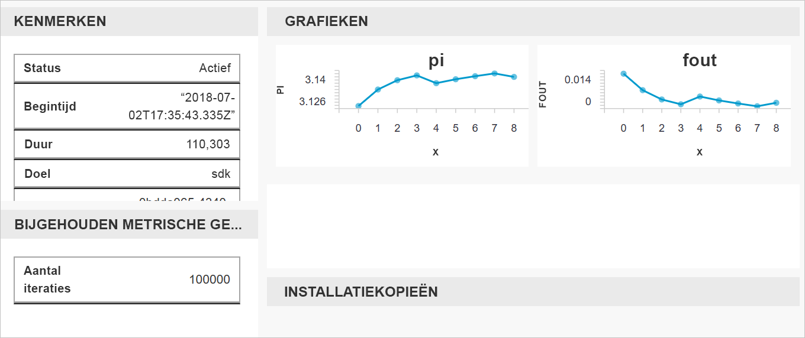

# <a name="quickstart-get-started-with-azure-machine-learning-using-the-cli-extension"></a>Snelstart: Aan de slag met de Azure Machine Learning-service met behulp van de Azure Machine Learning CLI-extensie

In deze snelstart gebruikt u een Machine Learning CLI-extensie om aan de slag te gaan met de [Azure Machine Learning-service](overview-what-is-azure-ml.md) (preview).

Met behulp van de CLI leert u het volgende:

1. Een werkruimte maken in uw Azure-abonnement. De werkruimte wordt gebruikt door een of meer gebruikers om hun rekenresources, modellen, implementaties en uitvoergeschiedenis in de cloud op te slaan.
1. Een project koppelen aan uw werkruimte.   Een project is een lokale map die de scripts en configuratiebestanden bevat die nodig zijn om uw machine learning-probleem op te lossen.  
1. Een Python-script uitvoeren in uw project dat sommige waarden voor meerdere iteraties vastlegt.
1. De vastgelegde waarden in de uitvoeringsgeschiedenis van uw werkruimte bekijken.

> [!NOTE]
> Om het u gemakkelijk te maken, worden de volgende Azure-resources automatisch toegevoegd aan uw werkruimte wanneer deze regionaal beschikbaar zijn: [containerregister](https://azure.microsoft.com/services/container-registry/), [opslag](https://azure.microsoft.com/services/storage/), [toepassingsinzichten](https://azure.microsoft.com/services/application-insights/) en [sleutelkluis](https://azure.microsoft.com/services/key-vault/).

De resources die u maakt, kunnen worden gebruikt als de vereisten voor andere Azure Machine Learning-zelfstudies en artikelen met procedures.

Deze CLI is ontwikkeld op de op Python gebaseerde <a href="http://aka.ms/aml-sdk" target="_blank">SDK</a> voor de Azure Machine Learning-service.

## <a name="prerequisites"></a>Vereisten

Zorg er voordat u aan de stappen van de snelstart begint voor dat u aan de volgende vereisten voldoet:

+ Een Azure-abonnement. Als u nog geen abonnement op Azure hebt, maak dan een [gratis account](https://azure.microsoft.com/free/?WT.mc_id=A261C142F) aan voordat u begint.
+ [Python 3.5 of hoger](https://www.python.org/) is geïnstalleerd
+ [Azure CLI](https://docs.microsoft.com/cli/azure/install-azure-cli?view=azure-cli-latest) is geïnstalleerd

## <a name="install-the-cli-extension"></a>De CLI-extensie installeren

Op uw computer een opdrachtregeleditor en installeer [de machine learning-extensie van Azure CLI](reference-azure-machine-learning-cli.md).  De installatie kan enkele minuten duren.

```azurecli
az extension add azureml-sdk
```

## <a name="install-the-sdk"></a>De SDK installeren

[!INCLUDE [aml-install-sdk](../../../includes/aml-install-sdk.md)]

## <a name="create-a-resource-group"></a>Een resourcegroep maken

Een resourcegroep is een container met gerelateerde resources voor een Azure-oplossing. Meld u met behulp van Azure CLI aan bij Azure, geef het abonnement op en maak een resourcegroep.

Meld u in een opdrachtregelvenster aan met de Azure CLI-opdracht, `az login`. Volg de aanwijzingen voor interactieve aanmelding:
    
   ```azurecli
   az login
   ```

Geef een lijst weer van de beschikbare Azure-abonnementen, en geef het abonnement op dat u wilt gebruiken:
   ```azurecli
   az account list --output table
   az account set --subscription <your-subscription-id>
   az account show
   ```
   waar \<your-subscription-id\> de ID-waarde is voor het abonnement dat u wilt gebruiken. Gebruik de haakjes niet.

Maak een resourcegroep voor het opslaan van uw werkruimte.
Voor deze snelstart geldt het volgende:
   + De naam van de resourcegroep is `docs-aml`.
   + De regio is `eastus2`. 

   ```azurecli
   az group create -n docs-aml -l eastus2
   ```

## <a name="create-a-workspace-and-a-project-folder"></a>Een werkruimte en een projectmap maken

Maak in het opdrachtregelvenster een Azure Machine Learning-werkruimte onder de resourcegroep.


   Voor deze snelstart geldt het volgende:
   + De werkruimtenaam is `docs-ws`.
   + De naam van de resourcegroep is `docs-aml`

   ```azurecli
   az ml workspace create -n docs-ws -g docs-aml
   ```

Maak in het opdrachtregelvenster een map op uw lokale computer voor uw Azure Machine Learning-project.

   ```
   mkdir docs-prj
   cd docs-prj
   ```

## <a name="create-a-python-script"></a>Een Python-script maken

[!INCLUDE [aml-create-script-pi](../../../includes/aml-create-script-pi.md)]

## <a name="run-the-script"></a>Het script uitvoeren

Voeg de map als project aan de werkruimte toe. Het argument `--history` geeft een naam op voor het uitvoeringsgeschiedenisbestand waarin de metrische gegevens voor elke uitvoering wordt vastgelegd.

   ```azurecli
   az ml project attach --history my_history -w docs-ws -g docs-aml
   ```

Voer het script uit op uw lokale computer.

   ```azurecli
   az ml run submit -c local pi.py
   ```

   Met deze opdracht wordt de code uitgevoerd en een webkoppeling naar uw console uitgevoerd. Kopieer de koppeling en plak deze in uw webbrowser.

Ga naar de URL in een webbrowser. Er wordt een webportal weergegeven met de resultaten van de uitvoering. U kunt de resultaten van deze uitvoering of eerdere uitvoeringen, indien aanwezig, controleren.

Het dashboard van de portal wordt alleen ondersteund in Edge, Chrome en Firefox.

   

## <a name="clean-up-resources"></a>Resources opschonen

[!INCLUDE [aml-delete-resource-group](../../../includes/aml-delete-resource-group.md)]

## <a name="next-steps"></a>Volgende stappen
U hebt nu de nodige resources gecreëerd om te gaan experimenteren en modellen te implementeren. U hebt ook een project gemaakt, een script uitgevoerd en de uitvoeringsgeschiedenis van het script bekeken.

Voor een diepgaande werkstroomervaring volgt u de zelfstudies over Azure Machine Learning om een ​​model te bouwen, te trainen en te implementeren.

> [!div class="nextstepaction"]
> [Zelfstudie: Bouwen, trainen en implementeren](tutorial-train-models-with-aml.md)