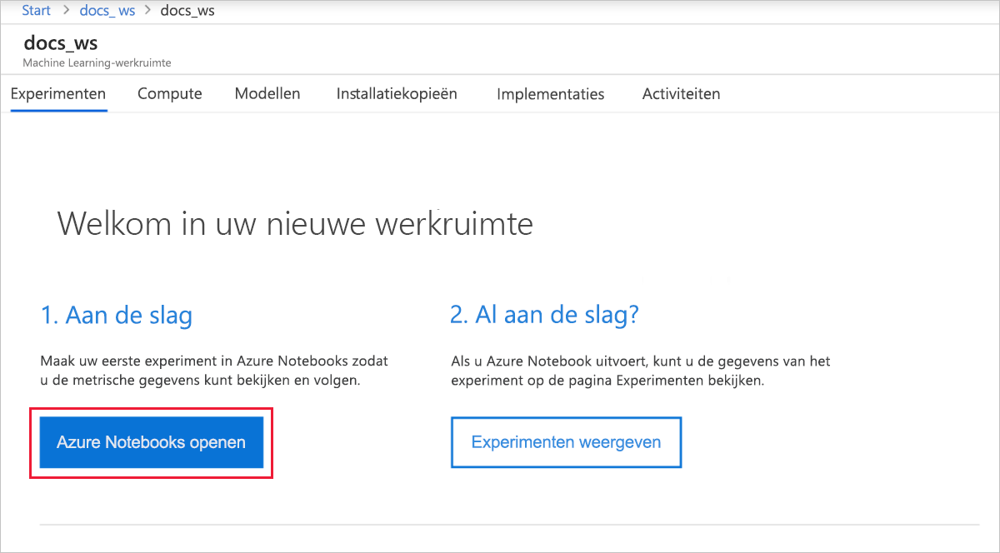
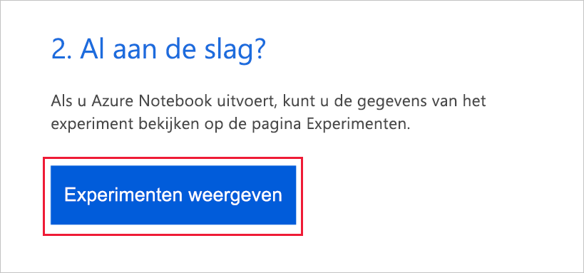
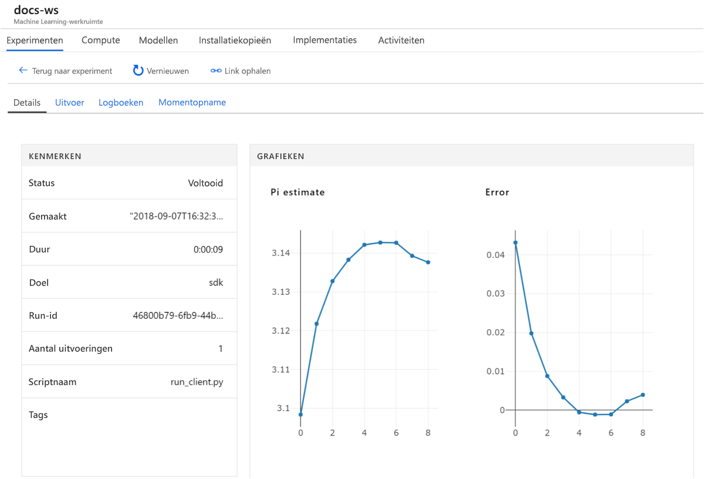

# <a name="quickstart-get-started-with-azure-machine-learning-service"></a>Snelstart: Aan de slag met de Azure Machine Learning-service

In deze snelstart leert u de Azure-portal gebruiken om een Azure Machine Learning-werkruimte te maken. Deze werkruimte is het basisblok in de cloud voor het experimenteren, trainen en implementeren van machine learning-modellen met de Azure Machine Learning-service. 

In deze zelfstudie leert u het volgende:

* Een werkruimte maken in uw Azure-abonnement
* Deze uitproberen met Python in een Azure Notebook en waarden vastleggen voor meerdere iteraties
* De vastgelegde waarden in uw werkruimte weergeven

Om het u gemakkelijk te maken, worden de volgende Azure-resources automatisch toegevoegd aan uw werkruimte wanneer deze regionaal beschikbaar zijn: [containerregister](https://azure.microsoft.com/services/container-registry/), [opslag](https://azure.microsoft.com/services/storage/), [toepassingsinzichten](https://azure.microsoft.com/services/application-insights/) en [sleutelkluis](https://azure.microsoft.com/services/key-vault/).

De resources die u maakt kunnen worden gebruikt als de vereisten voor andere Azure Machine Learning-zelfstudies en artikelen met procedures. Net als bij andere Azure-services gelden er beperkingen voor bepaalde resources (bijvoorbeeld voor BatchAI-clustergrootte) die zijn gekoppeld aan de Azure Machine Learning-service. Lees [dit](how-to-manage-quotas.md) artikel over de standaardlimieten en hoe u een groter quotum kunt aanvragen.

Als u nog geen abonnement op Azure hebt, maakt u een [gratis account](https://azure.microsoft.com/free/?WT.mc_id=A261C142F) aan voordat u begint.


## <a name="create-a-workspace"></a>Een werkruimte maken 

[!INCLUDE [aml-create-portal](../../../includes/aml-create-in-portal.md)]

Klik op de pagina van de werkruimte op `Explore your Azure Machine Learning Workspace`

 


## <a name="use-the-workspace"></a>De werkruimte gebruiken

Nu ziet u hoe u een werkruimte u helpt uw machine learning-scripts te beheren. In deze sectie doet u het volgende:

* Een notitieblok openen in Azure Notebooks
* Code uitvoeren die enkele vastgelegde waarden maakt
* De vastgelegde waarden in uw werkruimte weergeven

Dit is een voorbeeld van hoe de werkruimte u kan helpen bij het bijhouden van informatie die in een script wordt gegenereerd. 

### <a name="open-a-notebook"></a>Een notitieblok openen 

Azure Notebooks biedt een gratis cloudplatform voor Jupyter-notebooks, vooraf geconfigureerd met alles wat u nodig hebt om de Azure Machine Learning-service uit te voeren.  

Klik op de knop `Open Azure Notebooks` om uw eerste experiment te proberen.

 

Nadat u zich hebt aangemeld, wordt er een nieuw tabblad geopend en wordt er een `Clone Library`-prompt weergegeven.  Klik op `Clone`


### <a name="run-the-notebook"></a>Het notitieblok uitvoeren

U ziet twee notitieblokken en een `config.json`-bestand.  Dit configuratiebestand bevat informatie over de werkruimte die u zojuist hebt gemaakt.  

Klik op `01.run-experiment.ipynb` om het notitieblok te openen.

U kunt de cellen één voor één uitvoeren met behulp van `Shift`+`Enter`.  Of gebruik het menu `Cells` > `Run All` om het hele notitieblok uit te voeren.

U wordt mogelijk gevraagd om u aan te melden.  Kopieer de code in het bericht, klik op de koppeling en plak de code in het nieuwe venster.  Zorg ervoor dat u geen spatie voor of na de code kopieert.

 

In het notitieblok leest de tweede cel uit `config.json` om verbinding te maken met uw werkruimte.
```
ws = Workspace.from_config()
```

De derde codecel start een experiment met de naam "my-first-experiment".  U gebruikt deze naam om informatie over de run op te zoeken in uw werkruimte.

```
experiment = Experiment(workspace_object=ws, name = "my-first-experiment")
```

Let in de laatste cel op de waarden die naar een logboekbestand worden geschreven.

```
# Log final results
run.log("Final estimate: ",pi_estimate)
run.log("Final error: ",math.pi-pi_estimate)
```

U kunt deze waarden na het uitvoeren van de code weergeven in uw werkruimte.

## <a name="view-logged-values"></a>Logboekwaarden weergeven

Nadat alle cellen in het notitieblok zijn uitgevoerd, gaat u terug naar de portalpagina.  

Klik op `View Experiments`.



Sluit het pop-upvenster `Reports`.

Klik op `my-first-experiment`.

Bekijk de informatie over de uitvoering die u zojuist hebt uitgevoerd.  Blader naar beneden op de pagina om de tabel met uitvoeringen te vinden en klik op de koppeling met het nummer van de uitvoering.

 

U ziet plots die automatisch zijn gemaakt van de vastgelegde waarden:

   

## <a name="clean-up-resources"></a>Resources opschonen 

[!INCLUDE [aml-delete-resource-group](../../../includes/aml-delete-resource-group.md)]

U kunt ook de resource-groep behouden, maar één werkruimte verwijderen door de eigenschappen van de werkruimte weer te geven en de knop Delete (verwijderen) te selecteren.

## <a name="next-steps"></a>Volgende stappen

U hebt nu de nodige resources gecreëerd om te gaan experimenteren en modellen te implementeren. U hebt ook wat code in een notitieblok uitgevoerd en de uitvoeringsgeschiedenis van die code in uw werkruimte in de cloud onderzocht.

Voor een diepgaande werkstroomervaring volgt u de zelfstudies over Azure Machine Learning om een ​​model te trainen en te implementeren.  

> [!div class="nextstepaction"]
> [Zelfstudie: een model voor de classificatie van afbeeldingen trainen](tutorial-train-models-with-aml.md)
