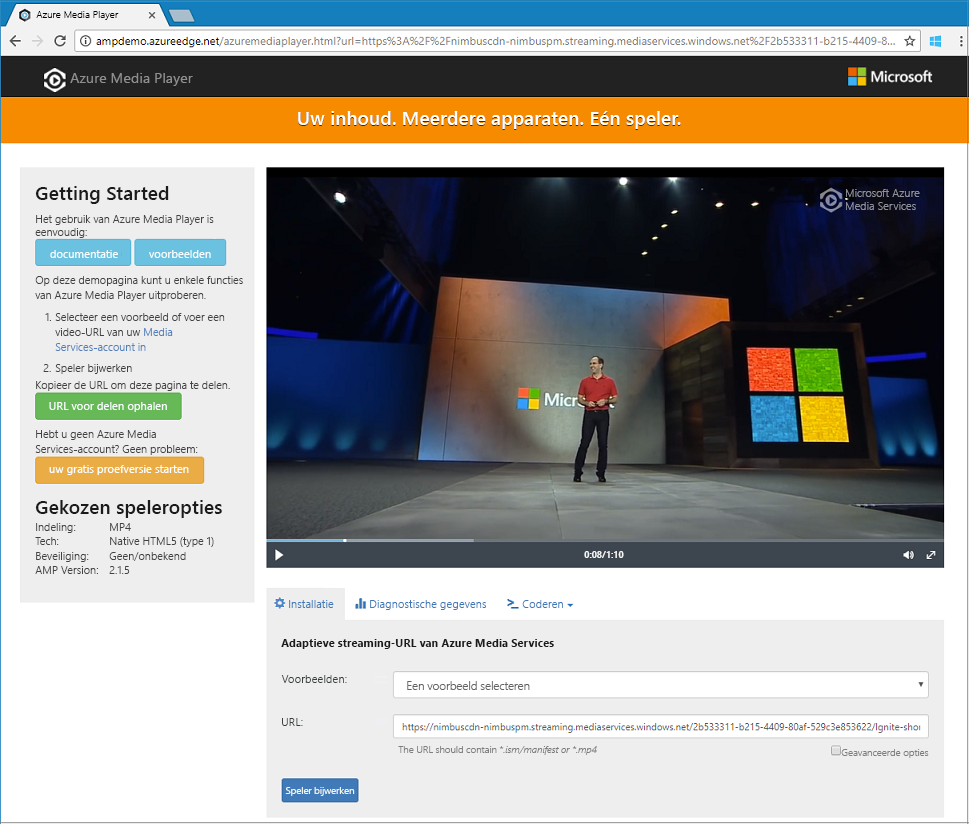

# <a name="quickstart-stream-video-files---net"></a>Snelstartgids: Videobestanden streamen - .NET

Deze snelstartgids laat zien hoe u met Azure Media Services eenvoudig video's kunt coderen en streamen naar allerlei verschillende browsers en apparaten. De invoerinhoud kan worden opgegeven met HTTPS-URL's, SAS-URL's of paden naar bestanden in Azure Blob-opslag.
Met het voorbeeld in dit onderwerp wordt inhoud gecodeerd die u toegankelijk maakt via een HTTPS-URL. Op dit moment biedt AMS v3 geen ondersteuning voor gesegmenteerde overdrachtscodering via HTTPS-URL's.

Als u deze snelstartgids hebt voltooid, weet u hoe u een video kunt streamen.  



[!INCLUDE [quickstarts-free-trial-note](../../../includes/quickstarts-free-trial-note.md)]

## <a name="prerequisites"></a>Vereisten

Als u niet beschikt over Visual Studio, kunt u [Visual Studio Community 2017](https://www.visualstudio.com/thank-you-downloading-visual-studio/?sku=Community&rel=15) downloaden.

## <a name="download-the-sample"></a>Het voorbeeld downloaden

Gebruik de volgende opdracht om een GitHub-opslagplaats te klonen op uw computer die het .NET-voorbeeld voor het streamen van video bevat:  

 ```bash
 git clone http://github.com/Azure-Samples/media-services-v3-dotnet-quickstarts.git
 ```

Het voorbeeld bevindt zich in de map [EncodeAndStreamFiles](https://github.com/Azure-Samples/media-services-v3-dotnet-quickstarts/tree/master/AMSV3Quickstarts/EncodeAndStreamFiles).

In het voorbeeld worden de volgende acties uitgevoerd:

1. Er wordt een transformatie gemaakt (eerst wordt gecontroleerd of de opgegeven transformatie bestaat). 
2. Er wordt een uitvoerasset gemaakt die wordt gebruikt als de uitvoer van de coderingstaak.
3. De invoer van de taak wordt gemaakt en is gebaseerd op een HTTPS-URL.
4. De coderingstaak wordt met behulp van de eerder gemaakte invoer en uitvoer verzonden.
5. De status van de taak wordt gecontroleerd.
6. Er wordt een StreamingLocator gemaakt.
7. Er worden streaming-URL's samengesteld.

Als u meer wilt weten over de werking van de functies in het voorbeeld, bekijkt u de code en leest u de opmerkingen in [dit bronbestand](https://github.com/Azure-Samples/media-services-v3-dotnet-quickstarts/blob/master/AMSV3Quickstarts/EncodeAndStreamFiles/Program.cs).

## <a name="log-in-to-azure"></a>Meld u aan bij Azure.

Meld u aan bij [Azure Portal](http://portal.azure.com).

[!INCLUDE [cloud-shell-try-it.md](../../../includes/cloud-shell-try-it.md)]

[!INCLUDE [media-services-cli-create-v3-account-include](../../../includes/media-services-cli-create-v3-account-include.md)]

[!INCLUDE [media-services-v3-cli-access-api-include](../../../includes/media-services-v3-cli-access-api-include.md)]

## <a name="run-the-sample-app"></a>De voorbeeld-app uitvoeren

Wanneer u de app uitvoert, worden URL's weergegeven die kunnen worden gebruikt om de video met verschillende protocollen af te spelen. 

1. Druk op Ctrl + F5 om de toepassing *EncodeAndStreamFiles* uit te voeren.
2. Kies het **HLS**-protocol van Apple (eindigt op *manifest(format=m3u8-aapl)*) en kopieer de streaming-URL uit de console.


In de [broncode](https://github.com/Azure-Samples/media-services-v3-dotnet-quickstarts/blob/master/AMSV3Quickstarts/EncodeAndStreamFiles/Program.cs) van het voorbeeld kunt u zien hoe de URL is samengesteld. Als u de URL wilt samenstellen, moet u de hostnaam van het streaming-eindpunt en het pad van de streaming-locator samenvoegen.  

## <a name="test-with-azure-media-player"></a>Testen met Azure Media Player

In dit artikel gebruiken we Azure Media Player om de stream te testen. 

> [!NOTE]
> Als een speler wordt gehost op een https-site, moet u de URL bijwerken naar 'https'.

1. Open een browser en ga naar [https://aka.ms/azuremediaplayer/](https://aka.ms/azuremediaplayer/).
2. Plak in het vak **URL:** een van de streaming URL's die u hebt verkregen door het uitvoeren van de toepassing. 
3. Klik op **Update Player**.

Azure Media Player kan worden gebruikt voor testdoeleinden, maar mag niet worden gebruikt in een productieomgeving. 

## <a name="clean-up-resources"></a>Resources opschonen

Als u de resources in de resourcegroep niet meer nodig hebt, met inbegrip van het Media Services-account en de opslagaccounts die u hebt gemaakt voor deze snelstartgids, verwijdert u de resourcegroep. Dit kan met het hulpprogramma **CloudShell**.

Voer in de **CloudShell** de volgende opdracht uit:

```azurecli-interactive
az group delete --name amsResourceGroup
```

## <a name="examine-the-code"></a>De code controleren

Als u meer wilt weten over de werking van de functies in het voorbeeld, bekijkt u de code en leest u de opmerkingen in [dit bronbestand](https://github.com/Azure-Samples/media-services-v3-dotnet-quickstarts/blob/master/AMSV3Quickstarts/EncodeAndStreamFiles/Program.cs).

De zelfstudie [Bestanden uploaden, coderen en streamen](stream-files-tutorial-with-api.md) bevat een geavanceerder voorbeeld voor het streamen van bestanden, met een meer gedetailleerde uitleg. 

## <a name="multithreading"></a>Multi-threading

De SDK's van Azure Media Services v3 zijn niet thread-safe. Als u werkt met een multi-threaded toepassing, moet u per thread een nieuw AzureMediaServicesClient-object genereren.

## <a name="next-steps"></a>Volgende stappen

> [!div class="nextstepaction"]
> [Zelfstudie: Bestanden uploaden, coderen en streamen](stream-files-tutorial-with-api.md)
