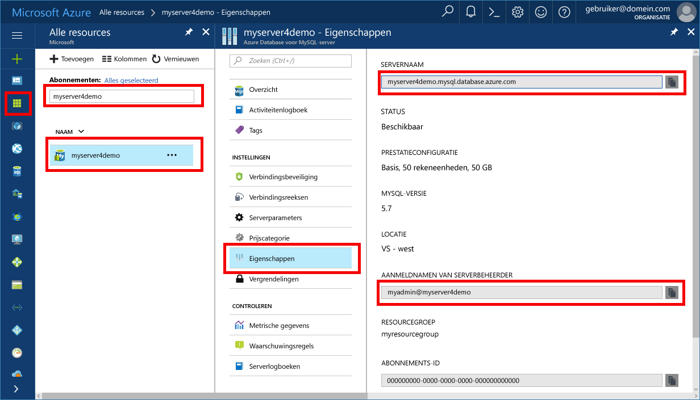

# <a name="azure-database-for-mysql-use-mysql-workbench-to-connect-and-query-data"></a>Azure MySQL-Database: gebruik MySQL Workbench verbinding maakt en gegevens opvragen
Deze snelstartgids demonstreert hoe u verbinding maken met een Azure-Database voor MySQL met behulp van de toepassing MySQL-Workbench. 

## <a name="prerequisites"></a>Vereisten
In deze snelstartgids worden de resources die in een van deze handleidingen zijn gemaakt, als uitgangspunt gebruikt:
- [Een Azure-database voor een MySQL-server maken met behulp van Azure Portal](./quickstart-create-mysql-server-database-using-azure-portal.md)
- [Een Azure-database voor een MySQL-server maken met behulp van Azure CLI](./quickstart-create-mysql-server-database-using-azure-cli.md)

## <a name="install-mysql-workbench"></a>MySQL-Workbench installeren
Download en installeer MySQL Workbench op uw computer uit [de MySQL-website](https://dev.mysql.com/downloads/workbench/).

## <a name="get-connection-information"></a>Verbindingsgegevens ophalen
Haal de verbindingsgegevens op die nodig zijn om verbinding te maken met de Azure Database voor MySQL. U hebt de volledig gekwalificeerde servernaam en aanmeldingsreferenties nodig.

1. Meld u aan bij [Azure Portal](https://portal.azure.com/).

2. Klik in het menu links in Azure-portal op **alle resources**, en zoek vervolgens naar de server die u hebt gemaakt (zoals **myserver4demo**).

3. Klik op de servernaam.

4. Selecteer de server **eigenschappen** pagina en maak een notitie van de **servernaam** en **aanmeldingsnaam van Server-beheerder**.

 
 
5. Als u uw aanmeldingsgegevens server bent vergeten, gaat u naar de **overzicht** pagina om de aanmeldingsnaam voor Server-beheerder weer te geven en zo nodig het wachtwoord opnieuw instellen.

## <a name="connect-to-the-server-by-using-mysql-workbench"></a>Verbinding maken met de server met behulp van MySQL Workbench 
Verbinding maken met Azure MySQL-Server met behulp van de GUI-hulpprogramma MySQL Workbench:

1.  Start de toepassing MySQL Workbench op uw computer. 

2.  In **Setup nieuwe verbinding** dialoogvenster en voer de volgende informatie op de **Parameters** tabblad:

    

    | **Instelling** | **Voorgestelde waarde** | **Beschrijving van veld** |
    |---|---|---|
    |   Verbindingsnaam | Demo-verbinding | Geef een label op voor deze verbinding. |
    | Verbindingsmethode | Standard (TCP/IP) | Standard (TCP/IP) is voldoende. |
    | Hostnaam | *servernaam* | Geef de waarde van de servernaam op die u hebt gebruikt toen u de Azure Database voor MySQL-server eerder hebt gemaakt. De server in ons voorbeeld is myserver4demo.mysql.database.azure.com. Gebruik de FQDN (Fully Qualified Domain Name) (\*.mysql.database.azure.com) zoals weergegeven in het voorbeeld. Volg de stappen in de vorige sectie om de verbindingsgegevens op te halen als u de servernaam bent vergeten.  |
    | Poort | 3306 | Gebruik altijd poort 3306 bij het verbinden met Azure Database voor MySQL. |
    | Gebruikersnaam |  *aanmeldnaam van serverbeheerder* | Typ de gebruikersnaam van de serverbeheerder die u hebt opgegeven toen u de Azure Database voor MySQL-server eerder hebt gemaakt. De gebruikersnaam in ons voorbeeld is myadmin@myserver4demo. Volg de stappen in de vorige sectie om de verbindingsgegevens op te halen als u de gebruikersnaam bent vergeten. De indeling is *username@servername*.
    | Wachtwoord | Uw wachtwoord | Klik op **Store in kluis...**  om op te slaan van het wachtwoord. |

3.   Klik op **Verbinding testen** om te controleren of alle parameters juist zijn geconfigureerd. 

4.   Klik op **OK** om op te slaan van de verbinding. 

5.   In de lijst met **MySQL verbindingen**, klik op de tegel die overeenkomt met de server en wacht tot de verbinding met het tot stand worden gebracht.

        Een nieuwe SQL-tabblad is geopend met een lege editor u uw query's typt.
    
        > [!NOTE]
        > Standaard is de beveiliging van de SSL-verbinding vereist en afgedwongen voor uw Azure-Database voor de MySQL-server. Geen aanvullende configuratie met SSL-certificaten is doorgaans vereist voor MySQL Workbench verbinding maken met uw server. Zie voor meer informatie over SSL [configureren van SSL-verbindingen in uw toepassing veilig verbinding kunnen maken met Azure-Database voor MySQL](./howto-configure-ssl.md).  Als u SSL uitschakelen, gaat u naar de Azure-portal en klikt u op de pagina verbinding beveiliging als u wilt uitschakelen, de wisselknop afdwingen SSL-verbinding.

## <a name="create-a-table-insert-data-read-data-update-data-delete-data"></a>Een tabel maken, gegevens invoegen, gegevens lezen, bijwerken van gegevens en gegevens verwijderen
1. Kopieer en plak de voorbeeldcode voor SQL in een lege SQL-tabblad ter illustratie van voorbeeldgegevens.

    Deze code maakt een lege database met de naam quickstartdb en maakt vervolgens een tabel met de naam inventory. Een aantal rijen wordt ingevoegd, leest u vervolgens de rijen. Deze gegevens met een update-instructie wordt gewijzigd en de rijen opnieuw leest. Ten slotte deze een rij verwijdert en vervolgens opnieuw leest de rijen.
    
    ```sql
    -- Create a database
    -- DROP DATABASE IF EXISTS quickstartdb;
    CREATE DATABASE quickstartdb;
    USE quickstartdb;
    
    -- Create a table and insert rows
    DROP TABLE IF EXISTS inventory;
    CREATE TABLE inventory (id serial PRIMARY KEY, name VARCHAR(50), quantity INTEGER);
    INSERT INTO inventory (name, quantity) VALUES ('banana', 150);
    INSERT INTO inventory (name, quantity) VALUES ('orange', 154);
    INSERT INTO inventory (name, quantity) VALUES ('apple', 100);
    
    -- Read
    SELECT * FROM inventory;
    
    -- Update
    UPDATE inventory SET quantity = 200 WHERE id = 1;
    SELECT * FROM inventory;
    
    -- Delete
    DELETE FROM inventory WHERE id = 2;
    SELECT * FROM inventory;
    ```

    De schermafbeelding toont een voorbeeld van de SQL-code in SQL Workbench en de uitvoer nadat deze is uitgevoerd.
    
    

2. Voor het uitvoeren van de steekproef SQL-Code, klikt u op het pictogram met de oplichtend op de werkbalk van de **SQL-bestand** tabblad.
3. U ziet de drie tabbladen resulteert in het **resultaat raster** sectie in het midden van de pagina. 
4. U ziet de **uitvoer** lijst aan de onderkant van de pagina. De status van elke opdracht wordt weergegeven. 

Nu u verbinding hebt gemaakt met Azure-Database voor MySQL via MySQL Workbench en u hebt opgevraagd gegevens met behulp van de SQL-taal.

## <a name="next-steps"></a>Volgende stappen
> [!div class="nextstepaction"]
> [Een database migreren met behulp van Exporteren en importeren](./concepts-migrate-import-export.md)
