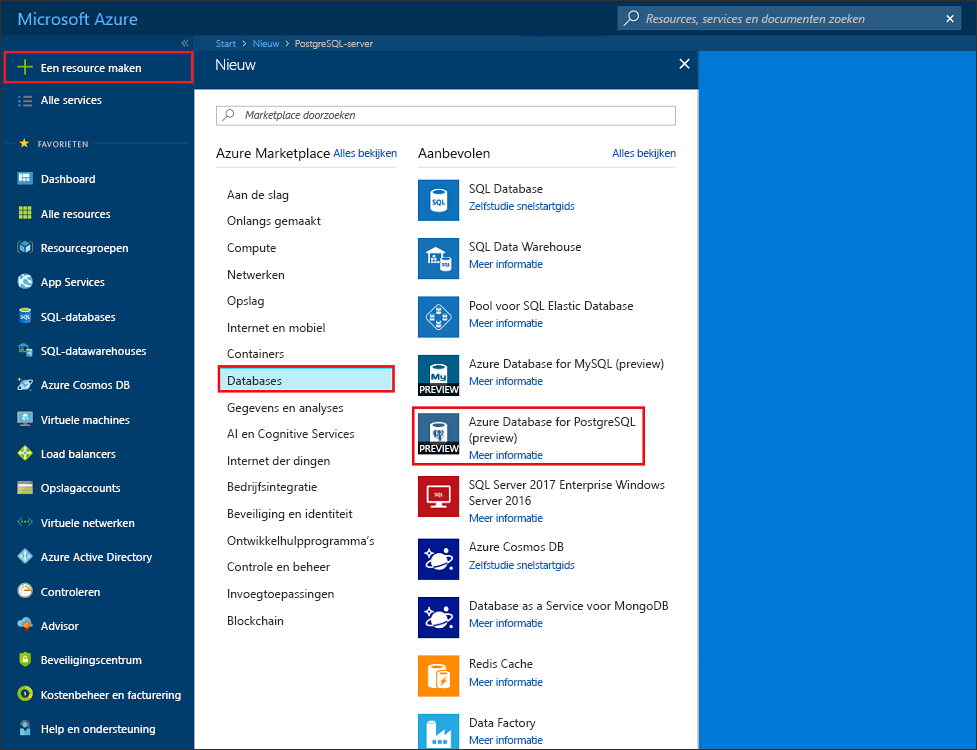
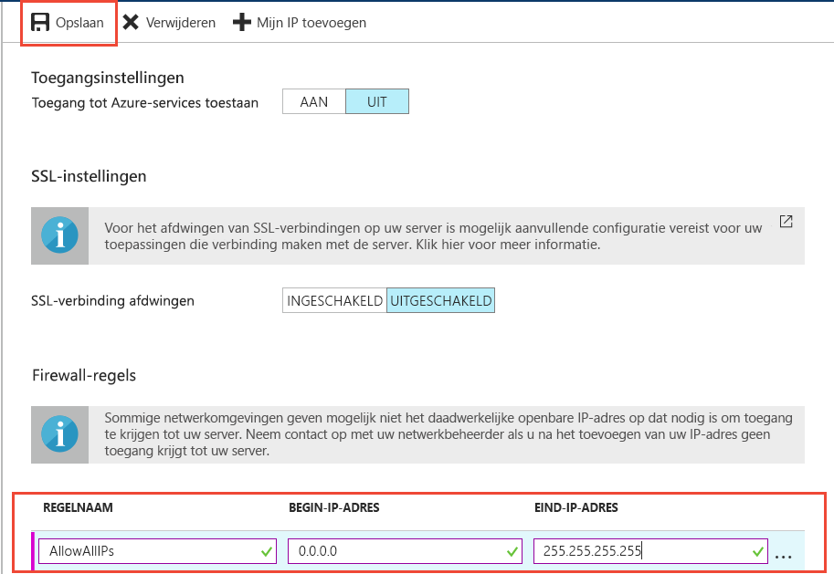

# <a name="design-your-first-azure-database-for-postgresql-using-the-azure-portal"></a>Ontwerp van uw eerste Azure-Database voor PostgreSQL met de Azure portal

Azure Database voor PostgreSQL is een beheerde service waarmee u PostgreSQL-databases met hoge beschikbaarheid in de cloud kunt uitvoeren, beheren en schalen. Met de Azure portal, kunt u eenvoudig beheren van uw server en ontwerpen van een database.

In deze zelfstudie maakt u de Azure portal gebruiken voor meer informatie over hoe:
> [!div class="checklist"]
> * Een Azure-database voor PostgreSQL-server maken
> * De serverfirewall configureren
> * Gebruik [ **psql** ](https://www.postgresql.org/docs/9.6/static/app-psql.html) hulpprogramma voor het maken van een database
> * Voorbeeldgegevens laden
> * Querygegevens
> * Gegevens bijwerken
> * Gegevens terugzetten

## <a name="prerequisites"></a>Vereisten
Als u nog geen Azure-abonnement hebt, maakt u een [gratis account](https://azure.microsoft.com/free/) voordat u begint.

## <a name="log-in-to-the-azure-portal"></a>Aanmelden bij Azure Portal
Meld u aan bij [Azure Portal](https://portal.azure.com).

## <a name="create-an-azure-database-for-postgresql"></a>Een Azure Database voor PostgreSQL-server maken

Een Azure Database voor PostgreSQL-server wordt gemaakt met een gedefinieerde set [reken- en opslagresources](./concepts-compute-unit-and-storage.md). De server wordt gemaakt in een [Azure-resourcegroep](../azure-resource-manager/resource-group-overview.md).

Volg deze stappen voor het maken van een Azure Database voor PostgreSQL-server:
1.  Klik op de **+ nieuw** knop gevonden in de linkerbovenhoek van de Azure portal.
2.  Selecteer **Databases** op de pagina **Nieuw** en selecteer **Azure Database voor PostgreSQL** op de pagina **Databases**.
 

3.  Vul het formulier voor gegevens van nieuwe server in met de volgende informatie, zoals in de voorgaande afbeelding wordt weergegeven:
    - Servernaam: **mypgserver-20170401** (de servernaam verwijst naar een DNS-naam en moet daarom wereldwijd uniek zijn) 
    - Abonnement: als u meerdere abonnementen hebt, kiest u het abonnement waarin de resource bestaat of waarvoor wordt gefactureerd.
    - Resourcegroep: **myresourcegroup**
    - De aanmeldgegevens van de serverbeheerder (gebruikersnaam en wachtwoord)
    - Locatie
    - PostgreSQL-versie

  > [!IMPORTANT]
  > De aanmeldgegevens van serverbeheerder en het wachtwoord dat u hier opgeeft, zijn vereist voor aanmelding bij de server en de databases verderop in deze snelstartgids. Onthoud of noteer deze informatie voor later gebruik.

4.  Klik op **Prijscategorie** om de servicelaag en het prestatieniveau voor de nieuwe database op te geven. Selecteer voor deze snelstartgids **Basic** laag, **50 Compute eenheden** en **50 GB** opgenomen opslag.
 
5.  Klik op **OK**.
6.  Klik op **Maken** om de server in te richten. De inrichting duurt een paar minuten.

  > [!TIP]
  > Schakel de optie **Vastmaken aan dashboard** in om uw implementaties eenvoudig te kunnen volgen.

7.  Klik op de werkbalk op **Meldingen** om het implementatieproces te bewaken.
 
   
  De database **postgres** wordt gemaakt op uw server. De database [postgres](https://www.postgresql.org/docs/9.6/static/app-initdb.html) is een standaarddatabase die kan worden gebruikt door gebruikers, hulpprogramma's en toepassingen van derden. 

## <a name="configure-a-server-level-firewall-rule"></a>Een serverfirewallregel configureren

De Azure Database voor PostgreSQL-service maakt een firewall op serverniveau. Standaard deze firewall voorkomt u dat alle externe toepassingen en hulpprogramma's verbinding te maken met de server en alle databases op de server, tenzij een firewallregel is gemaakt om de firewall voor een specifiek IP-adresbereik te openen. 

1.  Nadat de implementatie is voltooid, klikt u op **Alle resources** in het menu links en voert u de naam **mypgserver-20170401** in om te zoeken naar de zojuist gemaakte server. Klik op de servernaam in de zoekresultaten. De pagina **Overzicht** wordt geopend voor uw server en biedt opties voor verdere configuratie.
 
 

2.  Selecteer in de serverblade **verbindingsbeveiliging**. 
3.  Klik in het tekstvak onder **Regelnaam** en voeg een nieuwe firewallregel toe om het IP-bereik voor connectiviteit op de goedgekeurde lijst te plaatsen. Voor deze zelfstudie gaan we toestaan dat alle IP-adressen door te typen in **regelnaam = AllowAllIps**, **eerste IP-0.0.0.0 =** en **End-IP 255.255.255.255 =** en klik vervolgens op **opslaan** . U kunt een specifieke firewallregel die betrekking heeft op een kleinere IP-adresbereik om verbinding te maken van uw netwerk te kunnen instellen.
 
 

4.  Klik op **opslaan** en klik vervolgens op de **X** sluiten de **verbindingen beveiliging** pagina.

  > [!NOTE]
  > De Azure PostgreSQL-server communiceert via poort 5432. Als u verbinding probeert te maken vanuit een bedrijfsnetwerk, wordt uitgaand verkeer via poort 5432 mogelijk niet toegestaan door de firewall van uw netwerk. In dat geval kunt u alleen verbinding maken met uw Azure SQL Database-server als uw IT-afdeling poort 5432 openstelt.
  >


## <a name="get-the-connection-information"></a>De verbindingsgegevens ophalen

Wanneer u de Azure Database voor PostgreSQL-server maakt, wordt de standaarddatabase **postgres** ook gemaakt. Als u verbinding met uw databaseserver wilt maken, moet u hostgegevens en toegangsreferenties opgeven.

1. Klik in het menu links in de Azure portal op **alle resources** en zoek naar de server die u zojuist hebt gemaakt **mypgserver 20170401**.

  

3. Klik op de servernaam **mypgserver-20170401**.
4. Selecteer de pagina **Overzicht** van de server. Noteer de **servernaam** en de **gebruikersnaam van de serverbeheerder**.

 


## <a name="connect-to-postgresql-database-using-psql-in-cloud-shell"></a>Verbinding maken met een PostgreSQL-database met behulp van psql in Cloud Shell

We gaan nu gebruiken de [psql](https://www.postgresql.org/docs/9.6/static/app-psql.html) opdrachtregelprogramma verbinding maken met de Azure-Database voor PostgreSQL-server. 
1. Open Azure Cloud Shell via het terminalpictogram in het navigatiedeelvenster bovenaan.

   

2. Azure Cloud Shell wordt geopend in uw browser zodat u bash-opdrachten kunt invoeren.

   

3. In het Cloud Shell-prompt maakt u verbinding met uw Azure Database voor PostgreSQL-server met de psql-opdrachten. De volgende indeling wordt gebruikt om verbinding te maken met een Azure Database voor PostgreSQL-server via het [psql](https://www.postgresql.org/docs/9.6/static/app-psql.html)-hulpprogramma:
   ```bash
   psql --host=<myserver> --port=<port> --username=<server admin login> --dbname=<database name>
   ```

   Met de volgende opdracht maakt u bijvoorbeeld verbinding met de standaarddatabase **postgres** op uw PostgreSQL-server **mypgserver-20170401.postgres.database.azure.com** met behulp van toegangsreferenties. Voer het wachtwoord van de serverbeheerder in wanneer dat wordt gevraagd.

   ```bash
   psql --host=mypgserver-20170401.postgres.database.azure.com --port=5432 --username=mylogin@mypgserver-20170401 --dbname=postgres
   ```

## <a name="create-a-new-database"></a>Een nieuwe Database maken
Wanneer u met de server bent verbonden, maakt u in het prompt een lege database.
```bash
CREATE DATABASE mypgsqldb;
```

In het prompt voert u de volgende opdracht uit om verbinding te maken met de zojuist gemaakte database **mypgsqldb**.
```bash
\c mypgsqldb
```
## <a name="create-tables-in-the-database"></a>Tabellen maken in de database
Nu dat u hoe u verbinding maken met de Azure-Database voor PostgreSQL weet, kunnen we gaan over hoe u enkele eenvoudige taken uitvoeren.

We kunnen eerst een tabel maken en deze met enkele gegevens te laden. We gaan een tabel maken die inventarisgegevens houdt.
```sql
CREATE TABLE inventory (
    id serial PRIMARY KEY, 
    name VARCHAR(50), 
    quantity INTEGER
);
```

U kunt nu de zojuist gemaakte tabel in de lijst met tabellen zien door te typen:
```sql
\dt
```

## <a name="load-data-into-the-tables"></a>Gegevens laden in de tabellen
Nu dat we een tabel hebben, kunnen we sommige gegevens invoegen in het. Voer de volgende query voor het invoegen van een aantal rijen van de gegevens in het venster opdrachtprompt openen.
```sql
INSERT INTO inventory (id, name, quantity) VALUES (1, 'banana', 150); 
INSERT INTO inventory (id, name, quantity) VALUES (2, 'orange', 154);
```

U hebt nu twee rijen van de voorbeeldgegevens in de inventaris-tabel die u eerder hebt gemaakt.

## <a name="query-and-update-the-data-in-the-tables"></a>Vragen en de gegevens in de tabellen bijwerken
De volgende query om informatie te halen uit de inventaris-databasetabel. 
```sql
SELECT * FROM inventory;
```

U kunt ook de gegevens in de tabel bijwerken.
```sql
UPDATE inventory SET quantity = 200 WHERE name = 'banana';
```

U kunt de bijgewerkte waarden zien wanneer u de gegevens worden opgehaald.
```sql
SELECT * FROM inventory;
```

## <a name="restore-data-to-a-previous-point-in-time"></a>Gegevens naar een eerder tijdstip herstellen
Stel dat u deze tabel per ongeluk hebt verwijderd. Deze situatie is iets dat die u eenvoudig niet vanuit herstellen. Azure PostgreSQL-Database kunt u teruggaan naar een punt-in-tijd (in de laatste tot 7 dagen (basis) en 35 dagen (standaard)) en dit punt in tijd naar een nieuwe server herstellen. U kunt deze nieuwe server gebruiken om uw verwijderde gegevens te herstellen. De volgende stappen uit herstellen de **mypgserver 20170401** server naar een punt voordat de tabel is toegevoegd.

1.  In de Azure-Database voor PostgreSQL **overzicht** pagina voor uw server, klikt u op **herstellen** op de werkbalk. De **herstellen** pagina wordt geopend.
  
2.  Vul de **herstellen** formulier met de vereiste informatie:

  
  - **Herstelpunt**: Selecteer een point-in-time die deze gebeurtenis treedt op voordat de server is gewijzigd
  - **Doelserver**: Geef een nieuwe servernaam die u terugzetten wilt naar
  - **Locatie**: U kunt de regio niet selecteren, standaard is dit hetzelfde als de bronserver
  - **Prijscategorie**: U kunt deze waarde niet wijzigen bij het herstellen van een server. Dit is hetzelfde als de bronserver. 
3.  Klik op **OK** [de-server herstellen naar een punt in tijd](./howto-restore-server-portal.md) voordat de tabel is verwijderd. Herstellen van een server naar een ander punt in tijd maakt een dubbele nieuwe server als de oorspronkelijke server vanaf het punt in tijd die u opgeeft, mits dit binnen de bewaarperiode voor uw [servicelaag](./concepts-service-tiers.md).

## <a name="next-steps"></a>Volgende stappen
In deze zelfstudie hebt u geleerd hoe u de Azure-portal en andere hulpprogramma's om te gebruiken:
> [!div class="checklist"]
> * Een Azure-database voor PostgreSQL-server maken
> * De serverfirewall configureren
> * Gebruik [ **psql** ](https://www.postgresql.org/docs/9.6/static/app-psql.html) hulpprogramma voor het maken van een database
> * Voorbeeldgegevens laden
> * Querygegevens
> * Gegevens bijwerken
> * Gegevens terugzetten

Bekijk vervolgens voor informatie over het gebruik van de Azure CLI voor vergelijkbare taken, deze zelfstudie: [ontwerpen van uw eerste Azure-Database voor PostgreSQL met Azure CLI](tutorial-design-database-using-azure-cli.md)
