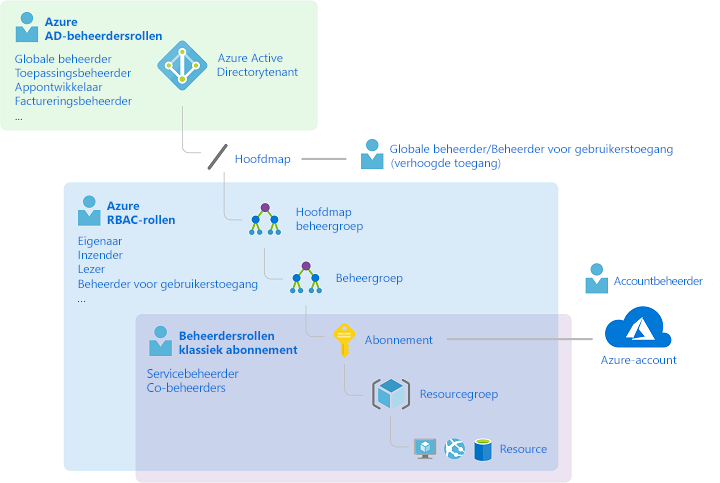
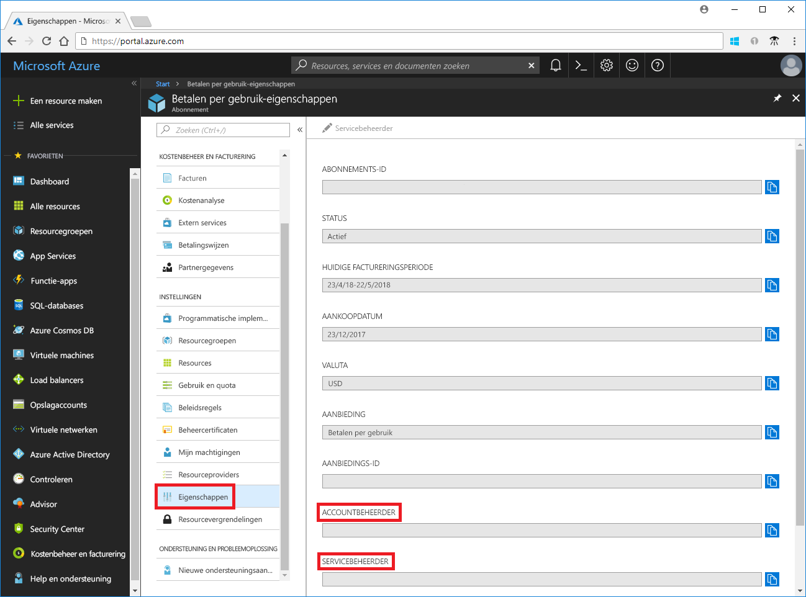

# Informatie over de verschillende rollen in Azure

Als u niet bekend bent met Azure, merkt u deze misschien moeilijk te begrijpen van de verschillende rollen in Azure. Dit artikel helpt Vertel over de volgende rollen en wanneer u elk moet gebruiken:
- Klassiek abonnement beheerdersrollen
- Azure op basis van rollen (RBAC) toegangsbeheerrollen
- Azure Active Directory (Azure AD)-beheerdersrollen

## Hoe de rollen die zijn gerelateerd

Voor meer informatie over functies in Azure, helpt het om te weten van enkele van de geschiedenis. Wanneer Azure in eerste instantie is vrijgegeven, toegang tot resources werd beheerd met slechts drie beheerdersrollen: accountbeheerder, servicebeheerder en Medebeheerder. Later, is op rollen gebaseerd toegangsbeheer (RBAC) voor Azure-resources toegevoegd. Azure RBAC is een nieuwere autorisatiesysteem dat is gebouwd op [Azure Resource Manager](../azure-resource-manager/resource-group-overview.md) dat biedt verfijnd toegangsbeheer voor Azure-resources. RBAC bevat veel ingebouwde rollen, kan worden toegewezen aan verschillende bereiken en kunt u uw eigen aangepaste rollen maken. Voor het beheren van resources in Azure AD, zoals gebruikers, groepen en domeinen, zijn er verschillende Azure AD-beheerdersrollen.

Het volgende diagram wordt een globaal overzicht van hoe de klassiek abonnement beheerder functies, Azure RBAC-rollen en Azure AD-beheerdersrollen zijn gerelateerd.

## Klassieke abonnementsbeheerders

Accountbeheerder, servicebeheerder en Medebeheerder zijn de drie klassiek abonnement beheerdersrollen in Azure. Klassiek abonnementbeheerders hebben volledige toegang tot het Azure-abonnement. Resources met behulp van de Azure portal, Azure Resource Manager-API's en het klassieke implementatiemodel API's, kunnen ze beheren. Het account dat wordt gebruikt om u te registreren voor Azure wordt automatisch ingesteld als de accountbeheerder en de Service-beheerder. Vervolgens kunnen extra Medebeheerders worden toegevoegd. De Service-beheerder en de CO-beheerders hebben de equivalente toegang van gebruikers die zijn toegewezen in de rol van eigenaar (een Azure RBAC-rol) op het abonnementsbereik. De volgende tabel beschrijft de verschillen tussen deze drie klassiek abonnement beheerdersrollen.

| Klassiek abonnement beheerder | Limiet | Machtigingen | Opmerkingen |
| --- | --- | --- | --- |
| Accountbeheerder | 1 per Azure-account | <ul><li>Toegang tot de [Accountcentrum van Azure](https://account.azure.com/Subscriptions)</li><li>Alle abonnementen in een account beheren</li><li>Nieuwe abonnementen maken</li><li>Abonnementen annuleren</li><li>De facturering voor een abonnement wijzigen</li><li>De servicebeheerder wijzigen</li></ul> | Conceptueel gezien de facturering eigenaar van het abonnement.|
| Servicebeheerder | 1 per Azure-abonnement | <ul><li>Beheren van services in de [Azure-portal](https://portal.azure.com)</li><li>Gebruikers toewijzen aan de rol CO-beheerder</li></ul> | De accountbeheerder is voor een nieuw abonnement wordt standaard ook de servicebeheerder. De Service-beheerder heeft de equivalente toegang van een gebruiker aan wie de rol van eigenaar op het abonnementsbereik wordt toegewezen. |
| CO-beheerder | 200 per abonnement | <ul><li>Dezelfde toegangsrechten als de servicebeheerder, maar kan de koppeling van abonnementen aan Azure-mappen wijzigen</li><li>Gebruikers toewijzen aan de rol CO-beheerder, maar de servicebeheerder niet wijzigen</li></ul> | De CO-beheerder heeft de equivalente toegang van een gebruiker aan wie de rol van eigenaar op het abonnementsbereik wordt toegewezen. |

In de Azure-portal, kunt u zien die is toegewezen aan de servicebeheerder en accountbeheerder door de eigenschappen van uw abonnement weer te geven.

Zie voor meer informatie over het toevoegen of wijzigen van de abonnementbeheerders [toevoegen of wijzigen Azure-abonnementbeheerders](../billing/billing-add-change-azure-subscription-administrator.md) in de documentatie van Azure-facturering.

### Azure-account en Azure-abonnementen

Een Azure-account vertegenwoordigt een facturering relatie. Een Azure-account is een gebruikers-id, een of meer Azure-abonnementen en een bijbehorende set Azure-resources. De persoon die het account wordt gemaakt, is de accountbeheerder is voor alle abonnementen die zijn gemaakt in dat account. Deze persoon is ook de standaard servicebeheerder voor het abonnement.

Azure-abonnementen kunnen u toegang tot Azure-resources te organiseren. Ze helpen u ook om te bepalen hoe resourcegebruik wordt gerapporteerd, gefactureerd en betaald. Elk abonnement hebben verschillende facturering en betaling instellingen, zodat u verschillende abonnementen en plannen van office, afdeling, project, enzovoort hebben kunt. Elke service behoort tot een abonnement en de abonnements-ID is mogelijk vereist voor de programmatische bewerkingen.

Accounts en abonnementen worden beheerd in de [Azure-Accountcentrum](https://account.azure.com/Subscriptions).
## Azure RBAC-rollen

Azure RBAC is een systeem dat verfijnd toegangsbeheer voor Azure-resources, zoals rekenkracht en opslag biedt. Azure RBAC bevat meer dan 60 ingebouwde rollen. Er zijn vier fundamentele RBAC-rollen. De eerste drie toepassen op alle resourcetypen:

| Azure RBAC-rol | Machtigingen | Opmerkingen |
| --- | --- | --- |
| [Eigenaar](built-in-roles.md#owner) | <ul><li>Volledige toegang tot alle resources</li><li>Toegang aan anderen delegeren</li></ul> | De servicebeheerder en Medebeheerders zijn de rol van eigenaar op het abonnementsbereik toegewezen Van toepassing op alle resourcetypen. |
| [Inzender](built-in-roles.md#contributor) | <ul><li>Maken en beheren van alle soorten Azure-resources</li><li>Kan geen toegang aan anderen verlenen</li></ul> | Van toepassing op alle resourcetypen. |
| [Lezer](built-in-roles.md#reader) | <ul><li>Azure-resources weergeven</li></ul> | Van toepassing op alle resourcetypen. |
| [Beheerder van gebruikerstoegang](built-in-roles.md#user-access-administrator) | <ul><li>Gebruikerstoegang tot Azure-resources beheren</li></ul> |  |

De rest van de ingebouwde rollen toestaan beheer van specifieke Azure-resources. Bijvoorbeeld, de [Inzender voor virtuele machines](built-in-roles.md#virtual-machine-contributor) rol kan de gebruiker te maken en beheren van virtuele machines. Zie voor een lijst van de ingebouwde rollen, [ingebouwde rollen](built-in-roles.md).

Alleen de Azure portal en de Azure Resource Manager API's ondersteunen RBAC. Gebruikers, groepen en toepassingen die zijn toegewezen RBAC-rollen niet gebruiken de [Azure klassieke implementatiemodel API's](../azure-resource-manager/resource-manager-deployment-model.md).

In de Azure-portal met RBAC roltoewijzingen worden weergegeven in de **toegangsbeheer (IAM)** blade. Deze blade te vinden in de portal, zoals abonnementen, resourcegroepen en verschillende bronnen.

Wanneer u klikt op de **rollen** optie, ziet u de lijst met ingebouwde en aangepaste rollen.

## Azure AD-beheerdersrollen

Azure AD-beheerder rollen worden gebruikt voor het beheren van Azure AD-resources in een map, zoals maken of gebruikers bewerken, beheerdersrollen toewijzen aan anderen, gebruikerswachtwoorden opnieuw instellen, Gebruikerslicenties beheren en domeinen beheren. Enkele van de belangrijkste Azure AD-beheerdersrollen worden beschreven in de volgende tabel.

| Azure AD-beheerdersrol | Machtigingen | Opmerkingen |
| --- | --- | --- |
| [Globale beheerder](../active-directory/active-directory-assign-admin-roles-azure-portal.md#company-administrator) | <ul><li>Toegang tot alle beheerfuncties in Azure Active Directory, evenals de services die federeren naar Azure Active Directory beheren</li><li>Beheerdersrollen toewijzen aan anderen</li><li>Het wachtwoord voor elke gebruiker en alle andere beheerders opnieuw instellen</li></ul> | De persoon die zich aanmeldt voor de Azure Active Directory-tenant wordt globale beheerder. |
| [Gebruikerbeheerder](../active-directory/active-directory-assign-admin-roles-azure-portal.md#user-account-administrator) | <ul><li>Alle aspecten van gebruikers en groepen maken en beheren</li><li>Ondersteuningstickets beheren</li><li>Servicestatus controleren</li><li>Wachtwoorden wijzigen voor gebruikers, helpdeskbeheerders en andere beheerders</li></ul> |  |
| [Helpdesk-beheerder](../active-directory/active-directory-assign-admin-roles-azure-portal.md#helpdesk-administrator) | <ul><li>Wachtwoorden wijzigen voor gebruikers en andere helpdeskbeheerders</li><li>Serviceaanvragen beheren</li><li>Servicestatus controleren</li></ul> |  |
| [Factureringsbeheerder](../active-directory/active-directory-assign-admin-roles-azure-portal.md#billing-administrator) | <ul><li>Aankopen doen</li><li>Abonnementen beheren</li><li>Ondersteuningstickets beheren</li><li>Monitors servicestatus</li></ul> |  |

Zie voor een lijst van alle Azure AD-beheerdersrollen, [beheerdersrollen toewijzen in Azure Active Directory](/azure/active-directory/active-directory-assign-admin-roles-azure-portal).

In de Azure-portal, kunt u de Azure AD-beheerdersrollen in de **Azure Active Directory** blade.

## Verschillen tussen Azure RBAC-rollen en Azure AD-beheerdersrollen

Azure RBAC-rollen beheren op een hoog niveau, machtigingen voor het beheren van Azure-resources, terwijl Azure AD-beheerdersrollen beheren van machtigingen voor het beheren van Azure Active Directory-resources. De volgende tabel vergelijkt de verschillen.

| Azure RBAC-rollen | Azure AD-beheerdersrollen |
| --- | --- |
| Toegang tot Azure-resources beheren | Toegang tot Azure Active Directory-resources beheren |
| Biedt ondersteuning voor aangepaste rollen | Kan niet uw eigen rollen maken |
| Bereik kan worden opgegeven op meerdere niveaus (beheergroep, abonnement, resourcegroep, resource) | Bereik is op het tenantniveau van de |
| Informatie van rollen kunnen worden geopend in Azure portal, Azure CLI, Azure PowerShell, Azure Resource Manager-sjablonen, de REST-API | Informatie van rollen kan worden geopend in Azure-beheerder het portal van het Office 365-beheerportal, Microsoft Graph, AzureAD PowerShell |

### Azure RBAC-rollen en Azure AD-beheerdersrollen overlappen elkaar?

Standaard Azure RBAC-rollen en functies van Azure AD-beheerder niet verdeeld Azure en Azure AD. Echter, als een globale beheerder is gemachtigd hun toegang door te kiezen wordt de **globale beheerder kan beheren Azure-abonnementen en beheergroepen** schakelen in Azure portal, de globale beheerder wordt verleend de [ Beheerder van gebruikerstoegang](built-in-roles.md#user-access-administrator) rol (een RBAC-rol) voor alle abonnementen voor een bepaalde tenant. De rol Administrator voor gebruikerstoegang kan de gebruiker andere gebruikers om toegang te verlenen tot Azure-resources. Deze switch kan handig zijn om weer toegang krijgen tot een abonnement. Zie voor meer informatie, [toegangsrechten als een Azure AD-beheerder](elevate-access-global-admin.md).

Meerdere Azure AD-beheerder rollen span Azure AD en Microsoft Office 365, zoals de globale beheerder en gebruiker beheerdersrollen. Bijvoorbeeld, als u een lid van de rol globale beheerder bent, u de mogelijkheden van de globale beheerder hebben in Azure AD en Office 365, zoals het maken van wijzigingen in Microsoft Exchange en Microsoft SharePoint. De globale beheerder heeft echter standaard geen toegang tot Azure-resources.

## Volgende stappen

- [Wat is op rollen gebaseerd toegangsbeheer (RBAC)?](overview.md)
- [Beheerdersrollen toewijzen in Azure Active Directory](/azure/active-directory/active-directory-assign-admin-roles-azure-portal)
- [Toevoegen of wijzigen van de beheerders van Azure-abonnement](/azure/billing/billing-add-change-azure-subscription-administrator)
