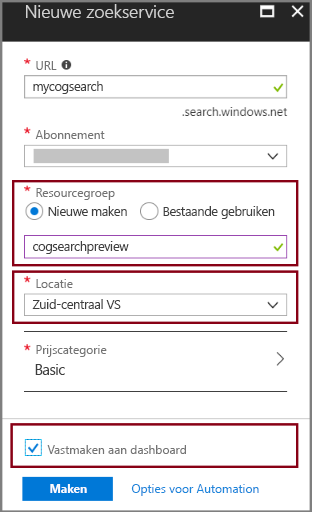
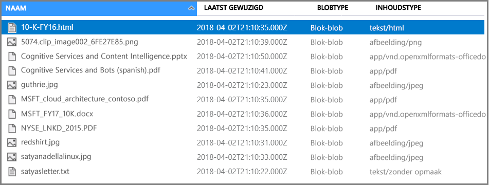
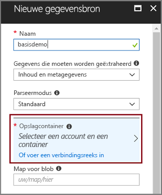
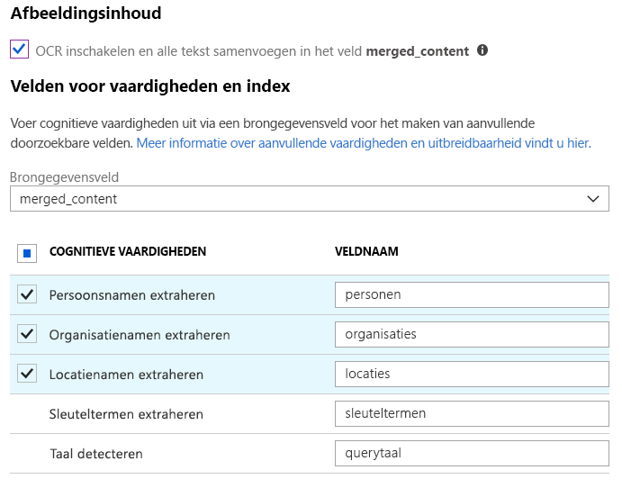
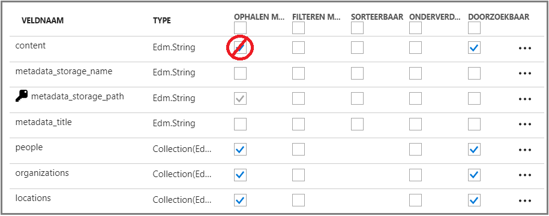
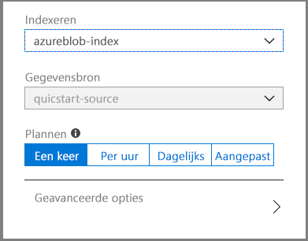
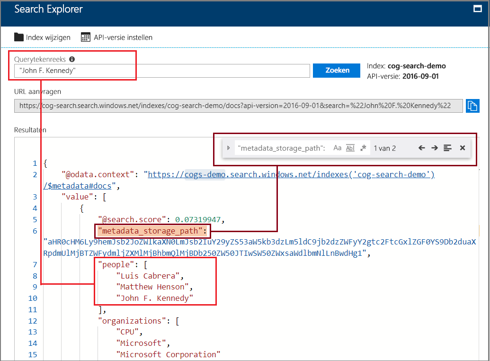

# Snelstart: een pijplijn voor cognitief zoeken maken met vaardigheden en voorbeeldgegevens

Cognitief zoeken (preview) voegt vaardigheden voor gegevensextractie, verwerking van natuurlijke taal (NLP) en beeldverwerking toe aan een Azure Search-indexeringspijplijn, waardoor niet-doorzoekbare of ongestructureerde inhoud doorzoekbaarder wordt. Gegevens die zijn gemaakt door een vaardigheid, zoals entiteitsherkenning of afbeeldingsanalyse, worden toegevoegd aan een index in Azure Search.

In deze snelstart probeert u de verrijkingspijplijn uit in [Azure Portal](https://portal.azure.com) voordat u ook maar één regel code schrijft:

* Begin met voorbeeldgegevens in Azure Blob-opslag
* Configureer de [wizard Gegevens importeren](search-import-data-portal.md) voor indexering en verrijking 
* Voer de wizard uit (een entiteitsvaardigheid detecteert mensen, locatie en organisaties)
* Gebruik [Search Explorer](search-explorer.md) om query's op de verrijkte gegevens uit te voeren.

U kunt cognitief zoeken uitproberen in een Azure Search-service in de volgende gebieden:

* Zuid-centraal VS
* West-Europa

Als u nog geen abonnement op Azure hebt, maak dan een [gratis account](https://azure.microsoft.com/free/?WT.mc_id=A261C142F) aan voordat u begint.

## Vereisten

[Wat is cognitief zoeken?](cognitive-search-concept-intro.md) introduceert de verrijkingsarchitectuur en -onderdelen. 

Azure-services worden uitsluitend in dit scenario gebruikt. Het maken van de services die u nodig hebt, maakt deel uit van de voorbereiding.

+ Azure Blob-opslag biedt de brongegevens.
+ Azure Search biedt gegevensopname en -indexering, verrijking van cognitief zoeken en query's voor zoeken in volledige tekst.

### Azure Search instellen

Registreer u eerst voor de Azure Search-service. 

1. Ga naar [Azure Portal](https://portal.azure.com) en meld u aan met uw Azure-account.

1. Klik op **Een resource maken**, zoek naar Azure Search en klik op **Maken**. Zie [Een Azure Search-service maken in de portal](search-create-service-portal.md) als u voor de eerste keer een zoekservice instelt en meer hulp nodig hebt.

  

1. Maak een resourcegroep voor alle resources die u in deze snelstart gaat maken. Dit vergemakkelijkt het opschonen van de resources nadat u de snelstart hebt voltooid.

1. Kies bij locatie voor **Zuid-centraal VS** of **West-Europa**. Op dit moment is de preview alleen in deze regio's beschikbaar.

1. Voor de prijscategorie kunt u een **Gratis** service maken om de zelfstudies en snelstarts te voltooien. Voor nadere analyse met behulp van uw eigen gegevens, maakt u een [betaalde service](https://azure.microsoft.com/pricing/details/search/) zoals **Basic** of **Standard**. 

  Een gratis service is beperkt tot 3 indexen, maximaal 16 MB aan blobgrootte en 2 minuten indexeren. Dit is voldoende om de volledige functionaliteit van cognitief zoeken te verkennen. Zie [Servicelimieten](search-limits-quotas-capacity.md) om de limieten voor verschillende prijscategorieën te bekijken.

  > [!NOTE]
  > Cognitief zoeken is een openbare preview. De uitvoering van vaardigheden is momenteel in alle prijscategorieën beschikbaar, waaronder de gratis categorie. De prijzen voor deze functionaliteit worden op een later moment bekend gemaakt.

1. Maak de service vast aan het dashboard voor snelle toegang tot service-informatie.

  

### Azure Blob service instellen en voorbeeldgegevens laden

De verrijkingspijplijn haalt gegevensbronnen op uit Azure ondersteund door [indexeerfuncties in Azure Search](search-indexer-overview.md). In dit voorbeeld gebruiken we blobopslag om meerdere inhoudstypen te laten zien.

1. [Download de voorbeeldgegevens](https://1drv.ms/f/s!As7Oy81M_gVPa-LCb5lC_3hbS-4) die bestaan uit een kleine set van verschillende typen bestanden. 

1. Meld u aan bij Azure Blob-opslag, maak een opslagaccount, meld u aan bij Storage Explorer en maak een container. Zie [Azure Storage Explorer Quickstart](../storage/blobs/storage-quickstart-blobs-storage-explorer.md) (Snelstart voor Azure Storage Explorer) voor instructies over alle stappen.

1. Klik in de container die u hebt gemaakt met behulp van Azure Storage Explorer op **Uploaden** om de voorbeeldbestanden te uploaden.

  

## De verrijkingspijplijn maken

Ga terug naar de dashboardpagina van de Azure Search-service en klik in de opdrachtbalk op **Gegevens importeren** om verrijking in te stellen in vier stappen.

### Stap 1: een gegevensbron maken

In **Verbinden met uw gegevens** > **Azure Blob-opslag** selecteert u het account en de container die u hebt gemaakt. Geef een naam op voor de gegevensbron en gebruik standaardwaarden voor de rest. 

   

Klik op **OK** om de gegevensbron te maken.

Een voordeel van het gebruik van de wizard **Gegevens importeren** is dat u hiermee ook uw index kunt maken. Terwijl de gegevensbron wordt gemaakt, maakt de wizard ook een indexschema. Het maken van de index kan een paar seconden duren.

### Stap 2: cognitieve vaardigheden toevoegen

Voeg vervolgens verrijkingsstappen toevoegen aan de pijplijn voor indexering. De portal biedt u vooraf gedefinieerde cognitieve vaardigheden voor afbeeldingsanalyse en tekstanalyse. In de portal werkt een set vaardigheden via één bronveld. Dat lijkt misschien een klein doel, maar voor Azure-blobs bevat het veld `content` het meeste van het blobdocument (bijvoorbeeld een Word-document of PowerPoint-presentatie). Dit veld is een ideale invoer omdat het alle inhoud van een blob bevat.

Kies in **Cognitieve vaardigheden toevoegen** de vaardigheden die de verwerking van natuurlijke taal uitvoeren. Kies bij deze snelstart voor entiteitsherkenning voor personen, organisaties en locaties.

Klik op **OK** om de definitie te accepteren.
   
  

Vaardigheden voor verwerking van natuurlijke taal werken met behulp van tekstinhoud in de set voorbeeldgegevens. Omdat er geen opties voor beeldverwerking zijn geselecteerd, worden de JPEG-bestanden in de set voorbeeldgegevens niet verwerkt in deze snelstart. 

### Stap 3: de index configureren

Herinnert u zich nog de index die met de gegevensbron is gemaakt? U kunt in deze stap het schema ervan bekijken en eventueel instellingen wijzigen. 

De wizard biedt goede standaardinstellingen voor deze snelstart: 

+ Elke index moet een naam hebben. Voor dit gegevensbrontype is de standaardnaam *azureblob-index*.

+ Elk document moet een sleutel hebben. De wizard kiest een veld met unieke waarden. In deze snelstart is de sleutel *metadata_storage_path*.

+ Elke veldverzameling moet velden hebben met een gegevenstype die de waarden ervan beschrijft, en elk veld moet indexkenmerken hebben die beschrijven hoe deze wordt gebruikt in een zoekscenario. 

Omdat u een set vaardigheden hebt gedefinieerd, gaat de wizard ervan uit dat u het gegevensveld van de bron wilt, plus de uitvoervelden die door de vaardigheden worden gemaakt. Daarom voegt de portal indexvelden toe voor `content`, `people`, `organizations` en `locations`. U ziet dat de wizard automatisch Ophaalbaar en Doorzoekbaar voor deze velden inschakelt.

Controleer in **Index aanpassen** de kenmerken van de velden om te zien hoe ze in een index worden gebruikt. Doorzoekbaar geeft aan dat een veld kan worden doorzocht. Ophaalbaar betekent dat het in resultaten kan worden geretourneerd. 

U kunt eventueel Ophaalbaar wissen in het veld `content`. In blobs kan dit veld duizenden regels opleveren, wat moeilijk te lezen is in een hulpprogramma zoals **Search Explorer**.

Klik op **OK** om de indexdefinitie te accepteren.

  

> [!NOTE]
> Niet-gebruikte velden zijn bijgesneden in de schermafbeelding voor een beknopt overzicht. Als u de handeling in de portal uitvoert, ziet u extra velden in uw lijst.

### Stap 4: de indexeerfunctie configureren

De indexeerfunctie is een belangrijke resource die het indexeerproces aandrijft. Het geeft de naam van de gegevensbron, de index en de uitvoerfrequentie op. Het eindresultaat van de wizard **Gegevens importeren** is altijd een indexeerfunctie die u herhaaldelijk kunt uitvoeren.

Geef op de pagina **Indexeerfunctie** een naam op voor de indexeerfunctie en gebruik de standaardinstelling Eenmaal uitvoeren om deze onmiddellijk uit te voeren. 

  

Klik op **OK** om de gegevens te importeren, verrijken en indexeren.

  

Indexeren en verrijken kunnen even duren. Daarom is het aan te raden om kleinere gegevenssets te gebruiken voor verkenning. U kunt het indexeren controleren op de pagina Meldingen van Azure Portal. 

## Query uitvoeren in Search Explorer

Nadat er een index is gemaakt, kunt u query's uitvoeren om documenten te retourneren uit de index. Gebruik **Search Explorer** in de portal om query's uit te voeren en resultaten te bekijken. 

1. Klik op de dashboardpagina van de zoekservice op **Search Explorer** in de opdrachtbalk.

1. Selecteer bovenaan **Index wijzigen** om de index die u hebt gemaakt te selecteren.

1. Voer een zoekopdracht in om een query op de index toe te passen, zoals 'John F. Kennedy'.

Resultaten worden in JSON geretourneerd, wat uitgebreid en moeilijk te lezen kan zijn, met name in grote documenten die afkomstig zijn van Azure-blobs. 

Als u niet eenvoudig resultaten kunt scannen, gebruikt u CTRL+F om in documenten te zoeken. Voor deze query kunt u in de JSON zoeken op 'John F. Kennedy' om instanties van deze zoekterm weer te geven. 

Met CTRL+F kunt u ook bepalen hoeveel documenten een bepaalde resultatenset bevat. Voor Azure-blobs kiest de portal 'metadata_storage_path' als de sleutel omdat elke waarde uniek voor het document is. Zoek met CTRL+F naar 'metadata_storage_path' om het aantal documenten te tellen. Voor deze query bevatten twee documenten in de resultatenset de term 'John F. Kennedy'.

  

## Opgedane kennis

U hebt nu uw eerste oefening in verrijkte indexering voltooid. Het doel van deze snelstart is om belangrijke concepten te introduceren en u de wizard te laten doorlopen, zodat u snel een oplossing voor cognitief zoeken kunt maken met behulp van uw eigen gegevens.

Een van de belangrijke concepten die we wilden overbrengen, is de afhankelijkheid van Azure-gegevensbronnen. Verrijking van cognitief zoeken is gebonden aan indexeerfuncties, en indexeerfuncties zijn Azure- en bronspecifiek. Hoewel deze snelstart Azure Blob-opslag gebruikt, zijn andere Azure-gegevensbronnen ook mogelijk. Zie [Indexeerfuncties in Azure Search](search-indexer-overview.md) voor meer informatie.

Een ander belangrijk concept is dat vaardigheden via invoervelden werken. In de portal moet u één bronveld voor alle vaardigheden kiezen. Invoeren kunnen in code andere velden zijn, of de uitvoer van een upstream-vaardigheid.

 Invoeren voor een vaardigheid worden toegewezen aan een uitvoerveld in een index. Intern stelt de portal [aantekeningen](cognitive-search-concept-annotations-syntax.md) in en definieert een [set vaardigheden](cognitive-search-defining-skillset.md), waarmee de volgorde van bewerkingen en de algemene stroom wordt bepaald. Deze stappen zijn verborgen in de portal, maar wanneer u begint met het schrijven van code worden deze concepten belangrijk.

Tot slot hebt u geleerd dat u resultaten kunt bekijken door query's in de index uit te voeren. Azure Search biedt eigenlijk een doorzoekbare index, waarin u query's kunt uitvoeren met behulp van de [eenvoudige](https://docs.microsoft.com/rest/api/searchservice/simple-query-syntax-in-azure-search) of [volledig uitgebreide querysyntaxis](https://docs.microsoft.com/rest/api/searchservice/lucene-query-syntax-in-azure-search). Een index met verrijkte velden werkt zoals elke andere index. Als u standaard of [aangepaste analyse](search-analyzers.md), [scoreprofielen](https://docs.microsoft.com/rest/api/searchservice/add-scoring-profiles-to-a-search-index), [synoniemen](search-synonyms.md), [meervoudige filters](search-filters-facets.md), geografisch zoeken of een andere functie van Azure Search wilt opnemen, kunt u dat gewoon doen.

## Resources opschonen

Als u klaar bent met verkennen, kunt u het snelst opschonen door de resourcegroep met de Azure Search-service en Azure Blob service te verwijderen.  

Ervan uitgaande dat u beide services in dezelfde groep hebt geplaatst, verwijdert u de resourcegroep om alle inhoud ervan permanent te verwijderen, waaronder de services en alle opgeslagen inhoud die u voor deze oefening hebt gemaakt. De naam van de resourcegroep staat in de portal op de pagina Overzicht van elke service.

## Volgende stappen

U kunt experimenteren met indexeren en verrijken door de wizard opnieuw uit te voeren met verschillende vaardigheden en velden voor brongegevens. Herhaal de stappen door de index en indexeerfunctie te verwijderen en vervolgens de indexeerfunctie opnieuw te maken met nieuwe selecties.

+ Selecteer in **Overzicht** > **Indexen** de index die u hebt gemaakt en klik vervolgens op **Verwijderen**.

+ Dubbelklik in **Overzicht** op de tegel **Indexeerfuncties**. Zoek de indexeerfunctie die u hebt gemaakt en verwijder deze.

U kunt ook de voorbeeldgegevens en de services die u hebt gemaakt opnieuw gebruiken in de volgende zelfstudie om meer te weten te komen over het programmatisch uitvoeren van dezelfde taken. 

> [!div class="nextstepaction"]
> [Zelfstudie: de REST API's voor cognitief zoeken gebruiken](cognitive-search-tutorial-blob.md)