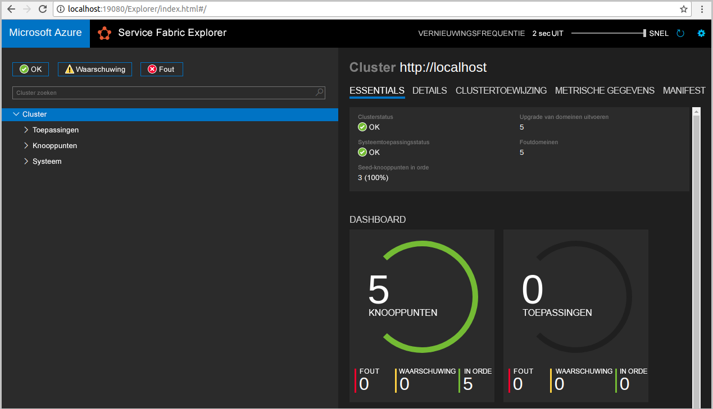
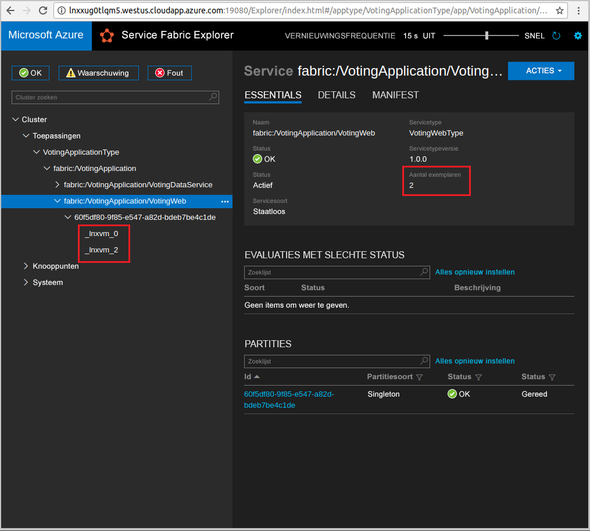

# <a name="create-a-java-application"></a>Een Java-toepassing maken
Azure Service Fabric is een platform voor gedistribueerde systemen voor het implementeren en distribueren van microservices en containers. 

Deze quickstart laat zien hoe u uw eerste Java-toepassing in Service Fabric implementeert met behulp van de Eclipse IDE op een Linux-machine voor ontwikkelaars. Wanneer u klaar bent, hebt u een stemtoepassing met een web-front-end in Java die stemresultaten opslaat in een stateful back-endservice in het cluster.


In deze quickstart leert u de volgende zaken:

> [!div class="checklist"]
> * Eclipse gebruiken als hulpmiddel voor uw Java-toepassingen in Service Fabric
> * De toepassing implementeren in het lokale cluster 
> * De toepassing implementeren in een cluster in Azure
> * De toepassing uitschalen over meerdere knooppunten

## <a name="prerequisites"></a>Vereisten
Dit zijn de vereisten voor het voltooien van deze Quickstart:
1. [Service Fabric-SDK en Service Fabric CLI (opdrachtregelinterface) installeren](https://docs.microsoft.com/en-us/azure/service-fabric/service-fabric-get-started-linux#installation-methods)
2. [Git installeren](https://git-scm.com/)
3. [Eclipse installeren](https://www.eclipse.org/downloads/)
4. [Java-omgeving instellen](https://docs.microsoft.com/en-us/azure/service-fabric/service-fabric-get-started-linux#set-up-java-development), inclusief de optionele stappen voor het installeren van de Eclipse-invoegtoepassing 

## <a name="download-the-sample"></a>Het voorbeeld downloaden
Voer in een opdrachtvenster de volgende opdracht uit om de voorbeeld-app-opslagplaats te klonen op de lokale computer.
```
git clone https://github.com/Azure-Samples/service-fabric-java-quickstart.git
```

## <a name="run-the-application-locally"></a>De toepassing lokaal uitvoeren
1. Start het lokale cluster door de volgende opdracht uit te voeren:

    ```bash
    sudo /opt/microsoft/sdk/servicefabric/common/clustersetup/devclustersetup.sh
    ```
    Het starten van het lokale cluster kan enige tijd duren. Open Service Fabric Explorer op **http://localhost:19080** om te controleren of het cluster helemaal naar behoren functioneert. Als de vijf knooppunten in orde zijn, is het lokale cluster actief. 
    
    

2. Open Eclipse.
3. Klik op Bestand -> Projecten openen vanuit bestandssysteem... 
4. Klik op Map en kies de map `Voting` uit de map `service-fabric-java-quickstart` die u hebt gekloond vanuit Github. Klik op Voltooien. 

    
    
5. U hebt nu het project `Voting` in de pakketverkenner voor Eclipse. 
6. Klik met de rechtermuisknop op het project en selecteer **Toepassing publiceren...** in de vervolgkeuzelijst **Service Fabric**. Kies **PublishProfiles/Local.json** als doelprofiel en klik op Publiceren. 

    
    
7. Open uw favoriete webbrowser en open de toepassing op **http://localhost:8080**. 

    
    
U kunt nu een reeks stemmingsopties toevoegen en beginnen met het verzamelen van stemmen. De toepassing wordt uitgevoerd en alle gegevens worden opgeslagen in het Service Fabric-cluster, zonder dat hiervoor een aparte database nodig is.

## <a name="deploy-the-application-to-azure"></a>De toepassing implementeren in Azure

### <a name="set-up-your-azure-service-fabric-cluster"></a>Het Azure Service Fabric-cluster instellen
Maak uw eigen cluster of gebruik een cluster van derden om de toepassing te implementeren in een cluster in Azure.

Clusters van derden zijn gratis tijdelijke Service Fabric-clusters die worden gehost in Azure. Ze worden beheerd door het Service Fabric-team. Iedereen kan hier toepassingen implementeren en informatie krijgen over het platform. [Volg de instructies](http://aka.ms/tryservicefabric) om toegang te krijgen tot een cluster van derden. 

Zie [Een Service Fabric-cluster maken op Azure](service-fabric-tutorial-create-vnet-and-linux-cluster.md) voor meer informatie over het maken van uw eigen cluster.

> [!Note]
> De web-front-endservice is geconfigureerd om naar binnenkomend verkeer te luisteren op poort 8080. Zorg ervoor dat de poort is geopend in het cluster. Als u een cluster van derden gebruikt, is deze poort geopend.
>

### <a name="deploy-the-application-using-eclipse"></a>De toepassing implementeren met behulp van Eclipse
Nu de toepassing en het cluster gereed zijn, kunt u deze rechtstreeks vanuit Eclipse implementeren in het cluster.

1. Open het bestand **Cloud.json** in de map **PublishProfiles**, en vul de velden `ConnectionIPOrURL` en `ConnectionPort` correct in. Hier volgt een voorbeeld: 

    ```bash
    {
         "ClusterConnectionParameters": 
         {
            "ConnectionIPOrURL": "lnxxug0tlqm5.westus.cloudapp.azure.com",
            "ConnectionPort": "19080",
            "ClientKey": "",
            "ClientCert": ""
         }
    }
    ```

2. Klik met de rechtermuisknop op het project en selecteer **Toepassing publiceren...** in de vervolgkeuzelijst **Service Fabric**. Kies **PublishProfiles/Cloud.json** als doelprofiel en klik op Publiceren. 

    

3. Open uw favoriete webbrowser en open de toepassing op **http://\<ConnectionIPOrURL>:8080**. 

    
    
## <a name="scale-applications-and-services-in-a-cluster"></a>Toepassingen en services voor schalen in een cluster
Services kunnen eenvoudig worden geschaald in een cluster om een wijziging in de belasting voor de services aan te kunnen. U schaalt een service door het aantal exemplaren te wijzigen dat wordt uitgevoerd in het cluster. Er zijn meerdere manieren waarop u services kunt schalen. U kunt hiervoor scripts of opdrachten van Service Fabric-CLI (sfctl) gebruiken. In dit voorbeeld wordt gebruikgemaakt van Service Fabric Explorer.

Service Fabric Explorer kan worden uitgevoerd in alle Service Fabric-clusters en is toegankelijk door vanuit een browser naar de HTTP-beheerpoort (19080) te bladeren, bijvoorbeeld `http://lnxxug0tlqm5.westus.cloudapp.azure.com:19080`.

Voer de volgende stappen uit om de web-front-endservice te schalen:

1. Open Service Fabric Explorer in het cluster - bijvoorbeeld: `http://lnxxug0tlqm5.westus.cloudapp.azure.com:19080`.
2. Klik op het beletselteken (drie punten) naast het knooppunt **fabric:/Voting/VotingWeb** in de structuurweergave en kies **Service schalen**.

    

    U kunt er nu voor kiezen om het aantal exemplaren van de web-front-endservice te schalen.

3. Wijzig het aantal in **2** en klik op **Service schalen**.
4. Klik op het knooppunt **fabric:/Voting/VotingWeb** in de structuurweergave en vouw het partitieknooppunt uit (vertegenwoordigd door een GUID).

    

    U ziet nu dat er twee exemplaren van de service zijn. In de structuurweergave ziet u op welke knooppunten de exemplaren worden uitgevoerd.

Met deze eenvoudige beheertaak is het aantal beschikbare resources voor het verwerken van gebruikersbelasting voor onze front-endservice verdubbeld. Het is belangrijk te weten dat u niet meerdere exemplaren van een service nodig hebt om ervoor te zorgen dat deze op betrouwbare wijze wordt uitgevoerd. Als de service mislukt, wordt in Service Fabric een nieuw exemplaar van de service uitgevoerd in het cluster.

## <a name="next-steps"></a>Volgende stappen
In deze quickstart hebt u de volgende zaken geleerd:

> [!div class="checklist"]
> * Eclipse gebruiken als hulpmiddel voor uw Java-toepassingen in Service Fabric
> * Java-toepassingen implementeren in het lokale cluster 
> * Java-toepassingen implementeren in een cluster in Azure
> * De toepassing uitschalen over meerdere knooppunten

* Meer informatie over [foutopsporingsservices in Java met Eclipse](service-fabric-debugging-your-application-java.md)
* Meer informatie over [doorlopende integratie en implementatie instellen met behulp van Jenkins](service-fabric-cicd-your-linux-applications-with-jenkins.md)
* Andere [Java-voorbeelden](https://github.com/Azure-Samples/service-fabric-java-getting-started) bekijken