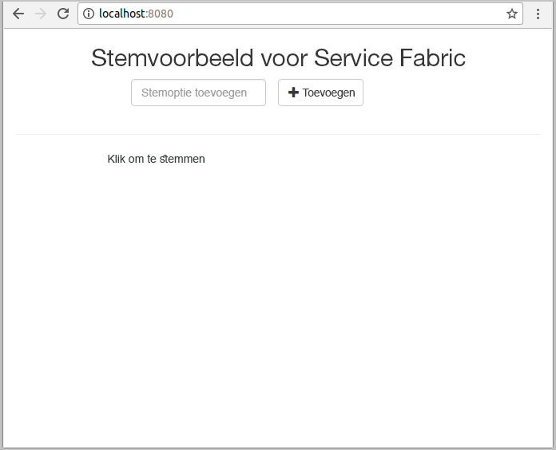
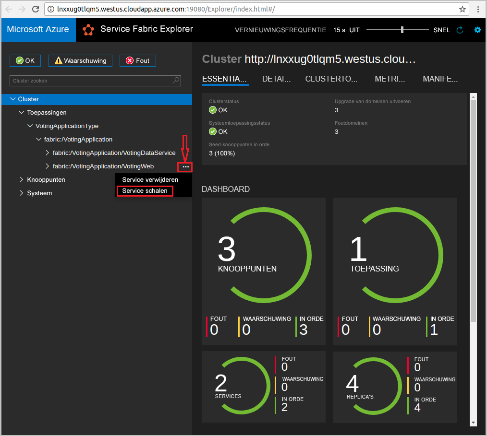

# <a name="create-a-java-application"></a>Een Java-toepassing maken
Azure Service Fabric is een platform voor gedistribueerde systemen voor het implementeren en beheren van microservices en containers. 

Deze snelstartgids laat zien hoe uw eerste Java-toepassing naar Service Fabric implementeren met behulp van de Eclipse IDE op een Linux-machine voor ontwikkelaars. Wanneer u klaar bent, hebt u een stemtoepassing met een Java-webfront-end die stemmende resultaten in een stateful back-end-service in het cluster slaat.


In deze snelstartgids leert u de volgende zaken:

> [!div class="checklist"]
> * Eclipse gebruiken als een hulpmiddel voor uw Service Fabric-Java-toepassingen
> * De toepassing op uw lokale cluster implementeren 
> * De toepassing implementeren naar een cluster in Azure
> * Scale-out van de toepassing op meerdere knooppunten

## <a name="prerequisites"></a>Vereisten
Dit zijn de vereisten voor het voltooien van deze Quickstart:
1. [Service Fabric SDK & Service Fabric-opdrachtregelinterface (CLI) installeren](https://docs.microsoft.com/en-us/azure/service-fabric/service-fabric-get-started-linux#installation-methods)
2. [Git installeren](https://git-scm.com/)
3. [Eclipse installeren](https://www.eclipse.org/downloads/)
4. [Java-omgeving instellen](https://docs.microsoft.com/en-us/azure/service-fabric/service-fabric-get-started-linux#set-up-java-development), waardoor ervoor dat met de optionele stappen voor het installeren van de Eclipse-invoegtoepassing 

## <a name="download-the-sample"></a>Het voorbeeld downloaden
Voer de volgende opdracht voor het klonen van de opslagplaats van de voorbeeld-app op uw lokale computer in een opdrachtvenster.
```
git clone https://github.com/Azure-Samples/service-fabric-java-quickstart.git
```

## <a name="run-the-application-locally"></a>De toepassing lokaal uitvoeren
1. Start uw lokale cluster door het uitvoeren van de volgende opdracht:

    ```bash
    sudo /opt/microsoft/sdk/servicefabric/common/clustersetup/devclustersetup.sh
    ```
    Het starten van het lokale cluster neemt enige tijd in. Toegang tot de Service Fabric Explorer op om te bevestigen dat het cluster volledig up-to-date **http://localhost: 19080**. De vijf knooppunten orde duiden op dat het lokale cluster actief is. 
    
    

2. Open de Eclipse.
3. Klik op bestand -> geopende projecten van bestandssysteem... 
4. Klik op de map en kies de `Voting` map van de `service-fabric-java-quickstart` map die u vanuit Github gekloond. Klik op Voltooien. 

    
    
5. U hebt nu de `Voting` -project in de Explorer-pakket voor Eclipse. 
6. Klik met de rechtermuisknop op het project en selecteer **toepassing publiceren...**  onder de **Service Fabric** vervolgkeuzelijst. Kies **PublishProfiles/Local.json** als het profiel van de doelcomputer en klik op publiceren. 

    
    
7. Open uw favoriete webbrowser en toegang tot de toepassing met het openen van **http://localhost: 8080**. 

    
    
U kunt nu een set opties voor uw stem toevoegen en begin met het maken van stemmen. De toepassing wordt uitgevoerd en worden alle gegevens in uw Service Fabric-cluster, zonder de noodzaak van een aparte database opgeslagen.

## <a name="deploy-the-application-to-azure"></a>De toepassing implementeren in Azure

### <a name="set-up-your-azure-service-fabric-cluster"></a>Uw Azure Service Fabric-Cluster instellen
Voor het implementeren van de toepassing naar een cluster in Azure maken van uw eigen cluster of een Cluster van derden gebruiken.

Clusters van derden zijn gratis tijdelijke Service Fabric-clusters die worden gehost in Azure. Door het Service Fabric-team waar iedereen toepassingen implementeren en meer informatie over het platform worden uitgevoerd. [Volg de instructies](http://aka.ms/tryservicefabric) om toegang te krijgen tot een cluster van derden. 

Zie voor meer informatie over het maken van uw eigen cluster [Service Fabric-cluster maken op Azure](service-fabric-tutorial-create-vnet-and-linux-cluster.md).

> [!Note]
> De web-front-service is geconfigureerd om te luisteren op poort 8080 voor binnenkomend verkeer. Zorg ervoor dat de poort is geopend in het cluster. Als u het Cluster van derden gebruikt, is deze poort is geopend.
>

### <a name="deploy-the-application-using-eclipse"></a>De toepassing met behulp van Eclipse implementeren
Nu dat de toepassing en het cluster klaar bent, kunt u deze rechtstreeks vanuit de Eclipse implementeren naar het cluster.

1. Open de **Cloud.json** bestand onder de **PublishProfiles** directory en vul de `ConnectionIPOrURL` en `ConnectionPort` velden op de juiste wijze. Een voorbeeld weergegeven: 

    ```bash
    {
         "ClusterConnectionParameters": 
         {
            "ConnectionIPOrURL": "lnxxug0tlqm5.westus.cloudapp.azure.com",
            "ConnectionPort": "19080",
            "ClientKey": "",
            "ClientCert": ""
         }
    }
    ```

2. Klik met de rechtermuisknop op het project en selecteer **toepassing publiceren...**  onder de **Service Fabric** vervolgkeuzelijst. Kies **PublishProfiles/Cloud.json** als het profiel van de doelcomputer en klik op publiceren. 

    

3. Open uw favoriete webbrowser en toegang tot de toepassing met het openen van **http://\<ConnectionIPOrURL >: 8080**. 

    
    
## <a name="scale-applications-and-services-in-a-cluster"></a>Toepassingen en services voor schalen in een cluster
Services kunnen worden geschaald over een cluster te maken voor een wijziging in de belasting van de services. U schaalt een service door het aantal exemplaren te wijzigen dat wordt uitgevoerd in het cluster. U hebt meerdere manieren schalen van uw services, kunt u scripts of opdrachten van Service Fabric CLI (sfctl). In dit voorbeeld gebruiken we Service Fabric Explorer.

Service Fabric Explorer wordt uitgevoerd in alle Service Fabric-clusters en toegankelijk is vanuit een browser door te bladeren naar de clusters HTTP-poort (19080), bijvoorbeeld `http://lnxxug0tlqm5.westus.cloudapp.azure.com:19080`.

Voer de volgende stappen uit om de web-front-endservice te schalen:

1. Open Service Fabric Explorer in het cluster - bijvoorbeeld: `http://lnxxug0tlqm5.westus.cloudapp.azure.com:19080`.
2. Klik op het weglatingsteken (drie punten) naast de **fabric: / Voting/VotingWeb** knooppunt in de structuurweergave en kies **Scale Service**.

    

    U kunt er nu voor kiezen om het aantal exemplaren van de web-front-endservice te schalen.

3. Wijzig het aantal in **2** en klik op **Service schalen**.
4. Klik op de **fabric: / Voting/VotingWeb** knooppunt in de structuurweergave en het partitie-knooppunt (vertegenwoordigd door een GUID zijn).

    

    U kunt nu zien dat de service twee exemplaren heeft en in de structuurweergave u welke knooppunten de instanties worden uitgevoerd ziet op.

Met deze eenvoudige beheertaak is het aantal beschikbare resources voor het verwerken van gebruikersbelasting voor onze front-endservice verdubbeld. Het is belangrijk te weten dat u niet meerdere exemplaren van een service nodig hebt om ervoor te zorgen dat deze op betrouwbare wijze wordt uitgevoerd. Als de service mislukt, wordt in Service Fabric een nieuw exemplaar van de service uitgevoerd in het cluster.

## <a name="next-steps"></a>Volgende stappen
In deze snelstartgids hebt u de volgende zaken geleerd:

> [!div class="checklist"]
> * Eclipse gebruiken als een hulpmiddel voor uw Service Fabric-Java-toepassingen
> * Java-toepassingen op uw lokale cluster implementeren 
> * Java-toepassingen met een cluster in Azure implementeren
> * Scale-out van de toepassing op meerdere knooppunten

* Meer informatie over [Foutopsporingsservices in Eclipse met Java](service-fabric-debugging-your-application-java.md)
* Meer informatie over [uw doorlopende integreation & implementatie met behulp van Jenkins instellen](service-fabric-cicd-your-linux-applications-with-jenkins.md)
* Afhandeling van andere [Java-voorbeelden](https://github.com/Azure-Samples/service-fabric-java-getting-started)