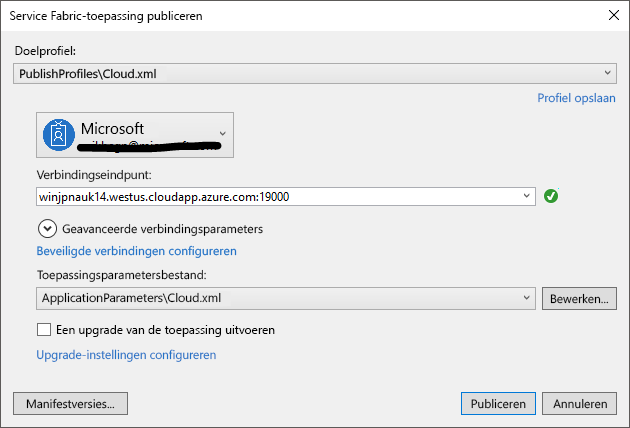

# <a name="tutorial-deploy-an-application-to-a-service-fabric-cluster-in-azure"></a>Zelfstudie: een toepassing implementeren naar een Service Fabric-cluster in Azure
Deze zelfstudie is deel twee van een reeks en laat zien hoe u direct vanuit Visual Studio een Azure Service Fabric-toepassing implementeert naar een nieuw cluster in Azure.

In deze zelfstudie leert u het volgende:
> [!div class="checklist"]
> * Een cluster maken vanuit Visual Studio
> * Een toepassing implementeren in een extern cluster met behulp van Visual Studio


In deze zelfstudie leert u het volgende:
> [!div class="checklist"]
> * [Een .NET Service Fabric-toepassing bouwen](service-fabric-tutorial-create-dotnet-app.md)
> * De toepassing implementeren in een extern cluster
> * [Een HTTPS-eindpunt toevoegen aan een front-end-service van ASP.NET Core](service-fabric-tutorial-dotnet-app-enable-https-endpoint.md)
> * [CI/CD configureren met behulp van Visual Studio Team Services](service-fabric-tutorial-deploy-app-with-cicd-vsts.md)
> * [Controle en diagnostische gegevens voor de toepassing instellen](service-fabric-tutorial-monitoring-aspnet.md)


## <a name="prerequisites"></a>Vereisten
Voor u met deze zelfstudie begint:
- Als u nog geen abonnement op Azure hebt, maak dan een [gratis account](https://azure.microsoft.com/free/?WT.mc_id=A261C142F)
- [Installeer Visual Studio 2017](https://www.visualstudio.com/) en installeer de workloads **Azure-ontwikkeling** en **ASP.NET-ontwikkeling en webontwikkeling**.
- [Installeer de Service Fabric-SDK](service-fabric-get-started.md)

## <a name="download-the-voting-sample-application"></a>De voorbeeldtoepassing om te stemmen downloaden
Als u in [deel één van deze zelfstudiereeks](service-fabric-tutorial-create-dotnet-app.md) niet de voorbeeldtoepassing om te stemmen hebt gemaakt, kunt u deze downloaden. Voer in een opdrachtvenster de volgende opdracht uit om de voorbeeld-app-opslagplaats te klonen op de lokale computer.

```
git clone https://github.com/Azure-Samples/service-fabric-dotnet-quickstart
```

## <a name="deploy-the-sample-application"></a>De voorbeeldtoepassing implementeren

### <a name="select-a-service-fabric-cluster-to-which-to-publish"></a>Selecteer een Service Fabric-cluster waarnaar u wilt publiceren
Nu de toepassing klaar is, kunt u deze rechtstreeks vanuit Visual Studio implementeren naar een cluster.

U hebt twee opties voor implementatie:
- Een cluster maken vanuit Visual Studio. Met deze optie kunt u een beveiligd cluster rechtstreeks vanuit Visual Studio met de configuraties van uw voorkeur maken. Dit type cluster is ideaal voor testscenario's, waar u het cluster kunt maken en er vervolgens direct naar kunt publiceren binnen Visual Studio.
- Publiceren naar een bestaand cluster in uw abonnement.

In deze zelfstudie worden de stappen gevolgd om vanuit Visual Studio een cluster te maken. Voor de andere opties kunt u uw verbindingseindpunt kopiëren en plakken, of kunt u het kiezen vanuit uw abonnement.
> [!NOTE]
> Veel services gebruiken de omgekeerde proxy om met elkaar te communiceren. Clusters die zijn gemaakt vanuit Visual Studio en clusters van derden hebben omgekeerde proxy standaard ingeschakeld.  Als u een bestaand cluster gebruikt, moet u [de omgekeerde proxy in het cluster inschakelen](service-fabric-reverseproxy.md#setup-and-configuration).

### <a name="deploy-the-app-to-the-service-fabric-cluster"></a>De app in het Service Fabric-cluster implementeren
1. Klik met de rechtermuisknop op het toepassingsproject in Solution Explorer en kies **Publiceren**.

2. Meld u aan met behulp van uw Azure-account, zodat u toegang hebt tot uw abonnement(en). Deze stap is optioneel als u een cluster van derden gebruikt.

3. Selecteer de vervolgkeuzelijst voor het **verbindingseindpunt** en selecteer de optie '<Create New Cluster...>'.
    
    
    
4. Wijzig in het dialoogvenster 'Cluster maken' de volgende instellingen:

    1. Geef de naam van het cluster op in het veld 'Clusternaam', evenals het abonnement en de locatie die u wilt gebruiken.
    2. Optioneel: u kunt het aantal knooppunten wijzigen. Standaard beschikt u over drie knooppunten, het minimale aantal dat is vereist om Service Fabric-scenario's te kunnen testen.
    3. Selecteer het tabblad 'Certificaat'. Typ op dit tabblad een wachtwoord dat u wilt gebruiken om het certificaat van uw cluster te beschermen. Met dit certificaat is uw cluster beter beveiligd. U kunt ook het pad wijzigen waar u het certificaat wilt opslaan. Visual Studio kan het certificaat voor u importeren, aangezien dit een vereiste stap is om de toepassing naar het cluster te kunnen publiceren.
    4. Selecteer het tabblad 'VM-details'. Geef het wachtwoord op dat u wilt gebruiken voor de virtuele machines (VM's) die het cluster vormen. De gebruikersnaam en het wachtwoord kunnen worden gebruikt om een externe verbinding met de virtuele machines tot stand te brengen. U moet ook een VM-machinegrootte selecteren, en u kunt indien nodig de VM-installatiekopie wijzigen.
    5. Optioneel: op het tabblad 'Geavanceerd' kunt u de lijst met poorten wijzigen die u wilt openen op de load balancer die samen met het cluster wordt gemaakt. U kunt ook een bestaande Application Insights-sleutel toevoegen die moet worden gebruikt om logboekbestanden naar door te sturen.
    6. Wanneer u klaar bent met het wijzigen van de instellingen, selecteert u de knop 'Maken'. Het maakproces duurt maar een paar minuten; in het uitvoervenster wordt aangegeven wanneer het cluster helemaal klaar is.
    
    

4. Zodra het cluster dat u wilt gebruiken gereed is, klikt u met de rechtermuisknop op het toepassingsproject en kiest u **Publiceren**.

    Nadat het publiceren is voltooid, moet u via een browser een aanvraag kunnen verzenden naar de toepassing.

5. Open de browser van uw voorkeur en typ het adres van het cluster (het verbindingseindpunt zonder de poortgegevens, bijvoorbeeld win1kw5649s.westus.cloudapp.azure.com).

    U moet nu hetzelfde resultaat zien als bij het lokaal uitvoeren van de toepassing.

    

## <a name="next-steps"></a>Volgende stappen
In deze zelfstudie heeft u het volgende geleerd:

> [!div class="checklist"]
> * Een cluster maken vanuit Visual Studio
> * Een toepassing implementeren in een extern cluster met behulp van Visual Studio

Ga door naar de volgende zelfstudie:
> [!div class="nextstepaction"]
> [HTTPS inschakelen](service-fabric-tutorial-dotnet-app-enable-https-endpoint.md)
