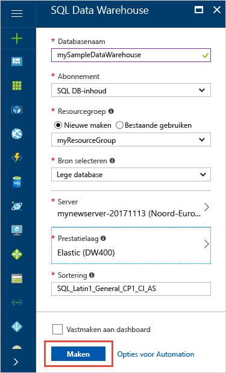
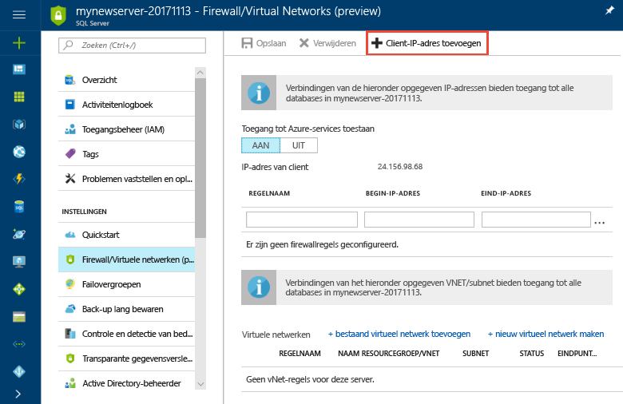

# <a name="create-an-azure-sql-data-warehouse-in-the-azure-portal"></a>Een Azure SQL datawarehouse maken in de Azure portal

Deze zelfstudie voor snel starten met de Azure SQL Data Warehouse-service datawarehouse maakt en geïnitialiseerd met behulp van de voorbeeldgegevens van AdventureWorksDW. Vervolgens verbinding maken met het datawarehouse en een query uitvoeren op de gegevens. De zelfstudie wordt gebruikgemaakt van de [Azure-portal](https://portal.azure.com) en [SQL Server Management Studio](/sql/ssms/download-sql-server-management-studio-ssms.md) (SSMS)

Als u nog geen Azure-abonnement hebt, maakt u een [gratis account](https://azure.microsoft.com/free/) voordat u begint.

## <a name="before-you-begin"></a>Voordat u begint

Voordat u deze snelstartgids, download en installeer de nieuwste versie van [SQL Server Management Studio](/sql/ssms/download-sql-server-management-studio-ssms.md) (SSMS).

## <a name="log-in-to-the-azure-portal"></a>Aanmelden bij Azure Portal

Meld u aan bij [Azure Portal](https://portal.azure.com/).

## <a name="create-a-data-warehouse"></a>Een datawarehouse maken

Een Azure SQL datawarehouse wordt gemaakt met een gedefinieerde set [rekenresources](performance-tiers.md). De database is gemaakt binnen een [Azure-resourcegroep](../azure-resource-manager/resource-group-overview.md) en in een [logische Azure SQL-server](../sql-database/sql-database-features.md). 

Volg deze stappen voor het maken van een SQL datawarehouse waarin de voorbeeldgegevens van AdventureWorksDW. 

1. Klik op de **nieuw** knop in de linkerbovenhoek van de Azure portal.

2. Selecteer **Databases** van de **nieuw** pagina en selecteer **SQL Data Warehouse** onder **aanbevolen** op de **nieuw**pagina.

    

3. Vul het formulier SQL Data Warehouse met de volgende informatie:   

    | Instelling | Voorgestelde waarde | Beschrijving | 
    | ------- | --------------- | ----------- | 
    | **Databasenaam** | mySampleDataWarehouse | Zie [Database-id's](/sql/relational-databases/databases/database-identifiers) voor geldige databasenamen. Opmerking, een datawarehouse is een type van de database.| 
    | **Abonnement** | Uw abonnement  | Zie [Abonnementen](https://account.windowsazure.com/Subscriptions) voor meer informatie over uw abonnementen. |
    | **Resourcegroep** | myResourceGroup | Zie [Naming conventions](https://docs.microsoft.com/azure/architecture/best-practices/naming-conventions) (Naamgevingsconventies) voor geldige resourcegroepnamen. |
    | **Bron selecteren** | Voorbeeld | Hiermee geeft u het laden van een voorbeelddatabase. Opmerking, een datawarehouse is een type van de database. |
    | **Voorbeeld selecteren** | AdventureWorksDW | Hiermee geeft u het laden van de voorbeelddatabase AdventureWorksDW.  |

    

4. Klik op **Server** als u een nieuwe server voor de nieuwe database wilt maken en configureren. Vul de **nieuwe serverformulier** met de volgende informatie: 

    | Instelling | Voorgestelde waarde | Beschrijving | 
    | ------------ | ------------------ | ------------------------------------------------- | 
    | **Servernaam** | Een wereldwijd unieke naam | Zie [Naming conventions](https://docs.microsoft.com/azure/architecture/best-practices/naming-conventions) (Naamgevingsconventies) voor geldige servernamen. | 
    | **Aanmeldgegevens van serverbeheerder** | Een geldige naam | Zie [Database-id's](https://docs.microsoft.com/sql/relational-databases/databases/database-identifiers) voor geldige aanmeldingsnamen.|
    | **Wachtwoord** | Een geldig wachtwoord | Uw wachtwoord moet ten minste acht tekens bestaan en moet tekens bevatten uit drie van de volgende categorieën: hoofdletters, kleine letters, cijfers en niet-alfanumerieke tekens. |
    | **Locatie** | Een geldige locatie | Zie [Azure-regio's](https://azure.microsoft.com/regions/) voor informatie over regio's. |

    

5. Klik op **Selecteren**.

6. Klik op **prestatielaag** om op te geven of het datawarehouse is geoptimaliseerd voor elasticiteit of compute en het aantal eenheden datawarehouse. 

7. Voor deze zelfstudie selecteert u de **geoptimaliseerd voor elasticiteit** servicelaag. De schuifregelaar standaard is ingesteld op **DW400**.  Verplaats het omhoog en omlaag om te zien hoe het werkt. 

    

8. Klik op **Toepassen**.

9. Nu u het SQL Database-formulier hebt ingevuld, klikt u op **Maken** om de database in te richten. De inrichting duurt een paar minuten. 

    

10. Klik op de werkbalk op **Meldingen** om het implementatieproces te bewaken.
    
     

## <a name="create-a-server-level-firewall-rule"></a>Een serverfirewallregel maken

De service SQL Data Warehouse maakt een firewall op het serverniveau die externe toepassingen en hulpprogramma's kan geen verbinding maken met de server of een database op de server. U kunt firewallregels waarmee connectiviteit voor bepaalde IP-adressen toevoegen zodat de verbinding.  Volg deze stappen voor het maken van een [firewallregel op serverniveau](../sql-database/sql-database-firewall-configure.md) voor IP-adres van de client. 

> [!NOTE]
> SQL Data Warehouse communiceert via poort 1433. Als u probeert verbinding maken vanaf een bedrijfsnetwerk, wordt het uitgaande verkeer via poort 1433 mogelijk niet toegestaan door de firewall van uw netwerk. In dat geval kunt u geen verbinding maken met uw Azure SQL Database-server, tenzij de IT-afdeling poort 1433 openstelt.
>

1. Wanneer de implementatie is voltooid, klikt u op **SQL Databases** in het menu aan de linkerkant. Klik vervolgens op de pagina **SQL Databases** op **mySampleDatabase**. De overzichtspagina voor uw database wordt geopend, waarin u de volledig gekwalificeerde servernaam (zoals **mynewserver 20171113.database.windows.net**) en biedt opties voor verdere configuratie. 

2. Kopieer deze volledig gekwalificeerde servernaam om in volgende Quick Starts verbinding te maken met de server en de bijbehorende databases. Klik vervolgens op de naam van de server om serverinstellingen te openen.

    

3. Klik op de naam van de server om serverinstellingen te openen.

    

5. Klik op **firewall-instellingen weergeven**. De pagina **Firewallinstellingen** voor de SQL Database-server wordt geopend. 

    

4. Klik op **IP van client toevoegen** op de werkbalk om uw huidige IP-adres aan een nieuwe firewallregel toe te voegen. Een firewallregel kan poort 1433 openen voor een afzonderlijk IP-adres of voor een aantal IP-adressen.

5. Klik op **Opslaan**. Er wordt een firewallregel op serverniveau gemaakt voor uw huidige IP-adres waarbij poort 1433 op de logische server wordt geopend.

6. Klik op **OK** en sluit de pagina **Firewallinstellingen**.

U kunt nu verbinding maken met de SQL-server en de datawarehouses met dit IP-adres. Werkt de verbinding van SQL Server Management Studio of een ander hulpprogramma naar keuze. Wanneer u verbinding maakt, gebruikt u de serverbeheerder-account dat u eerder hebt gemaakt.  

> [!IMPORTANT]
> Voor alle Azure-services is toegang via de SQL Database-firewall standaard ingeschakeld. Klik op **OFF** op deze pagina en klik vervolgens op **opslaan** de firewall voor alle Azure-services uitschakelen.

## <a name="get-the-fully-qualified-server-name"></a>De volledig gekwalificeerde servernaam ophalen

De volledig gekwalificeerde servernaam voor uw SQL-server ophalen in de Azure portal. U gaat de volledig gekwalificeerde naam later gebruiken bij het verbinden met de server.

1. Meld u aan bij [Azure Portal](https://portal.azure.com/).
2. Selecteer **SQL-databases** in het menu links en klik op uw database op de pagina **SQL-databases**. 
3. In het deelvenster **Essentials** van de Azure Portal-pagina van uw database kopieert u de **servernaam**. In dit voorbeeld is de volledig gekwalificeerde naam mynewserver 20171113.database.windows.net. 

      

## <a name="connect-to-the-server-as-server-admin"></a>Verbinding maken met de server als serverbeheerder

Deze sectie wordt [SQL Server Management Studio](/sql/ssms/download-sql-server-management-studio-ssms.md) (SSMS) een verbinding maken met uw Azure SQL-server.

1. Open SQL Server Management Studio.

2. Voer in het dialoogvenster **Verbinding maken met server** de volgende informatie in:

   | Instelling       | Voorgestelde waarde | Beschrijving | 
   | ------------ | ------------------ | ------------------------------------------------- | 
   | Servertype | Database-engine | Deze waarde is vereist |
   | Servernaam | De volledig gekwalificeerde servernaam | De naam moet er ongeveer als volgt: **mynewserver 20171113.database.windows.net**. |
   | Authentication | SQL Server-verificatie | SQL-verificatie is het enige verificatietype dat we in deze zelfstudie hebben geconfigureerd. |
   | Aanmelden | Het beheerdersaccount voor de server | Dit is het account dat u hebt opgegeven tijdens het maken van de server. |
   | Wachtwoord | Het wachtwoord voor het beheerdersaccount voor de server | Dit is het wachtwoord dat u hebt opgegeven tijdens het maken van de server. |

    

4. Klik op **Verbinden**. Het venster Objectverkenner wordt geopend in SSMS. 

5. Vouw in Object Explorer **Databases**. Vouw **mySampleDatabase** om de objecten in uw nieuwe database weer te geven.

     

## <a name="run-some-queries"></a>Sommige query's uitvoeren

SQL Data Warehouse maakt gebruik van T-SQL-querytaal als de. Gebruik de volgende stappen uit om een queryvenster openen en sommige T-SQL-query's uitvoert.

1. Met de rechtermuisknop op **mySampleDataWarehouse** en selecteer **nieuwe Query**.  Een nieuwe queryvenster wordt geopend.
2. Voer de volgende opdracht om een lijst weer van de databases in het queryvenster.

    ```sql
    SELECT * FROM sys.databases
    ```

3. Klik op **Uitvoeren**.  De queryresultaten weergegeven twee databases: **master** en **mySampleDataWarehouse**.

    

4. Voor sommige gegevens bekijkt, gebruik de volgende opdracht om te zien van het aantal klanten met de achternaam van Adams die bij u thuis drie onderliggende elementen hebben. De lijst met resultaten zes klanten. 

    ```sql
    SELECT LastName, FirstName FROM dbo.dimCustomer
    WHERE LastName = 'Adams' AND NumberChildrenAtHome = 3;
    ```

    

## <a name="clean-up-resources"></a>Resources opschonen

U bent in rekening worden gebracht rekenresources en gegevens die u in uw datawarehouse geladen. Deze worden afzonderlijk gefactureerd. 

- Als u dat de gegevens in de opslag wilt, kunt u de rekencapaciteit onderbreken wanneer u het datawarehouse niet gebruikt. Door de rekencapaciteit onderbreken u worden pas kosten voor opslag van gegevens en u kunt de berekeningen hervatten wanneer u klaar bent voor het werken met de gegevens.
- Als u verwijderen van toekomstige kosten wilt, kunt u het datawarehouse verwijderen. 

Volg deze stappen om op te schonen resources als gewenst.

1. Meld u aan bij de [Azure-portal](https://portal.azure.com), klikt u op uw datawarehouse.

    

1. Als u wilt onderbreken compute, klikt u op de **onderbreken** knop. Als het datawarehouse is onderbroken, ziet u een **Start** knop.  Als u wilt hervatten compute, klikt u op **Start**.

2. Als u wilt verwijderen, het datawarehouse zodat u geen voor compute of de opslag afgeschreven, klikt u op **verwijderen**.

3. Als u wilt verwijderen van de SQL-server die u hebt gemaakt, klikt u op **mynewserver 20171113.database.windows.net** in de vorige afbeelding en klik vervolgens op **verwijderen**.  Wees voorzichtig met dit als de server verwijdert, worden alle databases die zijn toegewezen aan de server.

4. Als u wilt verwijderen van de resourcegroep, klikt u op **myResourceGroup**, en klik vervolgens op **resourcegroep verwijderen**.


## <a name="next-steps"></a>Volgende stappen

Nu u een database hebt, kunt u verbinding maken met een hulpprogramma naar keuze en hiermee query's uitvoeren. Klik op de onderstaande hulpprogramma's voor meer informatie:

- [SQL Server Management Studio](../sql-database/sql-database-connect-query-ssms.md?toc=%2fazure%2fsql-data-warehouse%2ftoc.json)
- [Visual Studio Code](../sql-database/sql-database-connect-query-vscode.md?toc=%2fazure%2fsql-data-warehouse%2ftoc.json)
- [.NET](../sql-database/sql-database-connect-query-dotnet.md?toc=%2fazure%2fsql-data-warehouse%2ftoc.json)
- [PHP](../sql-database/sql-database-connect-query-php.md?toc=%2fazure%2fsql-data-warehouse%2ftoc.json)
- [Node.js](../sql-database/sql-database-connect-query-nodejs.md?toc=%2fazure%2fsql-data-warehouse%2ftoc.json)
- [Java](../sql-database/sql-database-connect-query-java.md?toc=%2fazure%2fsql-data-warehouse%2ftoc.json)
- [Python](../sql-database/sql-database-connect-query-python.md?toc=%2fazure%2fsql-data-warehouse%2ftoc.json)
- [Ruby](../sql-database/sql-database-connect-query-ruby.md?toc=%2fazure%2fsql-data-warehouse%2ftoc.json)