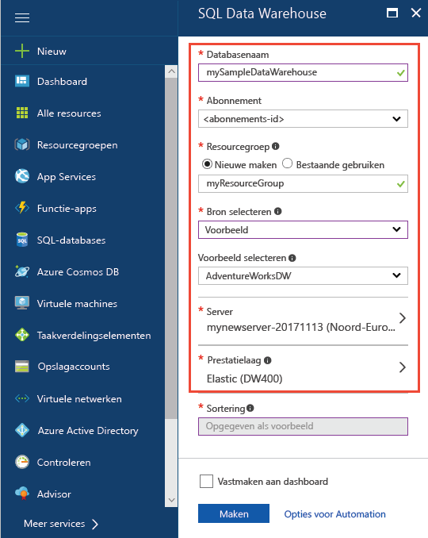
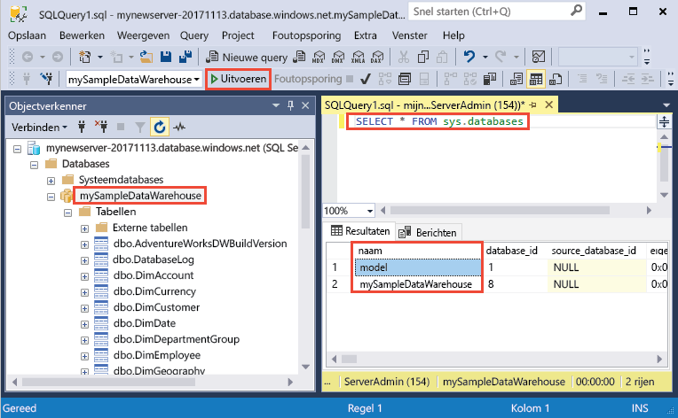
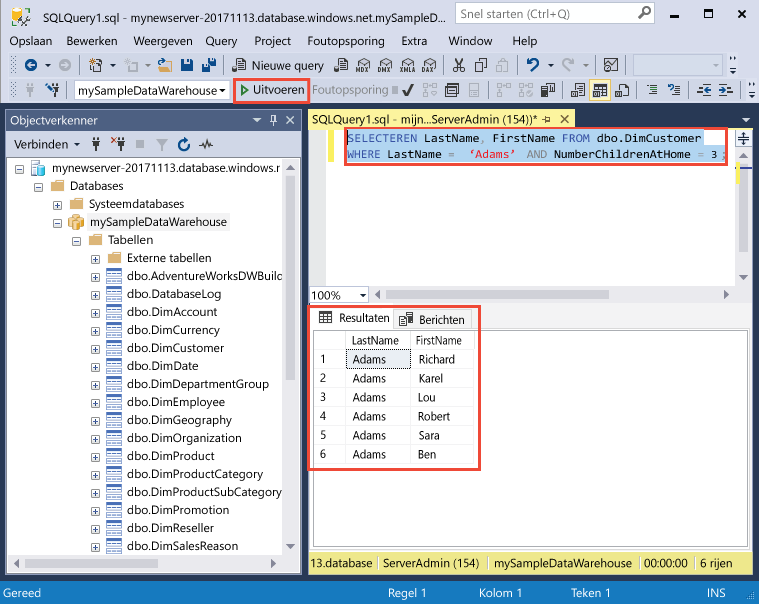

# <a name="quickstart-create-and-query-an-azure-sql-data-warehouse-in-the-azure-portal"></a>Snelstartgids: Een Azure SQL-datawarehouse maken en hier een query voor uitvoeren in Azure Portal

Maak snel een Azure SQL-datawarehouse en voer hier een query voor uit in Azure Portal.

Als u nog geen Azure-abonnement hebt, maakt u een [gratis account](https://azure.microsoft.com/free/) voordat u begint.

> [!NOTE]
> Het maken van een SQL Data Warehouse kan leiden tot een nieuwe factureerbare service.  Zie [Prijzen van SQL Data Warehouse](https://azure.microsoft.com/pricing/details/sql-data-warehouse/) voor meer informatie.
>
>

## <a name="before-you-begin"></a>Voordat u begint

Download en installeer de nieuwste versie van [SSMS](/sql/ssms/download-sql-server-management-studio-ssms) (SQL Server Management Studio).

## <a name="sign-in-to-the-azure-portal"></a>Aanmelden bij Azure Portal

Meld u aan bij [Azure Portal](https://portal.azure.com/).

## <a name="create-a-data-warehouse"></a>Een datawarehouse maken

Er wordt een Azure SQL-databasewarehouse gemaakt met een gedefinieerde set [compute-resources](memory-and-concurrency-limits.md). De database wordt gemaakt in een [Azure-resourcegroep](../azure-resource-manager/resource-group-overview.md) en in een [logische Azure SQL-server](../sql-database/sql-database-logical-servers.md). 

Volg de stappen om een SQL-datawarehouse te maken die de voorbeelddatabase AdventureWorksDW bevat. 

1. Klik in de linkerbovenhoek van Azure Portal op **Een resource maken**.

2. Selecteer op de pagina **Nieuw** de optie **Databases**, en selecteer onder **Aanbevolen** op de pagina **Nieuw** de optie **SQL Data Warehouse**.

    

3. Vul het SQL Data Warehouse-formulier in met de volgende gegevens:   

    | Instelling | Voorgestelde waarde | Beschrijving | 
    | ------- | --------------- | ----------- | 
    | **Databasenaam** | mySampleDataWarehouse | Zie [Database-id's](/sql/relational-databases/databases/database-identifiers) voor geldige databasenamen. Opmerking: een datawarehouse is een type database.| 
    | **Abonnement** | Uw abonnement  | Zie [Abonnementen](https://account.windowsazure.com/Subscriptions) voor meer informatie over uw abonnementen. |
    | **Resourcegroep** | myResourceGroup | Zie [Naming conventions](https://docs.microsoft.com/azure/architecture/best-practices/naming-conventions) (Naamgevingsconventies) voor geldige resourcegroepnamen. |
    | **Bron selecteren** | Voorbeeld | Geeft aan dat een voorbeelddatabase moet worden geladen. Opmerking: een datawarehouse is een type database. |
    | **Voorbeeld selecteren** | AdventureWorksDW | Geeft aan dat de voorbeelddatabase AdventureWorksDW moet worden geladen.  |

    

4. Klik op **Server** als u een nieuwe server voor de nieuwe database wilt maken en configureren. Vul het **nieuwe serverformulier** in met de volgende gegevens: 

    | Instelling | Voorgestelde waarde | Beschrijving | 
    | ------------ | ------------------ | ------------------------------------------------- | 
    | **Servernaam** | Een wereldwijd unieke naam | Zie [Naming conventions](https://docs.microsoft.com/azure/architecture/best-practices/naming-conventions) (Naamgevingsconventies) voor geldige servernamen. | 
    | **Aanmeldgegevens van serverbeheerder** | Een geldige naam | Zie [Database-id's](https://docs.microsoft.com/sql/relational-databases/databases/database-identifiers) voor geldige aanmeldingsnamen.|
    | **Wachtwoord** | Een geldig wachtwoord | Uw wachtwoord moet uit minstens acht tekens bestaan en moet tekens bevatten uit drie van de volgende categorieën: hoofdletters, kleine letters, cijfers en niet-alfanumerieke tekens. |
    | **Locatie** | Een geldige locatie | Zie [Azure-regio's](https://azure.microsoft.com/regions/) voor informatie over regio's. |

    

5. Klik op **Selecteren**.

6. Klik op **prestatieniveau** om op te geven van de prestatieconfiguratie van de voor het datawarehouse.

7. Selecteer voor deze zelfstudie **Gen2**. De schuifregelaar standaard is ingesteld op **DW1000c**.  Verplaats de regelaar omhoog en omlaag om te zien hoe dit werkt. 

    

8. Klik op **Toepassen**.

9. Nu dat u de SQL Data Warehouse-formulier hebt ingevuld, klikt u op **maken** voor het inrichten van de database. De inrichting duurt een paar minuten. 

    

10. Klik op de werkbalk op **Meldingen** om het implementatieproces te bewaken.
    
     

## <a name="create-a-server-level-firewall-rule"></a>Een serverfirewallregel maken

Met de SQL Database Warehouse-service wordt een firewall op serverniveau gemaakt die voorkomt dat externe toepassingen en hulpprogramma’s verbinding maken met de server of databases op de server. Als u de connectiviteit wilt inschakelen, kunt u firewallregels toevoegen waarmee connectiviteit voor bepaalde IP-adressen wordt ingeschakeld.  Volg deze stappen om een [firewallregel op serverniveau](../sql-database/sql-database-firewall-configure.md) te maken voor het IP-adres van uw client. 

> [!NOTE]
> SQL Database Warehouse communiceert via poort 1433. Als u verbinding wilt maken vanuit een bedrijfsnetwerk, is uitgaand verkeer via poort 1433 mogelijk niet toegestaan vanwege de firewall van het netwerk. In dat geval kunt u geen verbinding maken met uw Azure SQL Database-server, tenzij de IT-afdeling poort 1433 openstelt.
>

1. Nadat de implementatie is voltooid, klikt u op **SQL datawarehouses** vanuit het menu links en klik vervolgens op **mySampleDatabase** op de **SQL datawarehouses** pagina. De overzichtspagina voor uw database wordt geopend, met de volledig gekwalificeerde servernaam (zoals **mynewserver-20180430.database.windows.net**) en opties voor verdere configuratie. 

2. Kopieer deze volledig gekwalificeerde servernaam om in volgende Quick Starts verbinding te maken met de server en de bijbehorende databases. Klik op de servernaam om de serverinstellingen te openen.

    

3. Als u de serverinstellingen wilt openen, 
4. klikt u op de servernaam.

    

5. Klik op **Firewallinstellingen weergeven**. De pagina **Firewallinstellingen** voor de SQL Database-server wordt geopend. 

    

4. Klik op **IP-adres van client toevoegen** op de werkbalk om uw huidige IP-adres toe te voegen aan een nieuwe firewallregel. Een firewallregel kan poort 1433 openen voor een afzonderlijk IP-adres of voor een aantal IP-adressen.

5. Klik op **Opslaan**. Er wordt een firewallregel op serverniveau gemaakt voor uw huidige IP-adres waarbij poort 1433 op de logische server wordt geopend.

6. Klik op **OK** en sluit de pagina **Firewallinstellingen**.

U kunt nu via dit IP-adres verbinding maken met de SQL-server en de bijbehorende datawarehouses. De verbinding werkt met SQL Server Management Studio of een ander hulpprogramma van uw keuze. Wanneer u verbinding maakt, gebruikt u het ServerAdmin-account dat u eerder hebt gemaakt.  

> [!IMPORTANT]
> Voor alle Azure-services is toegang via de SQL Database-firewall standaard ingeschakeld. Klik op **UIT** op deze pagina en klik vervolgens op **Opslaan** om de firewall uit te schakelen voor alle Azure-services.

## <a name="get-the-fully-qualified-server-name"></a>De volledig gekwalificeerde servernaam ophalen

Haal de volledig gekwalificeerde servernaam van uw SQL-server op uit Azure Portal. Later gebruikt u de volledig gekwalificeerde servernaam bij het verbinding maken met de server.

1. Meld u aan bij [Azure Portal](https://portal.azure.com/).
2. Selecteer **SQL Data warehouses** in het menu links en klikt u op uw datawarehouse op de **SQL-datawarehouses** pagina. 
3. In het deelvenster **Essentials** van de Azure Portal-pagina van uw database kopieert u de **servernaam**. In dit voorbeeld is de volledig gekwalificeerde servernaam mynewserver-20180430.database.windows.net. 

      

## <a name="connect-to-the-server-as-server-admin"></a>Als serverbeheerder verbinding maken met de server

In deze sectie wordt gebruikgemaakt van [SSMS](/sql/ssms/download-sql-server-management-studio-ssms) (SQL Server Management Studio) om een verbinding tot stand te brengen met de Azure SQL-server.

1. Open SQL Server Management Studio.

2. Voer in het dialoogvenster **Verbinding maken met server** de volgende informatie in:

   | Instelling       | Voorgestelde waarde | Beschrijving | 
   | ------------ | ------------------ | ------------------------------------------------- | 
   | Servertype | Database-engine | Deze waarde is verplicht |
   | Servernaam | De volledig gekwalificeerde servernaam | Hier volgt een voorbeeld: **mynewserver-20180430.database.windows.net**. |
   | Verificatie | SQL Server-verificatie | SQL-verificatie is het enige verificatietype dat in deze zelfstudie is geconfigureerd. |
   | Aanmelden | Het beheerdersaccount voor de server | Dit is het account dat u hebt opgegeven tijdens het maken van de server. |
   | Wachtwoord | Het wachtwoord voor het beheerdersaccount voor de server | Dit is het wachtwoord dat u hebt opgegeven tijdens het maken van de server. |

    

4. Klik op **Verbinden**. Het venster Objectverkenner wordt geopend in SQL Server Management Studio. 

5. Vouw **Databases** uit in Objectverkenner. Vouw vervolgens **mySampleDatabase** uit om de objecten in uw nieuwe database weer te geven.

     

## <a name="run-some-queries"></a>Een aantal query's uitvoeren

SQL Data Warehouse maakt gebruik van T-SQL als querytaal. Gebruik de volgende stappen om een queryvenster te openen en een aantal T-SQL-query’s uit te voeren:

1. Klik met de rechtermuisknop op **mySampleDataWarehouse** en selecteer **Nieuwe query**.  Een nieuwe queryvenster wordt geopend.
2. Voer in het queryvenster de volgende opdracht in om een lijst met databases te zien.

    ```sql
    SELECT * FROM sys.databases
    ```

3. Klik op **Uitvoeren**.  De queryresultaten bevatten twee databases: **hoofd** en **mySampleDataWarehouse**.

    

4. Als u wat gegevens wilt bekijken, gebruikt u de volgende opdracht om het aantal klanten te zien met de achternaam Adams en met drie kinderen. De resultaten bestaan uit zes klanten. 

    ```sql
    SELECT LastName, FirstName FROM dbo.dimCustomer
    WHERE LastName = 'Adams' AND NumberChildrenAtHome = 3;
    ```

    

## <a name="clean-up-resources"></a>Resources opschonen

Er worden kosten in rekening gebracht voor datawarehouse-eenheden en gegevens die zijn opgeslagen in uw datawarehouse. Deze compute- en opslagresources worden apart in rekening gebracht. 

- Als u de gegevens in de opslag wilt houden, kunt u het berekenen onderbreken wanneer u het datawarehouse niet gebruikt. Als u het berekenen onderbreekt, worden alleen kosten in rekening gebracht voor de gegevensopslag. U kunt het berekenen hervatten wanneer u klaar bent om de gegevens te verwerken.
- Als u in de toekomst geen kosten meer wilt hebben, kunt u de datawarehouse verwijderen. 

Volg deze stappen om de resources op te schonen zoals gewenst.

1. Meld u aan bij [Azure Portal](https://portal.azure.com) en klik op uw datawarehouse.

    

1. Als u het berekenen wilt onderbreken, klikt u op de knop **Onderbreken**. Als het datawarehouse is onderbroken, ziet u een knop **Start**.  Als u het berekenen wilt hervatten, klikt u op **Start**.

2. Als u de datawarehouse wilt verwijderen zodat er geen kosten in rekening worden gebracht voor berekenen of opslaan, klikt u op **Verwijderen**.

3. Als u wilt verwijderen van de SQL-server die u hebt gemaakt, klikt u op **mynewserver-20180430.database.windows.net** in de vorige afbeelding, en klik vervolgens op **verwijderen**.  Wees voorzichtig met verwijderen. Als u de server verwijdert, worden ook alle databases verwijderd die zijn toegewezen aan de server.

4. Als u de resourcegroep wilt verwijderen, klikt u op **myResourceGroup**. Klik vervolgens op **Resourcegroep verwijderen**.


## <a name="next-steps"></a>Volgende stappen
U hebt nu een datawarehouse gemaakt, een firewallregel gemaakt die is verbonden met uw datawarehouse, en enkele query's uitgevoerd. Voor meer informatie over Azure SQL Data Warehouse gaat u verder met de zelfstudie voor het laden van gegevens.
> [!div class="nextstepaction"]
>[Gegevens laden in een SQL-datawarehouse](load-data-from-azure-blob-storage-using-polybase.md)
