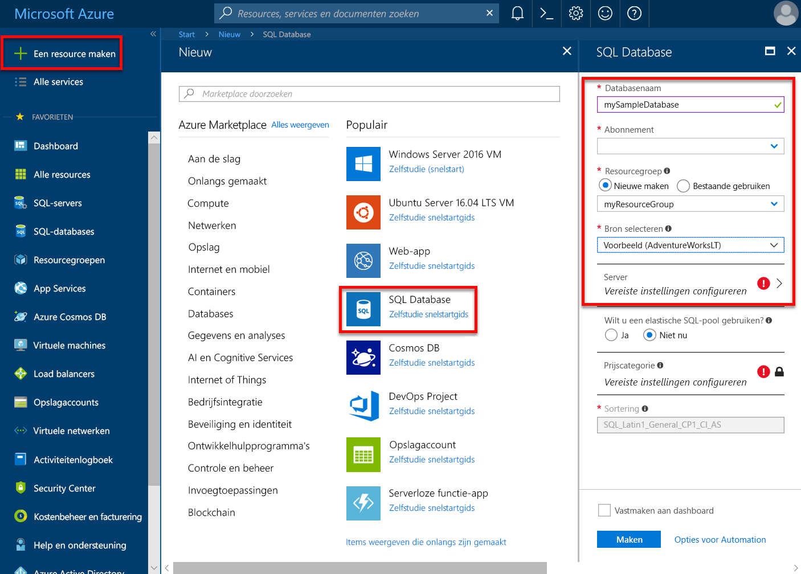
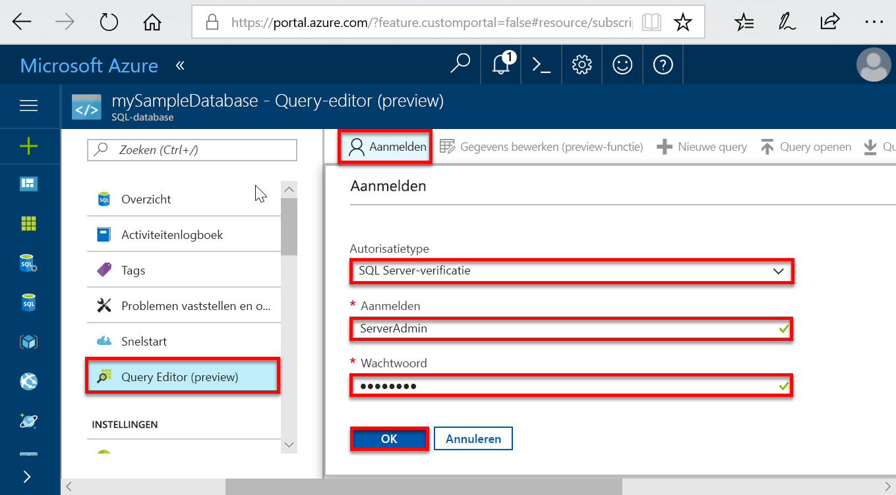

# <a name="create-an-azure-sql-database-in-the-azure-portal"></a>Een Azure SQL-database maken in Azure Portal

In deze snelstartgids leert u hoe u een SQL-database maakt in Azure met het [op DTU gebaseerde aankoopmodel](sql-database-service-tiers-dtu.md). Azure SQL Database is een Database-as-a-Service-oplossing waarmee u maximaal beschikbare SQL Server-databases kunt uitvoeren en schalen in de cloud. In deze snelstartgids ziet u hoe u aan de slag gaat door een SQL-database te maken met behulp van het Azure Portal.

Als u nog geen Azure-abonnement hebt, maakt u een [gratis account](https://azure.microsoft.com/free/) voordat u begint.

  >[!NOTE]
  >Deze zelfstudie maakt gebruik van het op DTU gebaseerde aankoopmodel, maar het [model op basis van vCore](sql-database-service-tiers-vcore.md) is ook beschikbaar.

## <a name="log-in-to-the-azure-portal"></a>Aanmelden bij Azure Portal

Meld u aan bij [Azure Portal](https://portal.azure.com/).

## <a name="create-a-sql-database"></a>Een SQL-database maken

Een Azure SQL-database wordt gemaakt met een gedefinieerde set [reken- en opslagresources](sql-database-service-tiers-dtu.md). De database is gemaakt in een [Azure-resourcegroep](../azure-resource-manager/resource-group-overview.md) en in een [logische Azure SQL Database-server](sql-database-features.md).

Volg deze stappen voor het maken van een SQL-database met de voorbeeldgegevens van Adventure Works LT.

1. Klik in de linkerbovenhoek van Azure Portal op **Een resource maken**.

2. Selecteer **Databases** op de pagina **Nieuw** en selecteer **Maken** onder **SQL-database** op de pagina **Nieuw**.

   

3. Vul het formulier SQL Database in met de volgende informatie, zoals in de voorgaande afbeelding wordt weergegeven:   

   | Instelling       | Voorgestelde waarde | Beschrijving |
   | ------------ | ------------------ | ------------------------------------------------- |
   | **Databasenaam** | mySampleDatabase | Zie [Database-id's](https://docs.microsoft.com/sql/relational-databases/databases/database-identifiers) voor geldige databasenamen. |
   | **Abonnement** | Uw abonnement  | Zie [Abonnementen](https://account.windowsazure.com/Subscriptions) voor meer informatie over uw abonnementen. |
   | **Resourcegroep**  | myResourceGroup | Zie [Naming conventions](https://docs.microsoft.com/azure/architecture/best-practices/naming-conventions) (Naamgevingsconventies) voor geldige resourcegroepnamen. |
   | **Bron selecteren** | Sample (AdventureWorksLT) | Hiermee worden het schema en de gegevens van AdventureWorksLT in de nieuwe database geladen. |

   > [!IMPORTANT]
   > U moet de voorbeelddatabase op dit formulier selecteren. Deze wordt namelijk in de rest van deze snelstartgids gebruikt.
   >

4. Klik onder **Server** op **Vereiste instellingen configureren** en vul het formulier SQL-server (logische server) in met de volgende informatie, zoals in de volgende afbeelding wordt weergegeven:   

   | Instelling       | Voorgestelde waarde | Beschrijving |
   | ------------ | ------------------ | ------------------------------------------------- |
   | **Servernaam** | Een wereldwijd unieke naam | Zie [Naming conventions](https://docs.microsoft.com/azure/architecture/best-practices/naming-conventions) (Naamgevingsconventies) voor geldige servernamen. |
   | **Aanmeldgegevens van serverbeheerder** | Een geldige naam | Zie [Database-id's](https://docs.microsoft.com/sql/relational-databases/databases/database-identifiers) voor geldige aanmeldingsnamen. |
   | **Wachtwoord** | Een geldig wachtwoord | Uw wachtwoord moet uit ten minste 8 tekens bestaan en moet tekens bevatten uit drie van de volgende categorieën: hoofdletters, kleine letters, cijfers en niet-alfanumerieke tekens. |
   | **Abonnement** | Uw abonnement | Zie [Abonnementen](https://account.windowsazure.com/Subscriptions) voor meer informatie over uw abonnementen. |
   | **Resourcegroep** | myResourceGroup | Zie [Naming conventions](https://docs.microsoft.com/azure/architecture/best-practices/naming-conventions) (Naamgevingsconventies) voor geldige namen van resourcegroepen. |
   | **Locatie** | Een geldige locatie | Zie [Azure-regio's](https://azure.microsoft.com/regions/) voor informatie over regio's. |

   > [!IMPORTANT]
   > De beheerdersaanmelding bij de server en het wachtwoord die u hier opgeeft, zijn vereist voor aanmelding bij de server en de bijbehorende databases verderop in deze snelstartgids. Onthoud of noteer deze informatie voor later gebruik.
   >  

   

5. Wanneer u het formulier hebt ingevuld, klikt u op **Selecteren**.

6. Klik op **Prijscategorie** om de servicelaag, het aantal DTU's en de hoeveelheid opslag op te geven. Bekijk de opties voor de hoeveelheid DTU's en opslag die voor elke servicelaag beschikbaar zijn.

   > [!IMPORTANT]
   > In de Premium-laag is momenteel meer dan 1 TB aan opslag beschikbaar in alle regio's met uitzondering van UK - noord, US - west-centraal, UK - zuid2, China - oost, US DoD - centraal, Duitsland - centraal, US DoD - oost, US Gov - zuid-centraal, US Gov zuid-centraal, Duitsland - noordoost, China - noord, US Gov - oost. In andere regio’s is de maximale opslagruimte in de Premium-laag beperkt tot 1 TB. Zie [P11-P15: huidige beperkingen]( sql-database-dtu-resource-limits-single-databases.md#single-database-limitations-of-p11-and-p15-when-the-maximum-size-greater-than-1-tb).  

7. Voor deze snelstartgids selecteert u de servicelaag **Standard** en gebruikt u vervolgens de schuifregelaar om **10 DTU's (S0)** en **1** GB aan opslagruimte te selecteren.

   

8. Accepteer de gebruiksvoorwaarden voor de preview om de optie **Extra opslag** te gebruiken.

   > [!IMPORTANT]
   > In de Premium-laag is momenteel meer dan 1 TB aan opslag beschikbaar in alle regio's met uitzondering van VS - west-centraal, China - oost, USDoDCentral, USGov Iowa, Duitsland - centraal, USDoDEast, US Gov Southwest, Duitsland - noordoost, China - noord. In andere regio’s is de maximale opslagruimte in de Premium-laag beperkt tot 1 TB. Zie [P11-P15: huidige beperkingen]( sql-database-dtu-resource-limits-single-databases.md#single-database-limitations-of-p11-and-p15-when-the-maximum-size-greater-than-1-tb).  

9. Als u de servicelaag, het aantal DTU's en de hoeveelheid opslagruimte hebt geselecteerd, klikt u op **Toepassen**.  

10. Nu u het SQL Database-formulier hebt ingevuld, klikt u op **Maken** om de database in te richten. De inrichting duurt een paar minuten.

11. Klik op de werkbalk op **Meldingen** om het implementatieproces te bewaken.

     

## <a name="create-a-server-level-firewall-rule"></a>Een serverfirewallregel maken

De service SQL Database maakt een firewall op serverniveau die voorkomt dat externe toepassingen en hulpmiddelen verbinding maken met de server of databases op de server, tenzij er een firewallregel is gemaakt om de firewall te openen voor specifieke IP-adressen. Volg deze stappen om een [SQL Database-firewallregel op serverniveau](sql-database-firewall-configure.md) te maken voor het IP-adres van de client en connectiviteit via de SQL Database-firewall alleen voor uw IP-adres toe te staan.

> [!NOTE]
> SQL Database communiceert via poort 1433. Als u verbinding probeert te maken vanuit een bedrijfsnetwerk, wordt uitgaand verkeer via poort 1433 mogelijk niet toegestaan door de firewall van uw netwerk. In dat geval kunt u geen verbinding maken met uw Azure SQL Database-server, tenzij de IT-afdeling poort 1433 openstelt.
>

1. Wanneer de implementatie is voltooid, klikt u op **SQL Databases** in het menu aan de linkerkant. Klik vervolgens op de pagina **SQL Databases** op **mySampleDatabase**. De overzichtspagina voor uw database wordt geopend, met de volledig gekwalificeerde servernaam (zoals **mynewserver20170824.database.windows.net**) en opties voor verdere configuratie.

2. Kopieer deze volledig gekwalificeerde servernaam om in volgende snelstartgidsen verbinding te maken met de server en de bijbehorende databases.

   

3. Klik op de werkbalk op **Serverfirewall instellen** zoals in de vorige afbeelding is weergegeven. De pagina **Firewallinstellingen** voor de SQL Database-server wordt geopend.

   

4. Klik op **IP van client toevoegen** op de werkbalk om uw huidige IP-adres aan een nieuwe firewallregel toe te voegen. Een firewallregel kan poort 1433 openen voor een afzonderlijk IP-adres of voor een aantal IP-adressen.

5. Klik op **Opslaan**. Er wordt een firewallregel op serverniveau gemaakt voor uw huidige IP-adres waarbij poort 1433 op de logische server wordt geopend.

6. Klik op **OK** en sluit de pagina **Firewallinstellingen**.

U kunt nu verbinding maken met de SQL Database-server en de bijbehorende databases met behulp van SQL Server Management Studio of een ander hulpprogramma naar keuze. Dit doet u vanaf dit IP-adres via het serverbeheerdersaccount dat eerder is gemaakt.

> [!IMPORTANT]
> Voor alle Azure-services is toegang via de SQL Database-firewall standaard ingeschakeld. Klik op **UIT** op deze pagina om dit voor alle Azure-services uit te schakelen.
>

## <a name="query-the-sql-database"></a>Query's uitvoeren op de SQL-database

Nu u een voorbeelddatabase in Azure hebt gemaakt, gebruiken we het ingebouwde hulpprogramma voor query's binnen Azure Portal om te bevestigen dat u verbinding kunt maken met de database en query's kunt uitvoeren voor de gegevens.

1. Klik op de pagina SQL Database voor uw database op **Query-editor (preview)** in het menu links en klik daarna op **Aanmelden**.

   

2. Selecteer de SQL Server-verificatie, geef de vereiste aanmeldingsgegevens op en klik op **OK** om u aan te melden.

3. Wanneer u bent geverifieerd als **ServerAdmin**, typt u de volgende query in het deelvenster van de query-editor.

   ```sql
   SELECT TOP 20 pc.Name as CategoryName, p.name as ProductName
   FROM SalesLT.ProductCategory pc
   JOIN SalesLT.Product p
   ON pc.productcategoryid = p.productcategoryid;
   ```

4. Klik op **Uitvoeren** en bekijk de resultaten van de query in het deelvenster **Resultaten**.

   

5. Sluit de pagina **Query-editor** en klik op **OK** om uw niet-opgeslagen bewerkingen te verwijderen.

## <a name="clean-up-resources"></a>Resources opschonen

Sla deze resources op als u verder wilt gaan met [Volgende stappen](#next-steps) en wilt leren hoe u op verschillende manieren verbinding kunt maken met uw database en deze kunt bevragen. Als u echter de resources wilt verwijderen die u hebt gemaakt in deze snelstartgids, voert u de volgende stappen uit.


1. Klik in het menu links in Azure Portal op **Resourcegroepen** en klik vervolgens op **myResourceGroup**.
2. Klik op de pagina van uw resourcegroep op **Verwijderen**, typ **myResourceGroup** in het tekstvak en klik vervolgens op **Verwijderen**.

## <a name="next-steps"></a>Volgende stappen

- Nu u een database hebt, kunt u [verbinding maken met een hulpprogramma of taal naar keuze en daarmee query's uitvoeren](sql-database-connect-query.md). 
- Voor informatie over het ontwerpen van uw eerste database, het maken van tabellen en het invoegen van gegevens kunt u een van deze zelfstudies gebruiken:
 - [Uw eerste Azure SQL-database ontwerpen met SQL Server Management Studio](sql-database-design-first-database.md)
  - [Een Azure SQL-database ontwerpen en verbinding maken met C# en ADO.NET](sql-database-design-first-database-csharp.md)
