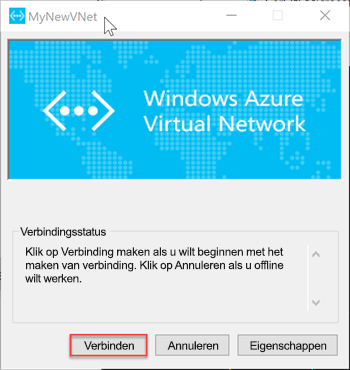

# <a name="configure-a-point-to-site-connection-to-connect-to-an-azure-sql-database-managed-instance-from-on-premises-computer"></a>Een punt-naar-site-verbinding verbinding maken met een Azure SQL Database Managed Instance vanaf on-premises computer configureren

In deze Quick Start ziet u hoe u verbinding maken met een Azure SQL Database Managed Instance via [SQL Server Management Studio](https://docs.microsoft.com/sql/ssms/sql-server-management-studio-ssms) (SSMS) vanuit een on-premises clientcomputer via een punt-naar-site-verbinding. Zie voor meer informatie over punt-naar-site-verbindingen [over punt-naar-Site-VPN](../vpn-gateway/point-to-site-about.md)

## <a name="prerequisites"></a>Vereisten

Deze Quick Start:
- Gebruikt als de wijst u de resources die in deze snelstartgids zijn gemaakt: [maken van een beheerd exemplaar](sql-database-managed-instance-get-started.md).
- PowerShell 5.1 en Azure PowerShell 5.4.2 vereist of hoger uw on-premises client-computer.
- Vereist de nieuwste versie van [SQL Server Management Studio](https://docs.microsoft.com/sql/ssms/sql-server-management-studio-ssms) (SSMS) op uw on-premises client-computer

## <a name="attach-a-vpn-gateway-to-your-managed-instance-virtual-network"></a>Een VPN-gateway met uw beheerde exemplaar van virtueel netwerk koppelen

1. Open Powershell op uw on-premises clientcomputer.
2. Kopieer en plak dit PowerShell-script. Met dit script koppelt u een VPN-Gateway met het virtuele netwerk van Managed Instance die u hebt gemaakt in de [maken van een beheerd exemplaar](sql-database-managed-instance-get-started.md) Quick Start. Met dit script voert de volgende drie stappen uit:
  - Maakt en installeert u certificaten op client-computer
  - Berekent de toekomstige VPN-Gateway-subnet IP-adresbereik
  - Hiermee maakt u het GatewaySubnet
  - De Azure Resource Manager-sjabloon die wordt gekoppeld de VPN-Gateway voor VPN-subnet implementeert

   ```powershell
   $scriptUrlBase = 'https://raw.githubusercontent.com/Microsoft/sql-server-samples/master/samples/manage/azure-sql-db-managed-instance/attach-vpn-gateway'

   $parameters = @{
       subscriptionId = '<subscriptionId>'
       resourceGroupName = '<resourceGroupName>'
       virtualNetworkName = '<virtualNetworkName>'
       certificateNamePrefix  = '<certificateNamePrefix>'
       }

   Invoke-Command -ScriptBlock ([Scriptblock]::Create((iwr ($scriptUrlBase+'/attachVPNGateway.ps1?t='+ [DateTime]::Now.Ticks)).Content)) -ArgumentList $parameters, $scriptUrlBase 
   ```

3. Geef de vereiste parameters in het PowerShell-script. De waarden voor `<subscriptionId>`, `<resourceGroup>` en `<virtualNetworkName>` moet overeenkomen met de gegevenstypen die worden gebruikt in [beheerd exemplaar maken](sql-database-managed-instance-get-started.md) Quick Start. De waarde voor `<certificateNamePrefix>` kan bestaan uit een tekenreeks van uw keuze.

4. Voer het PowerShell-script.

## <a name="create-a-vpn-connection-to-your-managed-instance"></a>Een VPN-verbinding met uw beheerde exemplaar maken

1. Meld u aan bij [Azure Portal](https://portal.azure.com/).
2. Open de resourcegroep waarin u de gateway van virtueel netwerk hebt gemaakt en vervolgens een resource van de virtuele netwerkgateway.

      

3. Klik op **punt-naar-site-configuratie** en klik vervolgens op **VPN-client downloaden**.

      
4. Pak de bestanden in het zip-bestand en open vervolgens de uitgepakte map. 
5. Havigate naar de map WindowsAmd64 en open de **VpnClientSetupAmd64.exe** bestand.
6. Als u ontvangt een **Windows beveiligd uw PC** weergegeven, klikt u op **meer info** en klik vervolgens op **toch uitvoeren**.

    \
7. Klik op **Ja** in het dialoogvenster User Account Control om door te gaan.
8. Klik in het dialoogvenster MyNewVNet **Ja** voor het installeren van een Vpn-Client voor MyNewVNet.

## <a name="connect-to-the-vpn-connection"></a>Verbinding maken met de VPN-verbinding.

1. Ga naar de VPN-verbindingen op uw client-computer en klikt u op **MyNewVNet** tot stand brengen van een verbinding met dit VNet.

      
2. Klik op **Verbinden**.
3. Klik in het dialoogvenster MyNewVNet **Connect**.

      
4. Wanneer u hierom wordt gevraagd dat Verbindingsbeheer behoeften met verhoogde bevoegdheden aan uw routetabel bijwerken, klikt u op **doorgaan**.
5. Klik op **Ja** in het dialoogvenster User Account Control om door te gaan.

      

   U hebt een VPN-verbinding tot stand gebracht met uw VNet beheerd exemplaar.

## <a name="use-ssms-to-connect-to-the-managed-instance"></a>SSMS gebruiken voor verbinding met het beheerde exemplaar

1. Open op de clientcomputer on-premises SQL Server Management Studio (SSMS).
 
2. In de **verbinding maken met Server** dialoogvenster vak, voer de volledig gekwalificeerde **hostnaam** voor uw beheerde exemplaar in de **servernaam** Schakel **SQL Server Verificatie**, uw gebruikersnaam en wachtwoord en klik vervolgens op **Connect**.

      

Nadat u verbinding hebt gemaakt, kunt u uw systeem en gebruikersdatabases bekijken in het knooppunt Databases. Daarnaast kunt u diverse objecten bekijken in de knooppunten Beveiliging, Server-objecten, Replicatie, Beheer, SQL Server Agent en XEvent Profiler.

## <a name="next-steps"></a>Volgende stappen

- Zie voor een snelstart van het verbinding maken vanaf een virtuele machine van Azure [een punt-naar-site-verbinding configureren](sql-database-managed-instance-configure-p2s.md)
- Zie voor een overzicht van de opties voor de verbinding voor toepassingen, [verbinding maken met uw toepassingen naar Managed Instance](sql-database-managed-instance-connect-app.md).
- Als u wilt een bestaande SQL Server-database herstellen van on-premises naar een beheerd exemplaar, kunt u de [Azure Database Migration Service (DMS) voor de migratie](../dms/tutorial-sql-server-to-managed-instance.md) om terug te zetten vanuit een back-upbestand van de database of de [T-SQL herstellen opdracht](sql-database-managed-instance-get-started-restore.md) om terug te zetten vanuit een back-upbestand van de database.
