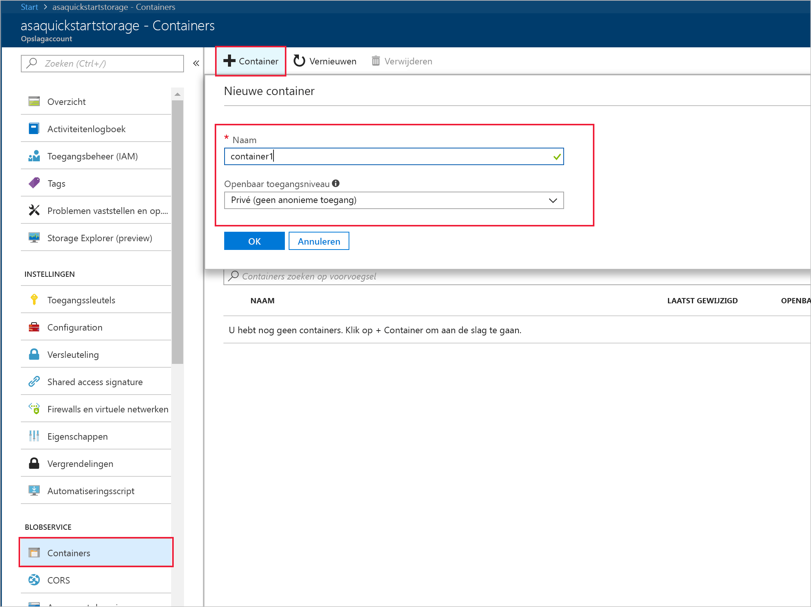
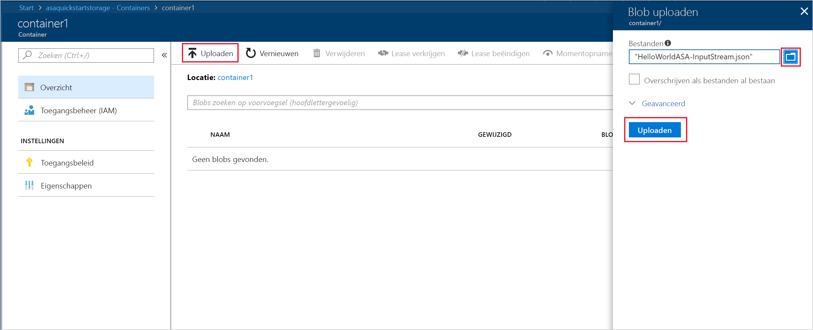
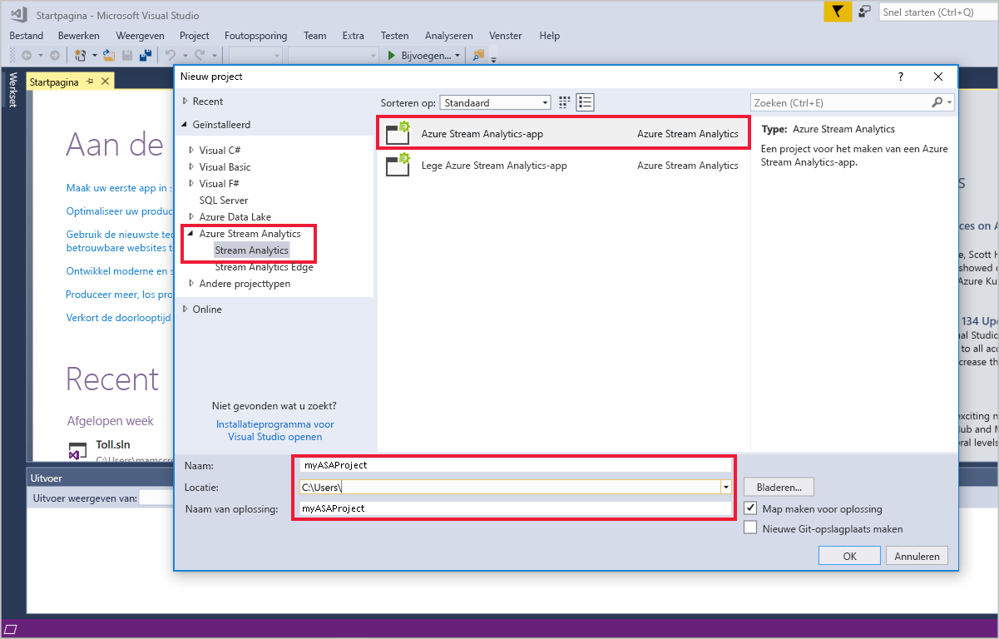
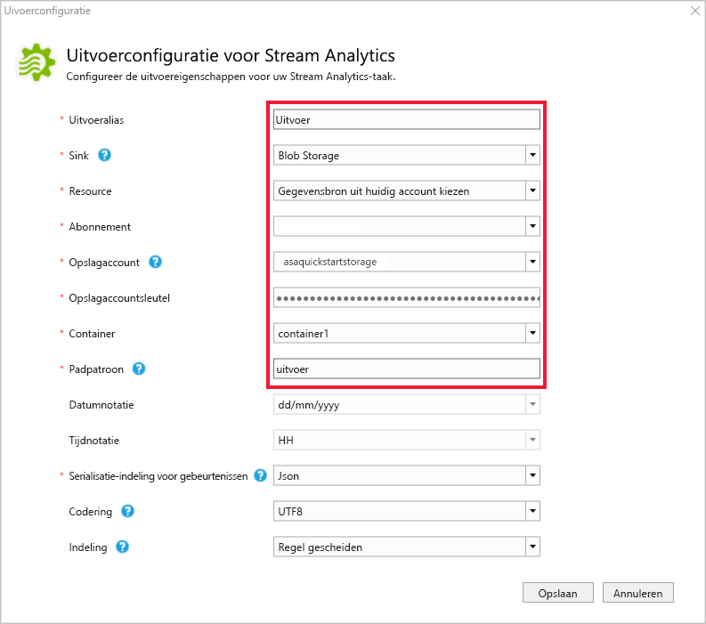
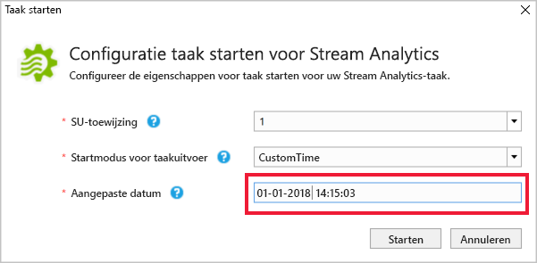
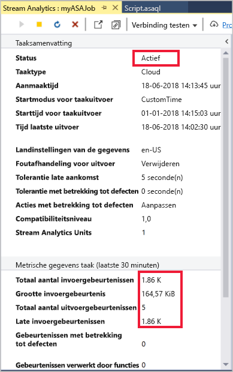

# <a name="quickstart-create-a-stream-analytics-job-by-using-the-azure-stream-analytics-tools-for-visual-studio"></a>Snelstart: Een Stream Analytics-taak maken met behulp van de Azure Stream Analytics-tools voor Visual Studio

Deze snelstart laat zien hoe u een Stream Analytics-taak kunt maken en uitvoeren met Azure Stream Analytics-tools voor Visual Studio. De voorbeeldtaak leest streaminggegevens uit Azure Blob-opslag. Het bestand met invoergegevens dat wordt gebruikt in deze snelstart, bevat statische gegevens die alleen zijn bedoeld ter illustratie. In een werkelijk scenario gebruikt u streaming-invoergegevens voor een Stream Analytics-taak. In deze snelstart definieert u een taak die de gemiddelde temperatuur bij meer dan 100° berekent en de resulterende uitvoergebeurtenissen naar een nieuw bestand schrijft.

## <a name="before-you-begin"></a>Voordat u begint

* Als u nog geen abonnement op Azure hebt, maakt u een [gratis account](https://azure.microsoft.com/free/) aan.

* Meld u aan bij [Azure Portal](https://portal.azure.com/).

* Installeer Visual Studio 2017, Visual Studio 2015 of Visual Studio 2013 Update 4. Enterprise- (Ultimate/Premium), Professional- en Community-edities worden ondersteund. De Express-editie wordt niet ondersteund.

* Volg de [installatie-instructies](https://docs.microsoft.com/azure/stream-analytics/stream-analytics-tools-for-visual-studio-install) om Stream Analytics-tools voor Visual Studio te installeren.

## <a name="prepare-the-input-data"></a>De invoergegevens voorbereiden

Voordat u de Stream Analytics-taak definieert, moet u de gegevens voorbereiden die als invoer voor de taak worden geconfigureerd. Voer de volgende stappen uit om de invoergegevens voor te bereiden die zijn vereist voor de taak:

1. Download de [voorbeeldsensorgegevens](https://raw.githubusercontent.com/Azure/azure-stream-analytics/master/Samples/GettingStarted/HelloWorldASA-InputStream.json) in GitHub. De voorbeeldgegevens bevatten sensorinformatie in de volgende JSON-indeling:  

   ```json
   {
     "time": "2018-01-26T21:18:52.0000000",
     "dspl": "sensorC",
     "temp": 87,
     "hmdt": 44
   }
   ```
2. Meld u aan bij [Azure Portal](https://portal.azure.com/).

3. Selecteer in de linkerbovenhoek in Azure Portal **Een resource maken** > **Storage** > **Storage-account**. Vul de pagina voor de Storage-accounttaak in, waarbij **Naam** is ingesteld op 'asaquickstartstorage', **Locatie** op 'US - west', **Resourcegroep** op 'asaquickstart-resourcegroup' (host het opslagaccount in dezelfde resourcegroep als de streaming-taak voor betere prestaties). De overige instellingen kunnen op de standaardwaarden blijven staan.  

   

4. Ga op de pagina **Alle resources** naar het opslagaccount dat u in de vorige stap hebt gemaakt. Open de pagina **Overzicht** en open vervolgens de tegel **Blobs**.  

5. Selecteer op de pagina **Blob Service** **Container**, geef een **naam** op voor uw container, zoals *container 1* > selecteer **OK**.  

   

6. Ga naar de container die u hebt gemaakt in de vorige stap. Selecteer **Uploaden** en upload de sensorgegevens die u hebt gekregen in de eerste stap.  

   

## <a name="create-a-stream-analytics-project"></a>Een Stream Analytics-project maken

1. Start Visual Studio.

2. Selecteer **Bestand > Nieuw > Project**.  

3. Selecteer **Stream Analytics**in de sjablonenlijst aan de linkerkant en selecteer vervolgens **Azure Stream Analytics Application**.  

4. Voer de **Naam**, **Locatie**en **Oplossingsnaam** van het project in en selecteer **OK**.

   

Let op de elementen die zijn opgenomen in een Azure Stream Analytics-project.

   


## <a name="choose-the-required-subscription"></a>Kies het vereiste abonnement

1. Selecteer in Visual Studio in het menu **Beeld** de optie **Server Explorer**.

2. Klik met de rechtermuisknop op **Azure**, selecteer **Verbinding maken met Microsoft Azure-abonnement**en meld u aan met uw Azure-account.

## <a name="define-input"></a>Invoer definiëren

1. Vouw in **Solution Explorer**het knooppunt **Inputs** uit en dubbelklik op **Input.json**.

2. Vul de **Stream Analytics-invoerconfiguratie** in met de volgende waarden:

   |**Instelling**  |**Voorgestelde waarde**  |**Beschrijving**   |
   |---------|---------|---------|
   |Invoeralias  |  Invoer   |  Voer een unieke naam in voor de invoer van de taak.   |
   |Brontype   |  Gegevensstroom |  Kies de juiste invoerbron: gegevensstroom of referentiegegevens.   |
   |Bron  |  Blob Storage |  Kies de juiste invoerbron.   |
   |Resource  | Kies gegevensbron van het huidige account | Kies ervoor om gegevens handmatig in te voeren of selecteer een bestaand account.   |
   |Abonnement  |  \<Uw abonnement\>   | Selecteer het Azure-abonnement met het opslagaccount dat u hebt gemaakt. Het opslagaccount kan voor hetzelfde of een ander abonnement gelden. Voor dit voorbeeld wordt aangenomen dat u een opslagaccount voor hetzelfde abonnement hebt gemaakt.   |
   |Opslagaccount  |  asaquickstartstorage   |  Kies of typ de naam van het opslagaccount. Namen van opslagaccounts worden automatisch gedetecteerd als ze worden gemaakt in hetzelfde abonnement.   |
   |Container  |  container1   |  Selecteer de bestaande container die u in uw opslagaccount hebt gemaakt.   |
   
3. De andere opties kunnen de standaardwaarden behouden. Selecteer **Opslaan** om de instellingen op te slaan.  

   

## <a name="define-output"></a>Uitvoer definiëren

1. Vouw in **Solution Explorer**het knooppunt **Outputs** uit en dubbelklik op **Output.json**.

2. Vul de **Stream Analytics-uitvoerconfiguratie** in met de volgende waarden:

   |**Instelling**  |**Voorgestelde waarde**  |**Beschrijving**   |
   |---------|---------|---------|
   |Uitvoeralias  |  Uitvoer   |  Voer een unieke naam in voor de uitvoer van de taak.   |
   |Sink   |  Blob Storage |  Kies de juiste sink.    |
   |Resource  |  Gegevensbroninstellingen handmatig opgeven |  Kies ervoor om gegevens handmatig in te voeren of selecteer een bestaand account.   |
   |Abonnement  |  \<Uw abonnement\>   | Selecteer het Azure-abonnement met het opslagaccount dat u hebt gemaakt. Het opslagaccount kan voor hetzelfde of een ander abonnement gelden. Voor dit voorbeeld wordt aangenomen dat u een opslagaccount voor hetzelfde abonnement hebt gemaakt.   |
   |Opslagaccount  |  asaquickstartstorage   |  Kies of typ de naam van het opslagaccount. Namen van opslagaccounts worden automatisch gedetecteerd als ze worden gemaakt in hetzelfde abonnement.   |
   |Container  |  container1   |  Selecteer de bestaande container die u in uw opslagaccount hebt gemaakt.   |
   |Padpatroon  |  output   |  Voer de naam in van een bestandspad dat in de container moet worden gemaakt.   |
   
3. De andere opties kunnen de standaardwaarden behouden. Selecteer **Opslaan** om de instellingen op te slaan.  

   

## <a name="define-the-transformation-query"></a>De transformatiequery definiëren

1. Open **Script.asaql** vanuit **Solution Explorer** in Visual Studio.

2. Voeg de volgende query toe:

   ```sql
   SELECT 
   System.Timestamp AS OutputTime,
   dspl AS SensorName,
   Avg(temp) AS AvgTemperature
   INTO
     Output
   FROM
     Input TIMESTAMP BY time
   GROUP BY TumblingWindow(second,30),dspl
   HAVING Avg(temp)>100
   ```

## <a name="submit-a-stream-analytics-query-to-azure"></a>Een Stream Analytics-query naar Azure verzenden

1. Selecteer in de **Query-editor** **Verzenden naar Azure** in de scripteditor.

2. Selecteer **Een nieuwe Azure Stream Analytics-taak** maken en voer een **taaknaam**in. Kies het **Abonnement**, de **Resourcegroep**en de **Locatie** die u aan het begin van de snelstart hebt gebruikt.

   

## <a name="start-the-stream-analytics-job-and-check-output"></a>Stream Analytics-taak starten en uitvoer controleren

1. Wanneer de taak is gemaakt, wordt de taakweergave automatisch geopend. Selecteer de knop met de groene pijl om de taak te starten.

   

2. Wijzig de datum van **Aangepaste tijd** in `2018-01-01` en selecteer **Start**.

   

3. Merk op dat de taakstatus is gewijzigd in **Actief**en dat er invoer-/uitvoergebeurtenissen zijn. Dit kan enkele minuten duren.

   

4. Als u resultaten wilt bekijken, selecteert u in het menu **Beeld** **Cloud Explorer**en navigeert u naar het opslagaccount in uw resourcegroep. Dubbelklik onder **Blob Containers**op **container1**en vervolgens op het **uitvoer**bestandspad.

   

## <a name="clean-up-resources"></a>Resources opschonen

Wanneer u een resourcegroep niet meer nodig hebt, verwijdert u de resourcegroep, de streamingtaak en alle gerelateerde resources. Door de taak te verwijderen, voorkomt u dat de streaming-eenheden die door de taak worden verbruikt, in rekening worden gebracht. Als u denkt dat u de taak in de toekomst nog gaat gebruiken, kunt u deze stoppen en later opnieuw starten wanneer dat nodig is. Als u deze taak niet meer gaat gebruiken, verwijdert u alle resources die in deze snelstart zijn gemaakt. Daarvoor voert u de volgende stappen uit:

1. Selecteer in het menu aan de linkerkant in Azure Portal de optie **Resourcegroepen** en selecteer vervolgens de resource die u hebt gemaakt.  

2. Selecteer op de pagina van uw resourcegroep de optie **Verwijderen**, typ de naam van de resource die u wilt verwijderen in het tekstvak en selecteer vervolgens **Verwijderen**.

## <a name="next-steps"></a>Volgende stappen

In deze snelstart hebt u een eenvoudige Stream Analytics-taak met behulp van Visual Studio geïmplementeerd. U kunt Stream Analytics-taken ook implementeren met behulp van de [Azure-portal](stream-analytics-quick-create-portal.md) en [PowerShell](stream-analytics-quick-create-powershell.md). 

Voor informatie over het configureren van andere invoerbronnen en het uitvoeren van detectie in realtime gaat u door naar het volgende artikel:

> [!div class="nextstepaction"]
> [Fraudedetectie in realtime met Azure Stream Analytics](stream-analytics-real-time-fraud-detection.md)
