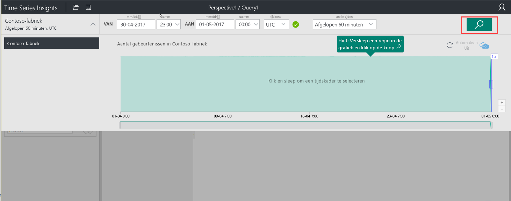
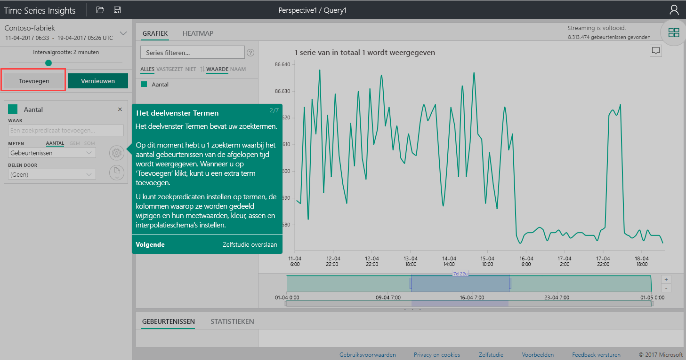
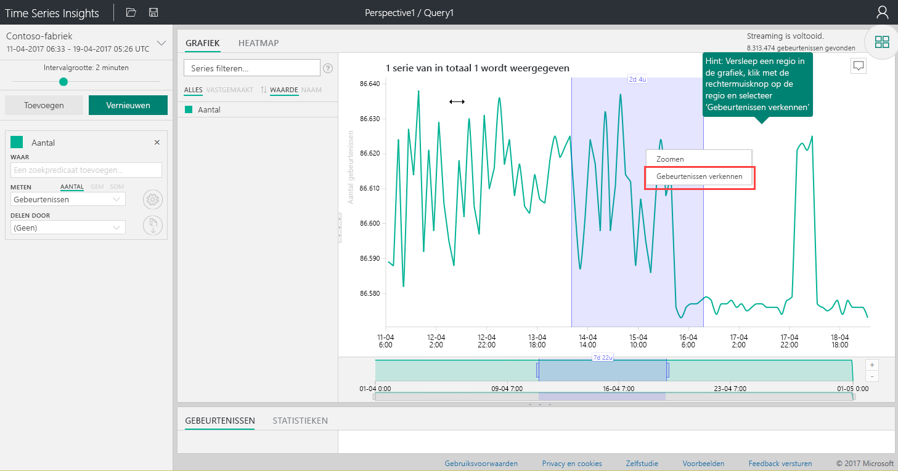
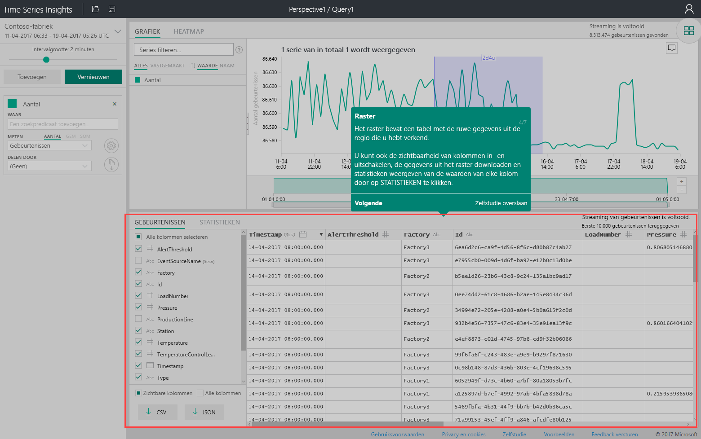

# Quickstart: Azure Time Series Insights verkennen
In deze quickstart wordt in een gratis demo-omgeving uitgelegd hoe u aan de slag kunt met de verkenner van Azure Time Series Insights. U leert hoe u in uw webbrowser grote hoeveelheden IoT-gegevens kunt visualiseren en u maakt een rondleiding door de belangrijkste functies van de verkenner van Time Series Insights. 

Azure Time Series Insights is een volledig beheerde service voor analyse, opslag en visualisatie die het eenvoudig maakt om miljarden IoT-gebeurtenissen tegelijkertijd te verkennen en te analyseren. De service biedt u een globaal overzicht van uw gegevens, helpt u snel uw IoT-oplossing te valideren en kostbare stilstand van essentiële apparaten te vermijden door verborgen trends te ontdekken en afwijkingen te vinden, en laat u in bijna realtime oorzaak-gevolganalyses uitvoeren.  Als u een toepassing bouwt die gegevens van tijdreeksen moet opslaan of opvragen, kunt u hiervoor de REST-API's van Time Series Insights gebruiken.

Als u nog geen abonnement op Azure hebt, maak dan een [gratis Azure-account](https://azure.microsoft.com/free/?ref=microsoft.com&utm_source=microsoft.com&utm_medium=docs&utm_campaign=visualstudio) aan voordat u begint.

## Verkenner van Time Series Insights nader bekeken in een demo-omgeving

1. Ga in de browser naar [https://insights.timeseries.azure.com/demo](https://insights.timeseries.azure.com/demo). 

2. Meld u indien nodig aan bij Time Series Insights. Gebruik hiervoor de referenties van uw Azure-account. 
 
3. U ziet nu de eerste pagina van de korte rondleiding door Time Series Insights. Klik op **Next** om de rondleiding te starten.

   

4. Het venster **Time selection** wordt weergegeven. Gebruik dit venster om het tijdsbestek te selecteren dat u wilt visualiseren.

   

5. Klik en sleep in de regio en klik vervolgens op de knop **Search**.
 
    

   U ziet in Time Series Insights een grafiek met een visualisatie voor het opgegeven tijdsbestek. U kunt verschillende bewerkingen uitvoeren in het lijndiagram, zoals filteren, vastmaken, sorteren en stapelen. 

   Als u terug wilt naar het venster **Time selection**, klikt u op de pijl-omlaag, zoals wordt aangegeven:

   

6. Klik op **Add** in het venster **Terms** om een nieuwe zoekterm toe te voegen.

   

7. In de grafiek kunt u een regio selecteren, hier met de rechtermuisknop op klikken en vervolgens **Explore Events** selecteren.
 
   

   U ziet een raster met de onbewerkte gegevens uit de regio die u bekijkt:

   

8. Pas de termen aan om de waarden in de grafiek te wijzigen, en voeg een term toe om verschillende soorten waarden kruislings te correleren:

   

9. Typ een filterterm in het vak **Filter series...** om de reeks ad hoc te filteren. Voor deze quickstart voeren we **Station5** in om de temperatuur- en drukwaarden voor dat station kruislings te correleren.
 
   

Als u klaar bent met de quickstart, kunt u experimenteren met de set voorbeeldgegevens om verschillende visualisaties te maken. 

### Volgende stappen
U kunt nu uw eigen Time Series Insights-omgeving gaan maken:
> [!div class="nextstepaction"]
> [Uw Time Series Insights-omgeving plannen](time-series-insights-environment-planning.md)
