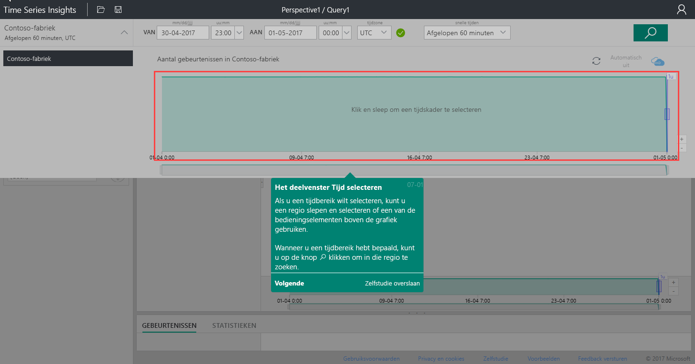
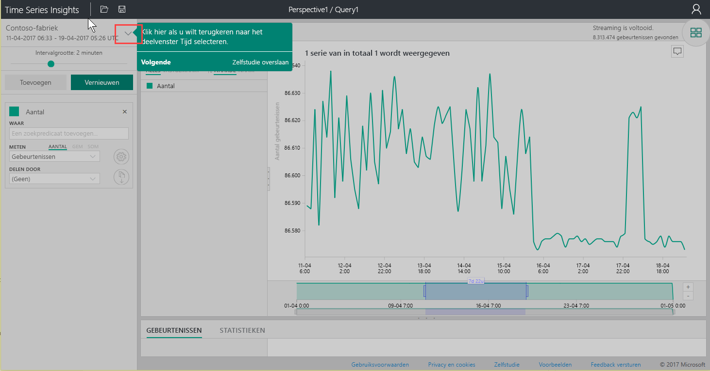
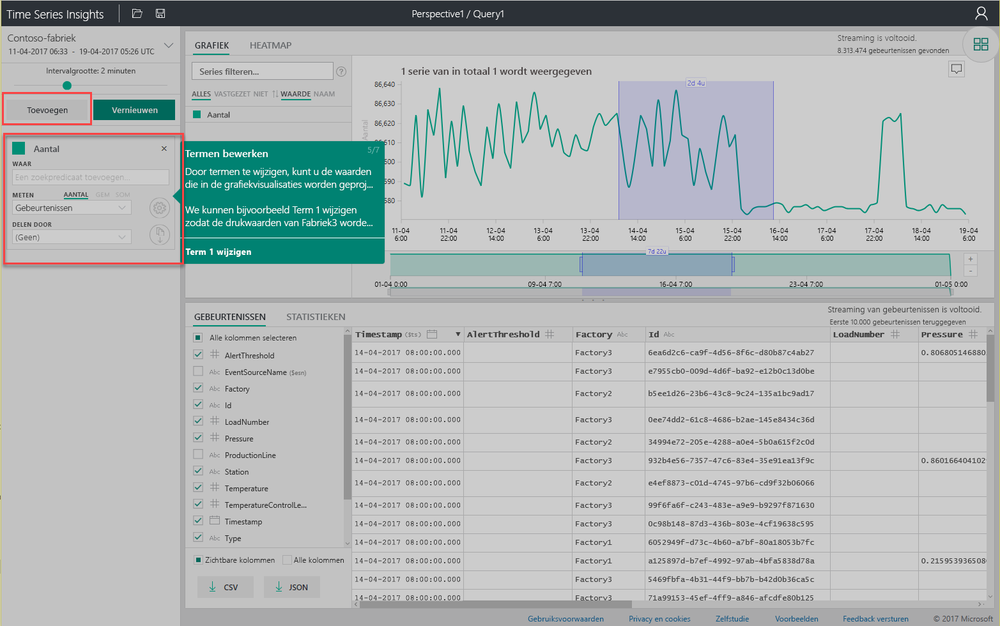
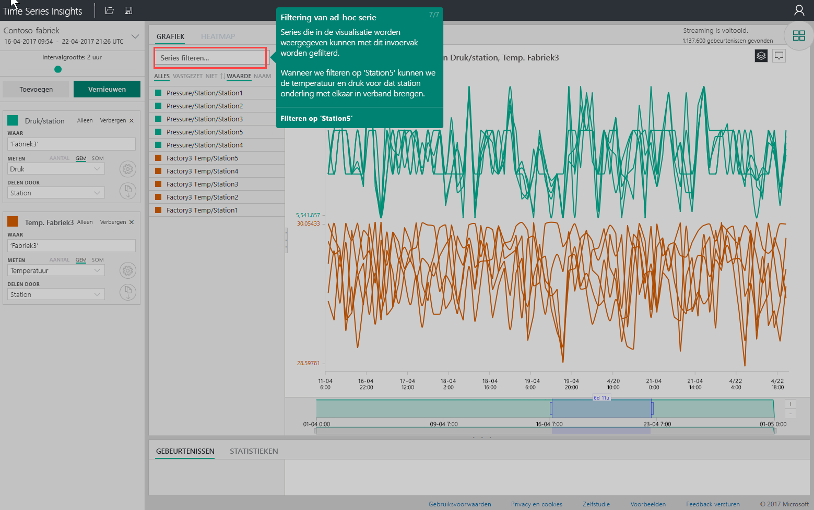

# Snelstartgids: Azure Time Series Insights verkennen
Deze snelstartgids wordt beschreven hoe u aan de slag met Azure Time Series Insights explorer in een omgeving met vrije demonstratie. U leert hoe u webbrowser grote volumes met IoT-gegevens visualiseren en rondleiding door de belangrijkste functies van de Time Series Insights explorer. 

Azure Time Series Insights is een volledig beheerde service voor analyse, opslag en visualisatie die het eenvoudig maakt om miljarden IoT-gebeurtenissen tegelijkertijd te verkennen en te analyseren. Dit biedt u een globale weergave van uw gegevens, zodat u snel uw IoT-oplossing te valideren en dure uitvaltijd voor essentiële apparaten voorkomen door ondersteuning bij het detecteren van verborgen trends herkennen afwijkingen en analyses van de hoofdoorzaak in bijna realtime uitvoeren.  Als u een toepassing die u reeksgegevens store of een query moet maakt, kunt u met de Time Series Insights REST API's kunt ontwikkelen.

Als u nog geen abonnement op Azure hebt, maak dan een [gratis Azure-account](https://azure.microsoft.com/free/?ref=microsoft.com&utm_source=microsoft.com&utm_medium=docs&utm_campaign=visualstudio) aan voordat u begint.

## Time Series Insights explorer in een omgeving met demo verkennen

1. Navigeer in uw browser naar [https://insights.timeseries.azure.com/demo](https://insights.timeseries.azure.com/demo). 

2. Als u wordt gevraagd, moet u zich aanmelden bij de Time Series Insights explorer met de referenties van uw Azure-account. 
 
3. De Time Series Insights rondleiding pagina wordt weergegeven. Klik op **volgende** om te beginnen met de rondleiding.

   

4. De **tijd selectie Configuratiescherm** wordt weergegeven. Met dit deelvenster kunt u een tijdsbestek visualiseren.

   

5. Klik en sleep in de regio en klik vervolgens op de **Search** knop.
 
    

   Time Series Insights geeft een grafiek visualisatie voor het opgegeven tijdsbestek weer. U kunt verschillende acties in de grafiek regel, zoals filteren, vastmaken, sorteer- en gestapeld doen. 

   Terugkeren naar de **tijd selectie Configuratiescherm**, klikt u op de pijl-omlaag, zoals wordt weergegeven:

   

6. Klik op **toevoegen** in de **voorwaarden Configuratiescherm** toevoegen van een nieuwe zoekterm.

   

7. In de grafiek kan een regio, met de rechtermuisknop op de regio, en selecteer **verkennen gebeurtenissen**.
 
   

   Een raster met de onbewerkte gegevens wordt van de regio die u bladert weergegeven:

   

8. Uw voorwaarden om te wijzigen van de waarden in de grafiek bewerken en een andere term om cross-correleer verschillende soorten waarden toevoegen:

   

9. Een filter term in de **reeks filteren... ** vak voor het filteren van ad-hoc reeks. Voer voor de snelstartgids **Station5** voor cross-correleer temperatuur en druk voor dat station.
 
   

Nadat u de Quick Start hebt voltooid, kunt u experimenteren met de voorbeeldgegevens te maken van verschillende visualisaties. 

### Volgende stappen
U bent klaar om uw eigen omgeving Time Series inzichten te maken:
> [!div class="nextstepaction"]
> [Uw omgeving Time Series Insights plannen](time-series-insights-environment-planning.md)
