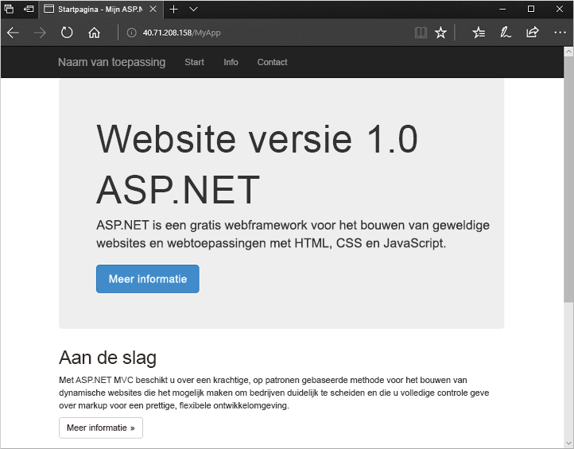

# <a name="quickstart-create-a-virtual-machine-scale-set-with-azure-powershell"></a>Snelstartgids: Een schaalset voor virtuele machines maken met Azure PowerShell
Met een schaalset voor virtuele machines kunt u een reeks identieke virtuele machines met automatisch schalen implementeren en beheren. U kunt het aantal VM’s in de schaalset handmatig schalen of regels voor automatisch schalen definiëren op basis van resourcegebruik zoals CPU, vraag naar geheugen, of netwerkverkeer. Een Azure load balancer verdeelt het verkeer vervolgens naar de VM-exemplaren in de schaalset. In deze snelstartgids gebruikt u Azure PowerShell om een schaalset voor virtuele machines te maken en een voorbeeldtoepassing te implementeren.

Als u nog geen abonnement op Azure hebt, maak dan een [gratis account](https://azure.microsoft.com/free/?WT.mc_id=A261C142F) aan voordat u begint.

[!INCLUDE [cloud-shell-powershell.md](../../includes/cloud-shell-powershell.md)]

Als u PowerShell lokaal wilt installeren en gebruiken, is voor deze zelfstudie versie 6.0.0 of hoger van de Azure PowerShell-module vereist. Voer `Get-Module -ListAvailable AzureRM` uit om de versie te bekijken. Als u PowerShell wilt upgraden, raadpleegt u [De Azure PowerShell-module installeren](/powershell/azure/install-azurerm-ps). Als u PowerShell lokaal uitvoert, moet u ook `Connect-AzureRmAccount` uitvoeren om verbinding te kunnen maken met Azure.


## <a name="create-a-scale-set"></a>Een schaalset maken
Maak een schaalset met virtuele machines met behulp van [New-AzureRmVmss](/powershell/module/azurerm.compute/new-azurermvmss). In het volgende voorbeeld wordt een schaalset met de naam *myScaleSet* gemaakt, die gebruikmaakt van de platforminstallatiekopie van *Windows Server 2016 Datacenter*. De Azure-netwerkresources voor het virtuele netwerk, het openbare IP-adres en de load balancer worden automatisch gemaakt. Wanneer u hierom wordt gevraagd, kunt u uw eigen beheerdersreferenties instellen voor de VM-exemplaren in de schaalset:

```azurepowershell-interactive
New-AzureRmVmss `
  -ResourceGroupName "myResourceGroup" `
  -Location "EastUS" `
  -VMScaleSetName "myScaleSet" `
  -VirtualNetworkName "myVnet" `
  -SubnetName "mySubnet" `
  -PublicIpAddressName "myPublicIPAddress" `
  -LoadBalancerName "myLoadBalancer" `
  -UpgradePolicyMode "Automatic"
```

Het duurt enkele minuten om alle schaalsetresources en VM's te maken en te configureren.


## <a name="deploy-sample-application"></a>Voorbeeldtoepassing implementeren
Als u de schaalset wilt testen, installeert u een eenvoudige webtoepassing. U kunt de aangepaste scriptextensie van Azure downloaden en een script uitvoeren waarmee IIS wordt geïnstalleerd in de VM-exemplaren. Deze uitbreiding is handig voor post-implementatieconfiguraties, software-installaties of andere configuratie-/beheertaken. Zie voor meer informatie het [overzicht van de aangepaste scriptextensie](../virtual-machines/windows/extensions-customscript.md).

Gebruik de aangepaste scriptextensie om een eenvoudige IIS-webserver te installeren. Pas de aangepaste scriptextensie waarmee IIS wordt geïnstalleerd als volgt toe:

```azurepowershell-interactive
# Define the script for your Custom Script Extension to run
$publicSettings = @{
    "fileUris" = (,"https://raw.githubusercontent.com/Azure-Samples/compute-automation-configurations/master/automate-iis.ps1");
    "commandToExecute" = "powershell -ExecutionPolicy Unrestricted -File automate-iis.ps1"
}

# Get information about the scale set
$vmss = Get-AzureRmVmss `
            -ResourceGroupName "myResourceGroup" `
            -VMScaleSetName "myScaleSet"

# Use Custom Script Extension to install IIS and configure basic website
Add-AzureRmVmssExtension -VirtualMachineScaleSet $vmss `
    -Name "customScript" `
    -Publisher "Microsoft.Compute" `
    -Type "CustomScriptExtension" `
    -TypeHandlerVersion 1.8 `
    -Setting $publicSettings

# Update the scale set and apply the Custom Script Extension to the VM instances
Update-AzureRmVmss `
    -ResourceGroupName "myResourceGroup" `
    -Name "myScaleSet" `
    -VirtualMachineScaleSet $vmss
```

## <a name="allow-traffic-to-application"></a>Verkeer toestaan naar de toepassing

 Maak een netwerkbeveiligingsgroep met [New-AzureRmNetworkSecurityRuleConfig](/powershell/module/azurerm.network/new-azurermnetworksecurityruleconfig) en [New-AzureRmNetworkSecurityGroup](/powershell/module/azurerm.network/new-azurermnetworksecuritygroup) om toegang toe te staan tot de eenvoudige webtoepassing. Zie voor meer informatie [Netwerken voor schaalsets voor virtuele Azure-machines](virtual-machine-scale-sets-networking.md).

 ```azurepowershell-interactive
 # Get information about the scale set
 $vmss = Get-AzureRmVmss `
             -ResourceGroupName "myResourceGroup" `
             -VMScaleSetName "myScaleSet"

 #Create a rule to allow traffic over port 80
 $nsgFrontendRule = New-AzureRmNetworkSecurityRuleConfig `
   -Name myFrontendNSGRule `
   -Protocol Tcp `
   -Direction Inbound `
   -Priority 200 `
   -SourceAddressPrefix * `
   -SourcePortRange * `
   -DestinationAddressPrefix * `
   -DestinationPortRange 80 `
   -Access Allow

 #Create a network security group and associate it with the rule
 $nsgFrontend = New-AzureRmNetworkSecurityGroup `
   -ResourceGroupName  "myResourceGroup" `
   -Location EastUS `
   -Name myFrontendNSG `
   -SecurityRules $nsgFrontendRule

 $vnet = Get-AzureRmVirtualNetwork `
   -ResourceGroupName  "myResourceGroup" `
   -Name myVnet

 $frontendSubnet = $vnet.Subnets[0]

 $frontendSubnetConfig = Set-AzureRmVirtualNetworkSubnetConfig `
   -VirtualNetwork $vnet `
   -Name mySubnet `
   -AddressPrefix $frontendSubnet.AddressPrefix `
   -NetworkSecurityGroup $nsgFrontend

 Set-AzureRmVirtualNetwork -VirtualNetwork $vnet

 # Update the scale set and apply the Custom Script Extension to the VM instances
 Update-AzureRmVmss `
     -ResourceGroupName "myResourceGroup" `
     -Name "myScaleSet" `
     -VirtualMachineScaleSet $vmss
 ```

## <a name="test-your-scale-set"></a>Uw schaalset testen
U kunt de schaalset in actie zien door in een webbrowser naar de voorbeeldwebtoepassing te gaan. Haal het openbare IP-adres van de load balancer op met [Get-AzureRmPublicIpAddress](/powershell/module/azurerm.network/get-azurermpublicipaddress). In het volgende voorbeeld wordt het IP-adres weergegeven dat is gemaakt in de resourcegroep *myResourceGroup*:

```azurepowershell-interactive
Get-AzureRmPublicIpAddress -ResourceGroupName "myResourceGroup" | Select IpAddress
```

Voer in een webbrowser het openbare IP-adres van de load balancer in. Via de load balancer wordt verkeer naar een van uw VM-instanties gedistribueerd, zoals wordt weergegeven in het volgende voorbeeld:




## <a name="clean-up-resources"></a>Resources opschonen
U kunt de opdracht [Remove-AzureRmResourceGroup](/powershell/module/azurerm.resources/remove-azurermresourcegroup) gebruiken om de resourcegroep, schaalset en alle gerelateerde resources te verwijderen wanneer u deze niet meer nodig hebt. Dit doet u als volgt: De parameter `-Force` bevestigt dat u de resources wilt verwijderen, zonder een extra prompt om dit te doen. De parameter `-AsJob` retourneert het besturingselement naar de prompt zonder te wachten totdat de bewerking is voltooid.

```azurepowershell-interactive
Remove-AzureRmResourceGroup -Name "myResourceGroup" -Force -AsJob
```


## <a name="next-steps"></a>Volgende stappen
In deze snelstartgids hebt u een standaardschaalset gemaakt en de aangepaste scriptextensie gebruikt om een standaard-IIS-webserver te installeren in de VM-exemplaren. Als u meer wilt weten over schaalsets, gaat u verder met de zelfstudie voor het maken en beheren van schaalsets voor virtuele Azure-machines.

> [!div class="nextstepaction"]
> [Schaalsets voor virtuele Azure-machines maken en beheren](tutorial-create-and-manage-powershell.md)
