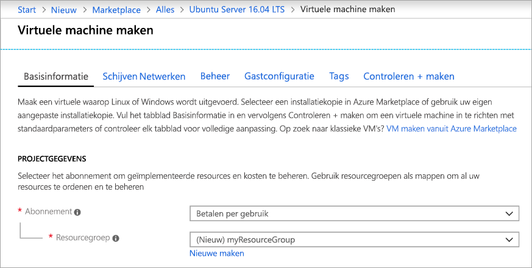

# <a name="quickstart-create-a-linux-virtual-machine-in-the-azure-portal"></a>Snelstart: Een virtuele Linux-machine maken op de Azure Portal

Virtuele Azure-machines (VM's) kunnen gemaakt worden via Azure Portal. De Azure-portal is een gebruikersinterface op basis van een browser voor het maken van VM's en alle verwante resources. In deze snelstart wordt beschreven hoe u de Azure-portal gebruikt voor het implementeren van een virtuele Linux-machine (VM) waarop Ubuntu 16.04 LTS wordt uitgevoerd. Wanner u uw virtuele machine in actie wilt zien, voert u ook SSH voor de virtuele machine uit en installeert u de NGINX-webserver.

Als u nog geen abonnement op Azure hebt, maak dan een [gratis account](https://azure.microsoft.com/free/?WT.mc_id=A261C142F) aan voordat u begint.

## <a name="create-ssh-key-pair"></a>Een SSH-sleutelpaar maken

U hebt een SSH-sleutelpaar nodig om deze snelstart te volgen. Als u al een SSH-sleutelpaar hebt, kunt u deze stap overslaan.

Open een bash-shell en gebruik [ssh-keygen](https://www.ssh.com/ssh/keygen/) om een SSH-sleutelpaar te maken. Als u geen een bash-shell op uw lokale computer hebt, kunt u de [Azure Cloud Shell](https://shell.azure.com/bash) gebruiken.  

```bash
ssh-keygen -t rsa -b 2048
```

Met de bovenstaande opdracht worden openbare en persoonlijke sleutels met de standaardnaam van `id_rsa` in de `~/.ssh directory` gegenereerd. Met de opdracht wordt het volledige pad naar de openbare sleutel geretourneerd. Gebruik het pad naar de openbare sleutel om de inhoud ervan weer te geven met `cat`.

```bash 
cat ~/.ssh/id_rsa.pub
```

Sla de uitvoer van deze opdracht op. U hebt deze nodig bij het configureren van de administratoraccount om u aan te melden bij uw virtuele machine.

Zie [SSH-sleutels gebruiken met Windows](ssh-from-windows.md) voor gedetailleerde informatie over het maken van SSH-sleutelparen, waaronder het gebruik van PuTTy.

Als u uw SSH-sleutelpaar met behulp van de Cloud Shell maakt, wordt deze opgeslagen in een Azure-bestandsshare die [automatisch wordt gekoppeld door de Cloud Shell](https://docs.microsoft.com/azure/cloud-shell/persisting-shell-storage). Verwijder deze bestandsshare of dit opslagaccount niet totdat u uw sleutels hebt opgehaald. Anders verliest u toegang tot de virtuele machine. 

## <a name="sign-in-to-azure"></a>Aanmelden bij Azure

Meld u aan bij [Azure Portal](https://portal.azure.com).

## <a name="create-virtual-machine"></a>Virtuele machine maken

1. Kies in de linkerbovenhoek van de Azure-portal **Een resource maken**.

1. Zoek via het zoekvak boven de lijst met Azure Marketplace-resources naar **Ubuntu Server 16.04 LTS by Canonical**, selecteer deze en kies **Maken**.

1. Zorg ervoor dat op het tabblad **Basis** onder **Projectgegevens** het juiste abonnement is geselecteerd, en kies **Nieuwe maken** onder **Resourcegroep**. Typ in het pop-upvenster *myResourceGroup* als naam voor de resourcegroep en kies **OK*. 

    

1. Typ onder **Exemplaardetails** *myVM* als **Naam van de virtuele machine** en kies *US - oost* als de **Regio**. Houd voor de rest de standaardinstellingen aan.

    

1. Selecteer onder **Administrator-account** **Openbare SSH-sleutel**, typ uw gebruikersnaam en plak uw openbare sleutel in het tekstvak. Verwijder eventuele voorloop- en volgspaties van uw openbare sleutel.

    

1. Onder **Regels voor binnenkomende poort** > **Openbare binnenkomende poorten**, kiest u **​​Geselecteerde poorten toestaan** en selecteert u vervolgens **SSH (22)** en  **TTP (80)** in de vervolgkeuzelijst. 

    

1. Laat de resterende standaardwaarden staan ​​en selecteer vervolgens de knop **Beoordelen en maken** aan de onderkant van de pagina.

1. Op de pagina **Een virtuele machine maken** ziet u de details van de virtuele machine die u gaat maken. Wanneer u klaar bent, selecteert u **Maken**.

Het duurt een paar minuten voor uw virtuele machine is geïmplementeerd. Wanneer de implementatie is voltooid, gaat u verder naar de volgende sectie.

    
## <a name="connect-to-virtual-machine"></a>Verbinding maken met de virtuele machine

Maak een SSH-verbinding met de VM.

1. Selecteer de knop **Verbinden** op de overzichtspagina van uw VM. 

    

2. Laat op de pagina **Verbinding maken met virtuele machine** de standaardopties staan om verbinding te maken met een IP-adres via poort 22. In **Aanmelden met lokaal VM-account** wordt een verbindingsopdracht weergegeven. Klik op de knop om de opdracht te kopiëren. Het volgende voorbeeld laat zien hoe de SSH-verbindingsopdracht eruitziet:

    ```bash
    ssh azureuser@10.111.12.123
    ```

3. Met behulp van dezelfde bash-shell die u hebt gebruikt om uw SSH-sleutelpaar te maken (zoals de [Azure Cloud Shell](https://shell.azure.com/bash) of uw lokale bash-shell), plakt u de opdracht voor de SSH-verbinding in de shell om een SSH-sessie te maken. 

## <a name="install-web-server"></a>Webserver installeren

Als u uw VM in actie wilt zien, installeert u de NGINX-webserver. Werk vanuit uw SSH-sessie de pakketbronnen bij en installeer het meest recente NGINX-pakket.

```bash
sudo apt-get -y update
sudo apt-get -y install nginx
```

Wanneer u klaar bent, typt u `exit` om de SSH-sessie te verlaten.


## <a name="view-the-web-server-in-action"></a>De webserver in actie zien

Gebruik een webbrowser naar keuze om de standaard NGINX-welkomstpagina weer te geven. Gebruik het openbare IP-adres van uw VM als het webadres. Het openbare IP-adres kan worden gevonden op de overzichtspagina van de virtuele machine of als onderdeel van de SSH-verbindingsreeks die u eerder hebt gebruikt.


## <a name="clean-up-resources"></a>Resources opschonen

Wanneer u de VM niet meer nodig hebt, kunt u de resourcegroep, de machine zelf én alle gerelateerde resources verwijderen. Wanneer u dit wilt doen, selecteert u de resourcegroep voor de virtuele machine en selecteert u **Verwijderen**. Vervolgens bevestigt u de naam van de resourcegroep die u wilt verwijderen.

## <a name="next-steps"></a>Volgende stappen

In deze snelstart hebt u een eenvoudige virtuele machine geïmplementeerd, een netwerkbeveiligingsgroep en -regel gemaakt en een eenvoudige webserver geïnstalleerd. Voor meer informatie over virtuele machines in Azure, gaat u verder met de zelfstudie voor virtuele Linux-machines.

> [!div class="nextstepaction"]
> [Zelfstudies over virtuele Linux-machines](./tutorial-manage-vm.md)
