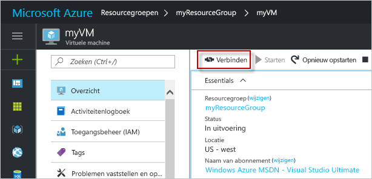

# <a name="create-a-linux-virtual-machine-with-the-azure-portal"></a>Een virtuele Linux-machine maken met Azure Portal

Virtuele Azure-machines kunnen worden gemaakt via Azure Portal. Deze methode biedt een gebruikersinterface op basis van een browser voor het maken en configureren van virtuele machines en alle verwante resources. In deze Quick Start gaat u een virtuele machine maken via Azure Portal.

Als u nog geen abonnement op Azure hebt, maak dan een [gratis account](https://azure.microsoft.com/en-us/free/?WT.mc_id=A261C142F) aan voordat u begint.

## <a name="create-ssh-key-pair"></a>Een SSH-sleutelpaar maken

U hebt een SSH-sleutelpaar nodig om deze Quick Start te volgen. Als u een bestaand SSH-sleutelpaar hebt, kunt u deze stap overslaan. Als u een Windows-machine gebruikt, volgt u de instructies [hier](ssh-from-windows.md). 

In een Bash-shell voert u deze opdracht uit en volgt u de aanwijzingen op het scherm. De uitvoer van de opdracht bevat de bestandsnaam van het bestand met de openbare sleutel. De inhoud van dit bestand is nodig om de virtuele machine te maken.

```bash
ssh-keygen -t rsa -b 2048
```

## <a name="log-in-to-azure"></a>Meld u aan bij Azure. 

Meld u via http://portal.azure.com aan bij Azure Portal.

## <a name="create-virtual-machine"></a>Virtuele machine maken

1. Klik op de knop **Nieuw** in de linkerbovenhoek van Azure Portal.

2. Selecteer **Compute** op de blade **Nieuw**. Selecteer **Ubuntu-server 16.04 LTS** op de blade **Compute** en klik daarna op **Maken**.

3. Vul het formulier **Basisinformatie** in voor de virtuele machine. Bij **Verificatietype** selecteert u **SSH**. Wanneer u uw **openbare SSH-sleutel** plakt, verwijdert u alle voorloop- en volgspaties. Selecteer een **resourcegroep** of maak een nieuwe. Een resourcegroep is een logische container waarin Azure-resources worden gemaakt en waarin ze collectief worden beheerd. Na het voltooien klikt u op **OK**.

      

4. Kies een grootte voor de virtuele machine. Kies om meer groottes weer te geven de optie **Alle weergeven** of wijzig het filter **Ondersteund schijftype**. 

      

5. Op de blade Instellingen selecteert u **Ja** onder **Managed Disks gebruiken**. Laat voor de rest de standaardinstellingen staan en klik op **OK**.

6. Klik op de pagina Overzicht op **OK** om de implementatie van de virtuele machine te starten.

7. Voor het bewaken van de implementatiestatus klikt u op de virtuele machine. U vindt de virtuele machine op het Azure Portal-dashboard, of door **Virtuele machines** te selecteren in het menu links. Wanneer de virtuele machine is gemaakt, verandert de status van **Implementeren** in **In uitvoering**.


## <a name="open-port-80-for-web-traffic"></a>Poort 80 openen voor webverkeer 

Standaard worden alleen SSH-verbindingen toegestaan naar virtuele Linux-machines die zijn geïmplementeerd in Azure. Als deze virtuele machine wordt gebruikt als een webserver, moet u poort 80 openen voor webverkeer. Deze stap helpt u bij het maken van een regel voor een netwerkbeveiligingsgroep (NSG) om binnenkomende verbindingen op poort 80 toe te staan.

1. Ga op de blade van de virtuele machine naar de sectie **Essentials** en klik op de naam van de **resourcegroep**.
2. Klik op de blade van de resourcegroep op de **netwerkbeveiligingsgroep** in de lijst met resources. De naam van de NSG moet bestaan uit de naam van de virtuele machine, met -nsg toegevoegd aan het einde.
3. Klik op de kop **Binnenkomende beveiligingsregel** om de lijst met regels voor binnenkomende verbindingen te openen. De lijst moet al een regel voor RDP bevatten.
4. Klik op **+ Toevoegen** om de blade **Inkomende beveiligingsregel toevoegen** te openen.
5. Typ bij **Naam** **nginx**. Zorg ervoor dat het **poortbereik** is ingesteld op 80 en **Actie** is ingesteld op **Toestaan**. Klik op **OK**.


## <a name="connect-to-virtual-machine"></a>Verbinding maken met de virtuele machine

Wanneer de implementatie is voltooid, maakt u een SSH-verbinding met de virtuele machine.

1. Klik op de knop **Verbinden** op de blade van de virtuele machine. Op de knop Verbinden wordt een SSH-verbindingsreeks weergegeven die u kunt gebruiken om verbinding te maken met de virtuele machine.

     

2. Voer de volgende opdracht uit om een SSH-sessie te starten. Vervang de verbindingsreeks door de reeks die u uit Azure Portal hebt gekopieerd.

```bash 
ssh <replace with IP address>
```

## <a name="install-nginx"></a>NGINX installeren

Gebruik het volgende bash-script om pakketbronnen bij te werken en het meest recente NGINX-pakket te installeren. 

```bash 
#!/bin/bash

# update package source
apt-get -y update

# install NGINX
apt-get -y install nginx
```

## <a name="view-the-ngix-welcome-page"></a>De welkomstpagina van NGIX weergeven

Nu NGINX is geïnstalleerd en poort 80 op de virtuele machine is geopend voor toegang vanaf internet, kunt u een webbrowser van uw keuze gebruiken om de standaardwelkomstpagina van NGINX weer te geven. Zorg ervoor dat u de standaardpagina bezoekt met het `publicIpAddress` dat u hebt gedocumenteerd. 

 
## <a name="delete-virtual-machine"></a>De virtuele machine verwijderen

Wanneer u de virtuele machine niet meer nodig hebt, verwijdert u de resourcegroep, de machine zelf én alle gerelateerde resources. Hiervoor selecteert u de resourcegroep op de blade van de virtuele machine en klikt u op **Verwijderen**.

## <a name="next-steps"></a>Volgende stappen

[Zelfstudie voor het maken van virtuele machines met een hoge beschikbaarheid](create-cli-complete.md?toc=%2fazure%2fvirtual-machines%2flinux%2ftoc.json)

[CLI-voorbeelden voor VM-implementatie verkennen](../windows/cli-samples.md?toc=%2fazure%2fvirtual-machines%2flinux%2ftoc.json)

