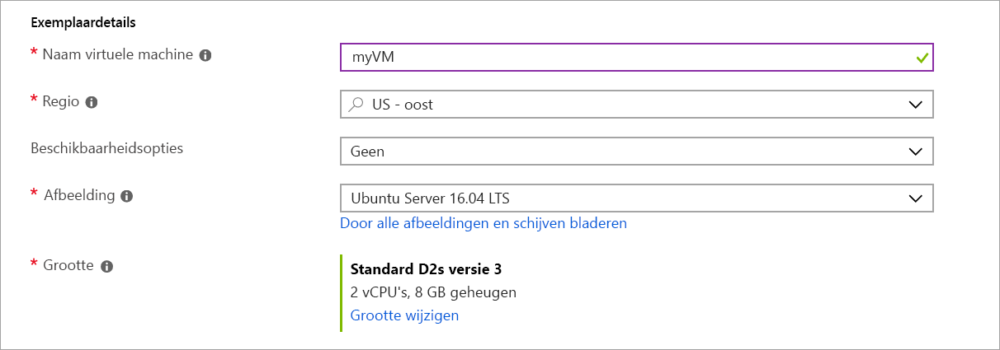
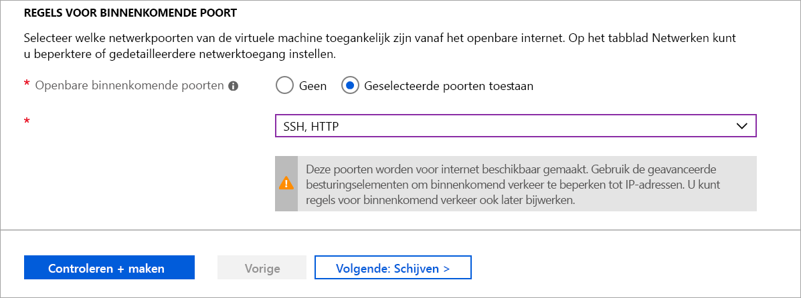

# <a name="quickstart-create-a-linux-virtual-machine-in-the-azure-portal"></a>Snelstart: Een virtuele Linux-machine maken op de Azure Portal

Virtuele Azure-machines (VM's)kunnen worden gemaakt via Azure Portal. Deze methode biedt een gebruikersinterface op basis van een browser voor het maken van VM's en van alle verwante resources. In deze snelstart wordt beschreven hoe u de Azure Portal gebruikt voor het implementeren van een virtuele Linux-machine (VM) in Azure waarop Ubuntu wordt uitgevoerd. Wanner u uw virtuele machine in actie wilt zien, voert u SSH voor de virtuele machine uit en installeert u de NGINX-webserver.

Als u nog geen abonnement op Azure hebt, maak dan een [gratis account](https://azure.microsoft.com/free/?WT.mc_id=A261C142F) aan voordat u begint.

## <a name="create-ssh-key-pair"></a>Een SSH-sleutelpaar maken

U hebt een SSH-sleutelpaar nodig om deze snelstart te volgen. Als u een bestaand SSH-sleutelpaar hebt, kunt u deze stap overslaan.

Wanneer u een SSH-sleutelpaar wilt maken en u wilt aanmelden bij Linux-VM’s, voert u de volgende opdracht uit vanaf een Bash-shell en volgt u de aanwijzingen op het scherm. U kunt bijvoorbeeld de [Azure Cloud Shell](../../cloud-shell/overview.md) of het [Windows-subsysteem voor Linux](/windows/wsl/install-win10) gebruiken. De uitvoer van de opdracht bevat de bestandsnaam van het bestand met de openbare sleutel. Kopieer de inhoud van het bestand met de openbare sleutel (`cat ~/.ssh/id_rsa.pub`) naar het klembord:

```bash
ssh-keygen -t rsa -b 2048
```

Zie [SSH-sleutels gebruiken met Windows](ssh-from-windows.md) voor gedetailleerde informatie over het maken van SSH-sleutelparen, waaronder het gebruik van PuTTy.

## <a name="log-in-to-azure"></a>Meld u aan bij Azure.

Aanmelden bij Azure Portal op http://portal.azure.com

## <a name="create-virtual-machine"></a>Virtuele machine maken

1. Kies in de linkerbovenhoek van Azure Portal **Een resource maken**.

1. Zoek via het zoekvak boven de lijst met Azure Marketplace-resources naar **Ubuntu Server 16.04 LTS by Canonical**, selecteer deze en kies **Maken**.

1. Zorg ervoor dat op het tabblad **Basis** onder **Projectgegevens** het juiste abonnement is geselecteerd, en kies **Nieuwe maken** onder **Resourcegroep**. Typ in het pop-upvenster *myResourceGroup* als naam voor de resourcegroep en kies **OK*. 

    

1. Typ onder **Exemplaardetails** *myVM* als **Naam van de virtuele machine** en kies *US - oost* als de **Regio**. Houd voor de rest de standaardinstellingen aan.

    

1. Selecteer onder **Administrator-account** **Openbare SSH-sleutel**, typ uw gebruikersnaam en plak uw openbare sleutel in het tekstvak. Verwijder eventuele voorloop- en volgspaties van uw openbare sleutel.

    

1. Onder **Regels voor binnenkomende poort** > **Openbare binnenkomende poorten**, kiest u **​​Geselecteerde poorten toestaan** en selecteert u vervolgens **SSH (22)** en  **TTP (80)** in de vervolgkeuzelijst. 

    

1. Laat de resterende standaardwaarden staan ​​en selecteer vervolgens de knop **Beoordelen en maken** aan de onderkant van de pagina.

    
## <a name="connect-to-virtual-machine"></a>Verbinding maken met de virtuele machine

Maak een SSH-verbinding met de VM.

1. Selecteer de knop **Verbinden** op de overzichtspagina van uw VM. 

    

2. Laat op de pagina **Verbinding maken met virtuele machine** de standaardopties staan om verbinding te maken met de DNS-naam via poort 22. In **Aanmelden met lokaal VM-account** wordt een verbindingsopdracht weergegeven. Klik op de knop om de opdracht te kopiëren. Het volgende voorbeeld laat zien hoe de SSH-verbindingsopdracht eruitziet:

    ```bash
    ssh azureuser@myvm-123abc.eastus.cloudapp.azure.com
    ```

3. Plak de SSH-verbindingsopdracht in een shell, zoals de Azure Cloud Shell of Bash op Ubuntu in Windows om de verbinding te maken. 

## <a name="install-web-server"></a>Webserver installeren

Als u uw VM in actie wilt zien, installeert u de NGINX-webserver. Gebruik de volgende opdrachten vanuit uw SSH-sessie om pakketbronnen bij te werken en het meest recente NGINX-pakket te installeren:

```bash
# update packages
sudo apt-get -y update

# install NGINX
sudo apt-get -y install nginx
```

Wanneer u klaar bent, `exit`sluit u de SSH-sessie af en geeft u de VM-eigenschappen op in de Azure Portal.


## <a name="view-the-web-server-in-action"></a>De webserver in actie zien

Als NGINX is geïnstalleerd en poort 80 is geopend voor de VM, is de webserver nu toegankelijk vanaf internet. Open een webbrowser en voer het openbare IP-adres van de VM in. Het openbare IP-adres kan worden gevonden op de overzichtspagina van de VM of bovenaan de pagina *Netwerken*, waar u de regel toevoegt voor de binnenkomende poort.


## <a name="clean-up-resources"></a>Resources opschonen

Wanneer u de VM niet meer nodig hebt, kunt u de resourcegroep, de machine zelf én alle gerelateerde resources verwijderen. Wanneer u dit wilt doen, selecteert u de resourcegroep voor de virtuele machine en selecteert u **Verwijderen**. Vervolgens bevestigt u de naam van de resourcegroep die u wilt verwijderen.

## <a name="next-steps"></a>Volgende stappen

In deze snelstart hebt u een eenvoudige virtuele machine geïmplementeerd, een netwerkbeveiligingsgroep en -regel gemaakt en een eenvoudige webserver geïnstalleerd. Voor meer informatie over virtuele machines in Azure, gaat u verder met de zelfstudie voor virtuele Linux-machines.

> [!div class="nextstepaction"]
> [Zelfstudies over virtuele Linux-machines](./tutorial-manage-vm.md)
