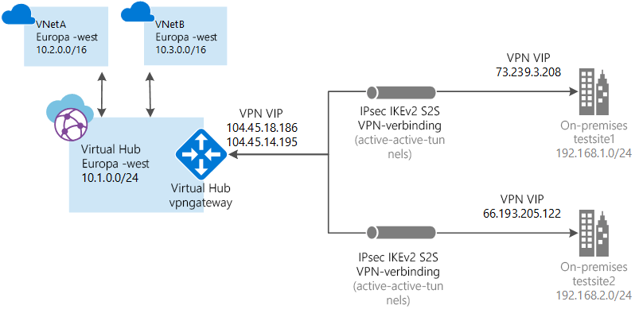

# Wat is Azure Virtual WAN? (Preview-versie)

Azure Virtual WAN is een netwerkservice die via Azure voor een geoptimaliseerde en geautomatiseerde verbinding tussen filialen zorgt. Met Virtual WAN kunt u apparaten in filialen verbinden en configureren, zodat deze met Azure kunnen communiceren. U kunt dit handmatig doen of met behulp van apparaten van voorkeursproviders via een Virtual WAN-partner. Met apparaten van voorkeursproviders geniet u de voordelen van gebruiksgemak, eenvoudige verbindingen en configuratiebeheer. Het geïntegreerde dashboard van Azure WAN biedt directe probleemoplossingsinzichten waarmee u tijd kunnen besparen en het laat u op eenvoudige wijze grootschalige verbindingen tussen verschillende locaties weergeven.

> [!IMPORTANT]
> Azure Virtual WAN is momenteel beschikbaar als een beheerde openbare preview-versie. Als u Virtual WAN wilt gebruiken, moet u zich [inschrijven in de preview-versie](#enroll).
>
> Deze openbare preview-versie wordt aangeboden zonder serviceovereenkomst en moet niet worden gebruikt voor productieworkloads. Bepaalde functies worden mogelijk niet ondersteund, zijn mogelijk beperkt of zijn mogelijk niet beschikbaar in alle Azure-locaties. Raadpleeg voor meer informatie de [aanvullende gebruiksrechtovereenkomst voor Microsoft Azure-previews](https://azure.microsoft.com/support/legal/preview-supplemental-terms/).

Met dit artikel krijgt u snel inzicht in de netwerkverbindingen van de workloads die u via Azure en buiten Azure uitvoert. Virtual WAN biedt de volgende voordelen:

* **Geïntegreerde verbindingsoplossingen in de hub en spoke:** automatiseer de interlokale configuratie en verbindingen tussen on-premises locaties en een Azure-hub vanuit verschillende bronnen, zoals Virtual WAN-partneroplossingen.
* **Geautomatiseerde installatie en configuratie van spokes:** zorg voor een naadloze verbinding van uw virtuele netwerken en workloads met de Azure-hub.
* **Intuïtieve probleemoplossing:** u beschikt over een overzicht van de end-to-end stroom in Azure en kunt aan de hand van deze informatie de vereiste acties ondernemen.

## Werken met een Virtual WAN-partner

1. De controller (VPN/SD-WAN) voor filiaalapparaten wordt geverifieerd voor het exporteren van locatiegegevens naar Azure met behulp van een Azure-serviceprincipal.
2. De controller (VPN/SD-WAN) voor filiaalapparaten ontvangt de Azure-verbindingsconfiguratie en werkt het lokale apparaat bij. Op deze manier wordt het downloaden van de configuratie, het bewerken en het bijwerken van het on-premises VPN-apparaat geautomatiseerd.
3. Wanneer het apparaat eenmaal de juiste Azure-configuratie heeft, wordt een verbinding tussen de locaties (twee actieve tunnels) en Azure WAN tot stand gebracht. Azure vereist dat de controller (VPN/SD-WAN) voor filialen ondersteuning biedt voor IKEv2. BGP is optioneel.

## Virtual WAN-resources

Als u een end-to-end virtuele WAN wilt configureren, maakt u de volgende resources:

* **virtualWAN:** de virtualWAN-resource staat voor een virtuele overlay van uw Azure-netwerk en is een verzameling van meerdere resources. Het bevat koppelingen naar al uw virtuele hubs die u wilt opnemen in de virtuele WAN. Virtual WAN-resources zijn van elkaar geïsoleerd en kunnen geen gemeenschappelijke hub bevatten. Virtuele hubs in Virtual WAN communiceren niet met elkaar.

* **Locatie:** de locatieresource, ook wel vpnsite genoemd, staat voor uw on-premises VPN-apparaat en de instellingen daarvan. Wanneer u met een Virtual WAN-partner werkt, beschikt u over een geïntegreerde oplossing die deze gegevens automatisch naar Azure exporteert.

* **Hub:** een virtuele hub is een virtueel netwerk dat door Microsoft wordt beheerd. De hub bevat verschillende service-eindpunten die verbindingen vanaf uw on-premises netwerk (vpnsite) mogelijk maken. De hub is de kern van uw netwerk in een regio. Een Azure-regio mag maar één hub bevatten. Als u met Azure Portal een hub maakt, wordt automatisch een VNet voor de virtuele hub en een vpngateway voor de virtuele hub gemaakt.

  Een hubgateway is niet hetzelfde als een gateway voor het virtuele netwerk die u voor ExpressRoute en VPN Gateway gebruikt. Wanneer u Virtual WAN gebruikt, maakt u bijvoorbeeld geen interlokale verbinding vanaf uw on-premises locatie rechtstreeks naar uw VNet. In plaats daarvan maakt u een interlokale verbinding naar de hub. Het verkeer verloopt altijd via de hubgateway. Dit houdt in dat uw VNet's hun eigen gateway voor het virtuele netwerk niet nodig hebben. In Virtual WAN kunnen uw VNet's eenvoudig schalen via de virtuele hub en de gateway van de virtuele hub. 

* **Hub-verbinding met het virtuele netwerk:** de resource van de hub-verbinding met het virtuele netwerk wordt gebruikt om de hub naadloos met het virtuele netwerk te verbinden. Op dit moment kunt u alleen verbinding maken met virtuele netwerken die zich in dezelfde hubregio bevinden.

##Registreren in de preview-versie

Voordat u Virtual WAN kunt configureren, moet u uw abonnement in de preview-versie registreren. Anders kunt u niet met Virtual WAN werken in de portal. Als u zich wilt inschrijven, stuurt u een e-mail met uw abonnements-id naar <azurevirtualwan@microsoft.com>. U ontvangt een e-mailbevestiging zodra uw abonnement is geregistreerd.

## Veelgestelde vragen

[!INCLUDE [Virtual WAN FAQ](../../includes/virtual-wan-faq-include.md)]

## Feedback voor de preview-versie

Wij stellen uw feedback zeer op prijs. Stuur een e-mail naar <azurevirtualwan@microsoft.com> om problemen te melden of feedback (positief of negatief) te geven over Virtual WAN. Vermeld uw bedrijfsnaam tussen '[ ]' in de onderwerpregel. Vermeld ook uw abonnements-id als u een probleem wilt melden.

## Volgende stappen

Als u een verbinding tussen de verschillende locaties wilt maken met Virtual WAN, kunt u dat doen via een [Virtual WAN-partner](https://aka.ms/virtualwan) of de verbinding handmatig tot stand brengen. Raadpleeg [Een verbinding tussen verschillende locaties maken met Virtual WAN](virtual-wan-site-to-site-portal.md) als u de verbinding handmatig tot stand wilt brengen.
