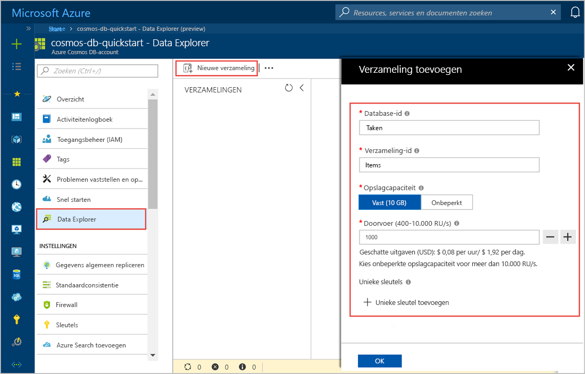

U kunt nu het hulpprogramma Data Explorer in Azure Portal gebruiken om een database en een verzameling te maken. 

1. Klik in Azure Portal in het navigatiemenu links op **Data Explorer (preview-versie)**. 

2. Klik op de blade **Data Explorer (preview-versie)** op **Nieuwe verzameling** en geef de volgende informatie op:

    

    Instelling|Voorgestelde waarde|Beschrijving
    ---|---|---
    Database-id|Taken|De naam voor de nieuwe database. Databasenamen moeten tussen de 1 en 255 tekens zijn en mogen geen /, \\, # of ? bevatten en mogen niet eindigen met een spatie.
    Verzamelings-id|Items|De naam voor de nieuwe verzameling. Voor verzamelingsnamen gelden dezelfde tekenvereisten als voor database-id's.
    Opslagcapaciteit| Vast (10 GB)|Gebruik de standaardwaarde. Deze waarde is de opslagcapaciteit van de database.
    Doorvoer|400 RU|Gebruik de standaardwaarde. U kunt de doorvoer later opschalen als u de latentie wilt beperken.
    RU/m|Uit|Laat de standaardwaarde staan.
    Partitiesleutel|/category|Een partitiesleutel waarmee gegevens gelijkmatig worden gedistribueerd naar elke partitie. Het is belangrijk dat u de juiste partitiesleutel selecteert bij het maken van een prestatieverzameling. Ga voor meer informatie hierover naar [Ontwerpen voor partitioneren](../articles/cosmos-db/partition-data.md#designing-for-partitioning).    
3. Wanneer u het formulier hebt ingevuld, klikt u op **OK**.

In Data Explorer worden de nieuwe database en verzameling weergegeven. 