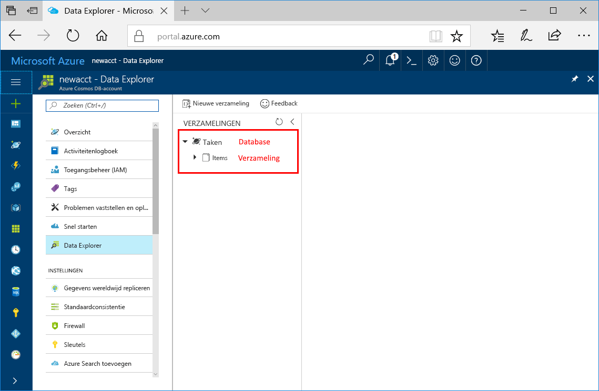

U kunt nu het hulpprogramma Data Explorer in Azure Portal gebruiken om een database en een verzameling te maken. 

1. Klik op **Gegevensverkenner** > **nieuwe verzameling**. 
    
    De **verzameling toevoegen** gebied aan de rechterkant wordt weergegeven, moet u mogelijk scrollen rechts om het te bekijken.

    

2. In de **verzameling toevoegen** pagina, voert u de instellingen voor de nieuwe verzameling.

    Instelling|Voorgestelde waarde|Beschrijving
    ---|---|---
    Database-id|Taken|Voer *taken* als de naam voor de nieuwe database. Databasenamen moeten tussen de 1 en 255 tekens zijn en mogen geen /, \\, # of ? bevatten en mogen niet eindigen met een spatie.
    Verzamelings-id|Items|Voer *Items* als de naam voor de nieuwe verzameling. Verzameling-ID's hebben dezelfde vereisten als databasenamen teken.
    Opslagcapaciteit| Vast (10 GB)|Wijzig de waarde in **vast (10 GB)**. Deze waarde is de opslagcapaciteit van de database.
    Doorvoer|400 RU|Wijzig de doorvoer in 400 aanvraageenheden per seconde (RU/s). Capaciteit moet worden ingesteld op **vast (10 GB)** om de doorvoer ingesteld op 400 RU/s. U kunt de doorvoer later opschalen als u de latentie wilt beperken. 
    Partitiesleutel|/category|Voer */Category* als de partitiesleutel. Een partitiesleutel distribueert gegevens gelijkmatig naar elke partitie in de database. Zie voor meer informatie over partitioneren, [ontwerpen voor het partitioneren van](../articles/cosmos-db/partition-data.md#designing-for-partitioning).

    Klik op **OK**.

    Data Explorer wordt weergegeven voor de nieuwe database en verzameling.

    