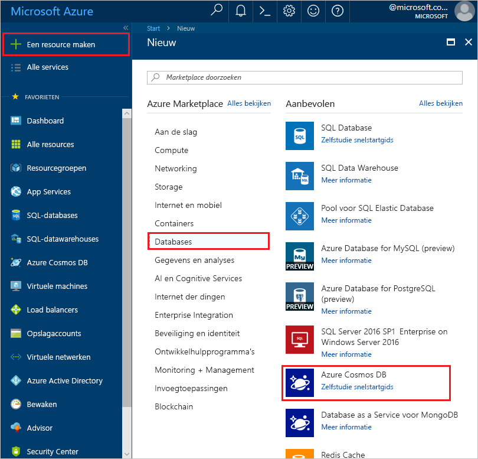
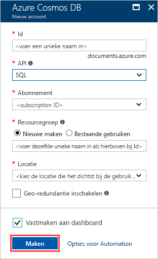

1. Meld u in een nieuw browservenster aan bij [Azure Portal](https://portal.azure.com/).
2. Selecteer **Een resource maken** > **Databases** > **Azure Cosmos DB**.
   
   

3. Voer op de pagina **Nieuw account** de instellingen in voor het nieuwe Azure Cosmos DB-account. 
 
    Instelling|Waarde|Beschrijving
    ---|---|---
    Id|Voer een unieke naam in|Voer een unieke naam in om uw Azure Cosmos DB-account te identificeren. Gebruik een unieke id omdat *documents.azure.com* is toegevoegd aan de id die u hebt opgegeven om uw URI te maken.  De id mag alleen kleine letters, cijfers en het koppelteken (-) bevatten. Deze moet 3 tot 50 tekens lang zijn.
    API|SQL|De API bepaalt het type te maken account. Azure Cosmos DB heeft vijf API's: SQL voor documentdatabases, Gremlin voor grafiekdatabases, MongoDB voor documentdatabases, Table-API en Apache Cassandra-API. Op dit moment moet u voor elke API een afzonderlijk account maken.   Selecteer **SQL** omdat u in dit artikel een documentdatabase maakt en query's uitvoert met SQL-syntaxis.   [Meer informatie over de SQL-API](../articles/cosmos-db/documentdb-introduction.md).|
    Abonnement|Uw abonnement|Selecteer het Azure-abonnement dat u voor dit Azure Cosmos DB-account wilt gebruiken. 
    Resourcegroep|Nieuwe maken  Voer de unieke naam in die u in ID hebt opgegeven|Selecteer **Nieuw maken**. Voer daarna een nieuwe resourcegroepnaam in voor het account. Gebruik voor het gemak dezelfde naam als uw id. 
    Locatie|Selecteer de regio het dichtst in de buurt van uw gebruikers|Selecteer een geografische locatie waar u het Azure Cosmos DB-account wilt hosten. Gebruik de locatie die zich het dichtst bij uw gebruikers bevindt, zodat ze de snelst mogelijke toegang tot de gegevens hebben.
    Georedundantie inschakelen| Leeg laten | Met deze optie maakt u een gerepliceerde versie van uw database in een tweede (gekoppelde) regio. Laat dit selectievakje leeg. 

    Selecteer **Maken**.

    

4. Het duurt enkele minuten om het account te maken. Wacht tot de portal de pagina **Gefeliciteerd! Uw Azure Cosmos DB-account is gemaakt** weergeeft.

    

