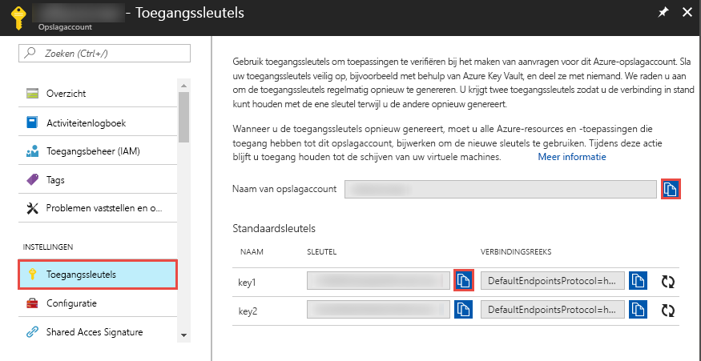

## <a name="prerequisites"></a>Vereisten

### <a name="azure-subscription"></a>Azure-abonnement
Als u nog geen Azure-abonnement hebt, maakt u een [gratis account](https://azure.microsoft.com/free/) voordat u begint.

### <a name="azure-roles"></a>Azure-rollen
Als u Data Factory-exemplaren wilt maken, moet het gebruikersaccount waarmee u zich bij Azure aanmeldt, lid zijn van de rollen **Inzender** of **Eigenaar**, of moet dit een **beheerder** van het Azure-abonnement zijn. Klik in Azure Portal op uw **gebruikersnaam** in de rechterbovenhoek en selecteer **Machtigingen** om de machtigingen weer te geven die u in het abonnement hebt. Als u toegang tot meerdere abonnementen hebt, moet u het juiste abonnement selecteren. Zie het artikel [Rollen toevoegen](../articles/billing/billing-add-change-azure-subscription-administrator.md) voor voorbeelden van instructies voor het toevoegen van een gebruiker aan een rol.

### <a name="azure-storage-account"></a>Azure Storage-account
In deze QuickStart gaat u een algemeen Azure Storage-account (en dan met name voor Blob Storage) gebruiken als zowel **bron-** als **doel**gegevensarchieven. Zie het artikel [Een opslagaccount maken](../articles/storage/common/storage-create-storage-account.md#create-a-storage-account) als u geen Azure Storage-account hebt voor algemene doeleinden en er een wilt maken. 

#### <a name="get-storage-account-name-and-account-key"></a>De naam en sleutel van een opslagaccount ophalen
In deze QuickStart gaat u de naam en sleutel van uw Azure Storage-account gebruiken. De volgende procedure bevat stappen waarmee u de naam en sleutel van uw opslagaccount kunt ophalen. 

1. Open een browser en navigeer naar [Azure Portal](https://portal.azure.com). Meld u aan met uw Azure-gebruikersnaam en -wachtwoord. 
2. Klik op **Meer services >** in het menu links, filter op het trefwoord **Opslag** en selecteer **Opslagaccounts**.

    
3. Filter in de lijst met opslagaccounts op uw opslagaccount (indien nodig) en selecteer vervolgens **uw opslagaccount**. 
4. Selecteer op de pagina **Opslagaccount** de optie **Toegangssleutels** in het menu.

    
5. Kopieer de waarden voor de velden **Opslagaccountnaam** en **key1** naar het klembord. Plak deze in Kladblok of een andere editor en sla ze op. U gebruikt ze verderop in deze QuickStart.   

#### <a name="create-input-folder-and-files"></a>Invoermap en bestanden maken
In deze sectie maakt u in uw Azure Blob Storage een blobcontainer met de naam **adftutorial**. Vervolgens maakt u in de container een map met de naam **Invoer** en uploadt u een voorbeeldbestand naar de map Invoer. 

1. Schakel op de pagina **Opslagaccount** over naar **Overzicht** en klik vervolgens op **Blobs**. 

    
2. Klik op de pagina **Blob service** in de werkbalk op **+ Container**. 

        
3. Voer in het dialoogvenster **Nieuwe container** als naam **adftutorial** in en klik op **OK**. 

    
4. Klik op **adftutorial** in de lijst met containers. 

    
1. Klik op de pagina **Container** in de werkbalk op **Uploaden**.  

    
6. Klik op de pagina **Blob uploaden** op **Geavanceerd**.

    
7. Start **Kladblok** en maak een bestand met de naam **emp.txt** met de volgende inhoud. Sla dit bestand op in de map **c:\ADFv2QuickStartPSH**. Maak de map **ADFv2QuickStartPSH** als deze nog niet bestaat.
    
    ```
    John, Doe
    Jane, Doe
    ```    
8. Blader in Azure Portal op de pagina **Blob uploaden** naar het bestand **emp.txt** en selecteer dit voor het veld **Bestanden**. 
9. Typ **Invoer** als waarde in het veld **Uploaden naar map**. 

        
10. Controleer of de map **Invoer** en het bestand **emp.txt** is en klik op **Uploaden**.
11. Als het goed is, ziet u in de lijst nu het bestand **emp.txt**, evenals de uploadstatus hiervan. 
12. Sluit de pagina **Blob uploaden** door op de **X** in de hoek te klikken. 

    
1. Houd de pagina **Container** geopend. U gaat hiermee aan het einde van deze QuickStart de uitvoer controleren.