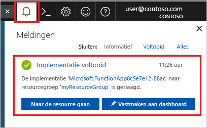

1. Klik op **Een resource maken** in de linkerbovenhoek van Azure Portal. Selecteer vervolgens **Compute** > **Functie-app**. 

    

2. Gebruik voor de functie-app de instellingen die in de tabel onder de afbeelding zijn opgegeven.

    

    | Instelling      | Voorgestelde waarde  | Beschrijving                                        |
    | ------------ |  ------- | -------------------------------------------------- |
    | **Naam van app** | Wereldwijd unieke naam | Naam waarmee uw nieuwe functie-app wordt aangeduid. Geldige tekens zijn `a-z`, `0-9` en `-`.  | 
    | **Abonnement** | Uw abonnement | Het abonnement waarmee deze nieuwe functie-app is gemaakt. | 
    | **[Resourcegroep](../articles/azure-resource-manager/resource-group-overview.md)** |  myResourceGroup | Naam voor de nieuwe resourcegroep waarin uw functie-app moet worden gemaakt. | 
    | **Besturingssysteem** | Windows | Hosten zonder server is momenteel alleen beschikbaar wanneer u gebruikmaakt van Windows. Raadpleeg [Create your first function running on Linux using the Azure CLI](../articles/azure-functions/functions-create-first-azure-function-azure-cli-linux.md) (Uw eerste Linux-functie maken met behulp van de Azure CLI) voor meer informatie over hosten met Linux. |
    | **[Hostingplan](../articles/azure-functions/functions-scale.md)** |   Verbruiksabonnement | Hostingabonnement dat definieert hoe resources worden toegewezen aan uw functie-app. In het standaard **Verbruiksabonnement** worden resources dynamisch toegevoegd zoals door uw functies wordt vereist. Met hosten [zonder server](https://azure.microsoft.com/overview/serverless-computing/) betaalt u alleen voor de tijd dat uw functies actief zijn.   |
    | **Locatie** | West-Europa | Kies een [regio](https://azure.microsoft.com/regions/) in de buurt of in de buurt van andere services die door uw functie worden gebruikt. |
    | **[Opslagaccount](../articles/storage/common/storage-create-storage-account.md#create-a-storage-account)** |  Wereldwijd unieke naam |  Naam van het nieuwe opslagaccount dat door uw functie-app wordt gebruikt. Namen van opslagaccounts moeten tussen 3 en 24 tekens lang zijn en mogen alleen cijfers en kleine letters bevatten. U kunt ook een bestaand account gebruiken. |

1. Klik op **Maken** om de nieuwe functie-app in te richten en te implementeren. U kunt de status van de implementatie controleren door op het meldingspictogram rechtsboven in de hoek van de portal te klikken. 

    

    Als u op **Naar de resource gaan** klikt, komt u uit bij uw nieuwe functie-app.
