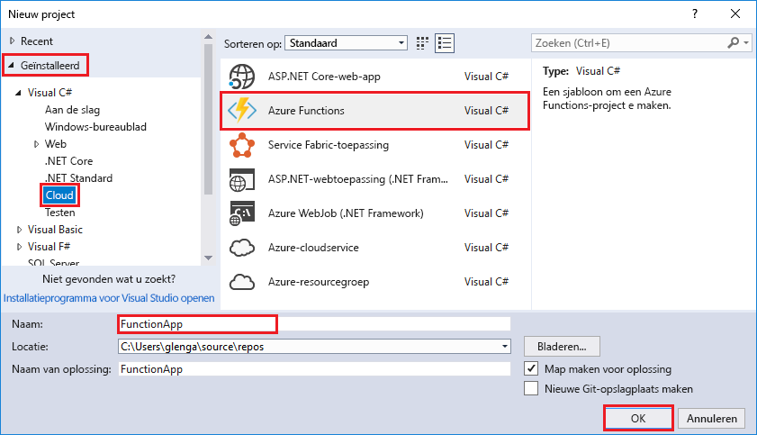
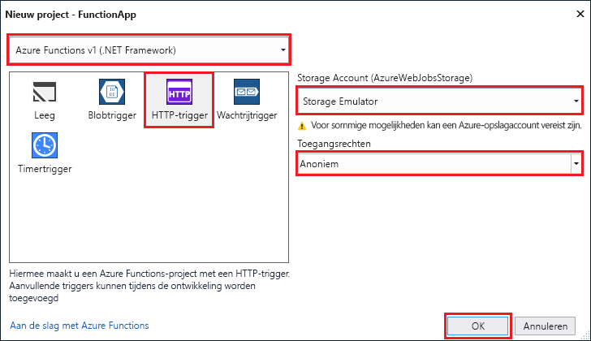

De Azure Functions-projectsjabloon in Visual Studio maakt een project dat kan worden gepubliceerd in een functie-app in Azure. Met een functie-app kunt u functies groeperen in een logische eenheid, zodat u resources kunt beheren, implementeren en delen.

1. Selecteer **Nieuw** > **Project** in het menu **Bestand** in Visual Studio.

2. Selecteer **Geïnstalleerd** in het dialoogvenster **Nieuw project**, breid **Visual C#** > **Cloud** uit, selecteer **Azure Functions**, typ een **Naam** voor uw project en klik op **OK**. De functie-appnaam moet geldig zijn als een C#-naamruimte. Gebruik dus geen onderstrepingstekens, afbreekstreepjes of andere niet-alfanumerieke tekens.

    

3. Gebruik de instellingen die zijn weergegeven in de tabel onder de afbeelding.

     

    | Instelling      | Voorgestelde waarde  | Beschrijving                      |
    | ------------ |  ------- |----------------------------------------- |
    | **Versie** | Azure Functions v1  (.NET Framework) | Hierdoor wordt er een functieproject gemaakt dat gebruikmaakt van versie 1 van de runtime van Azure Functions. Versie 2 van de runtime, die .NETCore ondersteunt, is momenteel beschikbaar in de preview-versie. Zie [Een versie kiezen voor de runtime van Azure Functions](../articles/azure-functions/functions-versions.md) voor meer informatie.   |
    | **Sjabloon** | HTTP-trigger | Hierdoor wordt er een functie gemaakt die wordt geactiveerd door een HTTP-aanvraag. |
    | **Opslagaccount**  | Opslagemulator | Een HTTP-trigger maakt geen gebruik van de opslagaccountverbinding. Voor alle andere triggertypen is er een geldige verbindingsreeks voor het opslagaccount nodig. |
    | **Toegangsrechten** | Anoniem | De gemaakte functie kan door iedere client worden geactiveerd zonder een sleutel op te geven. Met deze autorisatie-instelling kunt u eenvoudig uw nieuwe functie testen. Zie [Autorisatiesleutels](../articles/azure-functions/functions-bindings-http-webhook.md#authorization-keys) in de [HTTP- en webhookbindingen](../articles/azure-functions/functions-bindings-http-webhook.md) voor meer informatie over sleutels en autorisatie. |
4. Klik op **OK** om het functieproject en de door HTTP geactiveerde functie te maken.

