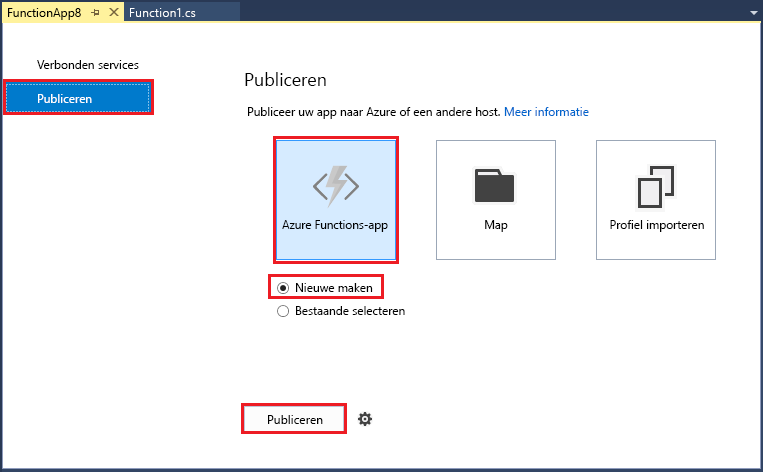

Klik in **Solution Explorer** met de rechtermuisknop op het project en selecteer **Publiceren**. Kies **Nieuw maken** en klik vervolgens op **Publiceren**. 

Als u Visual Studio nog niet aan uw Azure-account hebt gekoppeld, klikt u op **Een account toevoegen...**.  

In het dialoogvenster **App-service maken** gebruikt u de hostinginstellingen zoals opgegeven in de tabel. 

| Instelling      | Voorgestelde waarde  | Beschrijving                                |
| ------------ |  ------- | -------------------------------------------------- |
| **Naam van app** | Wereldwijd unieke naam | Naam waarmee uw nieuwe functie-app uniek wordt aangeduid. |
| **Abonnement** | Kies uw abonnement | Het te gebruiken Azure-abonnement. |
| **[Resourcegroep](../articles/azure-resource-manager/resource-group-overview.md)** | myResourceGroup |  Naam van de resourcegroep waarin uw functie-app moet worden gemaakt. |
| **[App-serviceabonnement](../articles/azure-functions/functions-scale.md)** | Verbruiksabonnement | Zorg dat u het **Verbruik** kiest onder **Grootte** wanneer u een nieuw abonnement maakt.  |
| **[Opslagaccount](../articles/storage/storage-create-storage-account.md#create-a-storage-account)** | Wereldwijd unieke naam | Gebruik een bestaand opslagaccount of maak een nieuw.   |

Klik op **Maken** om in Azure een functie-app met deze instellingen te maken. Noteer nadat het inrichtingsproces is voltooid de **Site-URL**. Dit is het adres van de functie-app in Azure. 

