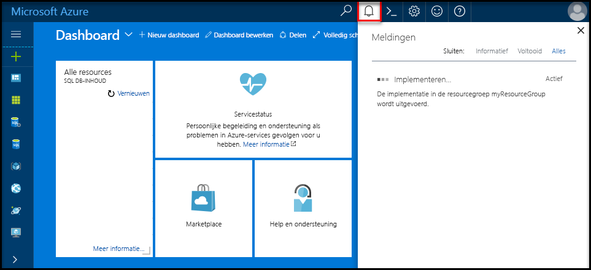

## Aanmelden bij Azure Portal

Meld u aan bij [Azure Portal](https://portal.azure.com/).

## Een lege SQL-database maken

Een Azure SQL-database wordt gemaakt met een gedefinieerde set [reken- en opslagresources](../articles/sql-database/sql-database-service-tiers-dtu.md). De database is gemaakt in een [Azure-resourcegroep](../articles/azure-resource-manager/resource-group-overview.md) en in een [logische Azure SQL Database-server](../articles/sql-database/sql-database-features.md). 

Volg deze stappen om een lege SQL-database te maken. 

1. Klik in de linkerbovenhoek van Azure Portal op **Een resource maken**.

2. Selecteer **Databases** op de pagina **Nieuw** en selecteer **Maken** onder **SQL-database** op de pagina **Nieuw**.

   

3. Vul het formulier SQL Database in met de volgende informatie, zoals in de voorgaande afbeelding wordt weergegeven:   

   | Instelling       | Voorgestelde waarde | Beschrijving | 
   | ------------ | ------------------ | ------------------------------------------------- | 
   | **Databasenaam** | mySampleDatabase | Zie [Database-id's](https://docs.microsoft.com/sql/relational-databases/databases/database-identifiers) voor geldige databasenamen. | 
   | **Abonnement** | Uw abonnement  | Zie [Abonnementen](https://account.windowsazure.com/Subscriptions) voor meer informatie over uw abonnementen. |
   | **Resourcegroep** | myResourceGroup | Zie [Naming conventions](https://docs.microsoft.com/azure/architecture/best-practices/naming-conventions) (Naamgevingsconventies) voor geldige resourcegroepnamen. |
   | **Bron selecteren** | Lege database | Hiermee geeft u aan dat er een lege database moet worden gemaakt. |

4. Klik op **Server** als u een nieuwe server voor de nieuwe database wilt maken en configureren. Vul het **nieuwe serverformulier** in met de volgende gegevens: 

   | Instelling       | Voorgestelde waarde | Beschrijving | 
   | ------------ | ------------------ | ------------------------------------------------- | 
   | **Servernaam** | Een wereldwijd unieke naam | Zie [Naming conventions](https://docs.microsoft.com/azure/architecture/best-practices/naming-conventions) (Naamgevingsconventies) voor geldige servernamen. | 
   | **Aanmeldgegevens van serverbeheerder** | Een geldige naam | Zie [Database-id's](https://docs.microsoft.com/sql/relational-databases/databases/database-identifiers) voor geldige aanmeldingsnamen.|
   | **Wachtwoord** | Een geldig wachtwoord | Uw wachtwoord moet uit ten minste 8 tekens bestaan en moet tekens bevatten uit drie van de volgende categorieën: hoofdletters, kleine letters, cijfers en niet-alfanumerieke tekens. |
   | **Locatie** | Een geldige locatie | Zie [Azure-regio's](https://azure.microsoft.com/regions/) voor informatie over regio's. |

   

5. Klik op **Selecteren**.

6. Klik op **Prijscategorie** om de servicelaag, het aantal DTU's en de hoeveelheid opslag op te geven. Bekijk de opties voor de hoeveelheid DTU's en opslag die voor elke servicelaag beschikbaar zijn. 

7. Voor deze zelfstudie selecteert u de servicelaag **Standard** en gebruikt u vervolgens de schuifregelaar om **100 DTU's (S3)** en **400** GB aan opslagruimte te selecteren.

   

8. Accepteer de gebruiksvoorwaarden voor de preview om de optie **Extra opslag** te gebruiken. 

   > [!IMPORTANT]
   > \* Opslagruimten groter dan de hoeveelheid inbegrepen opslagruimte zijn in preview en hiervoor gelden extra kosten. Zie [de prijsinformatie voor SQL Database](https://azure.microsoft.com/pricing/details/sql-database/) voor meer informatie. 
   >
   >\* In de Premium-laag is momenteel ruim 1 TB aan opslag beschikbaar voor de volgende regio's: Canada - centraal, Canada - oost, Frankrijk - centraal, Duitsland - centraal, Japan - oost, Korea - centraal, VS Zuid-Centraal, Zuidoost-Azië, VS - oost2, VS - west, VS (overheid) - Virginia, en West-Europa. Zie [P11-P15: huidige beperkingen](../articles/sql-database/sql-database-dtu-resource-limits.md#single-database-limitations-of-p11-and-p15-when-the-maximum-size-greater-than-1-tb).  
   > 

9. Als u de servicelaag, het aantal DTU's en de hoeveelheid opslagruimte hebt geselecteerd, klikt u op **Toepassen**.  

10. Selecteer een **sortering** voor de lege database (gebruik de standaardwaarde in deze zelfstudie). Zie [Collations](https://docs.microsoft.com/sql/t-sql/statements/collations) (Sorteringen) voor meer informatie over sorteringen

11. Klik op **Maken** om de database in te richten. De inrichting duurt ongeveer anderhalve minuut. 

12. Klik op de werkbalk op **Meldingen** om het implementatieproces te bewaken.
    
     

## Een serverfirewallregel maken

De service SQL Database maakt een firewall op serverniveau die voorkomt dat externe toepassingen en hulpmiddelen verbinding maken met de server of databases op de server, tenzij er een firewallregel is gemaakt om de firewall te openen voor specifieke IP-adressen. Volg deze stappen om een [SQL Database-firewallregel op serverniveau](../articles/sql-database/sql-database-firewall-configure.md) te maken voor het IP-adres van de client en connectiviteit via de SQL Database-firewall alleen voor uw IP-adres toe te staan. 

> [!NOTE]
> SQL Database communiceert via poort 1433. Als u verbinding probeert te maken vanuit een bedrijfsnetwerk, wordt uitgaand verkeer via poort 1433 mogelijk niet toegestaan door de firewall van uw netwerk. In dat geval kunt u geen verbinding maken met uw Azure SQL Database-server, tenzij de IT-afdeling poort 1433 openstelt.
>

1. Wanneer de implementatie is voltooid, klikt u op **SQL Databases** in het menu aan de linkerkant. Klik vervolgens op de pagina **SQL Databases** op **mySampleDatabase**. De overzichtspagina voor uw database wordt geopend, met de volledig gekwalificeerde servernaam (zoals **mynewserver20170824.database.windows.net**) en opties voor verdere configuratie. 

2. Kopieer deze volledig gekwalificeerde servernaam om in volgende Quick Starts verbinding te maken met de server en de bijbehorende databases. 

    

3. Klik op de werkbalk op **Serverfirewall instellen**. De pagina **Firewallinstellingen** voor de SQL Database-server wordt geopend. 

    

4. Klik op **IP van client toevoegen** op de werkbalk om uw huidige IP-adres aan een nieuwe firewallregel toe te voegen. Een firewallregel kan poort 1433 openen voor een afzonderlijk IP-adres of voor een aantal IP-adressen.

5. Klik op **Opslaan**. Er wordt een firewallregel op serverniveau gemaakt voor uw huidige IP-adres waarbij poort 1433 op de logische server wordt geopend.

6. Klik op **OK** en sluit de pagina **Firewallinstellingen**.

U kunt nu verbinding maken met de SQL Database-server en de bijbehorende databases met behulp van SQL Server Management Studio of een ander hulpprogramma naar keuze. Dit doet u vanaf dit IP-adres via het serverbeheerdersaccount dat eerder is gemaakt.

> [!IMPORTANT]
> Voor alle Azure-services is toegang via de SQL Database-firewall standaard ingeschakeld. Klik op **UIT** op deze pagina om dit voor alle Azure-services uit te schakelen.

## SQL Server-verbindingsgegevens

Haal de volledig gekwalificeerde servernaam van uw Azure SQL Database-server op uit Azure Portal. U gebuikt de volledig gekwalificeerde servernaam om verbinding met uw server te maken via SQL Server Management Studio.

1. Meld u aan bij [Azure Portal](https://portal.azure.com/).
2. Selecteer **SQL-databases** in het menu links en klik op uw database op de pagina **SQL-databases**. 
3. In het deelvenster **Essentials** van de Azure Portal-pagina van uw database kopieert u de **servernaam**.

   
