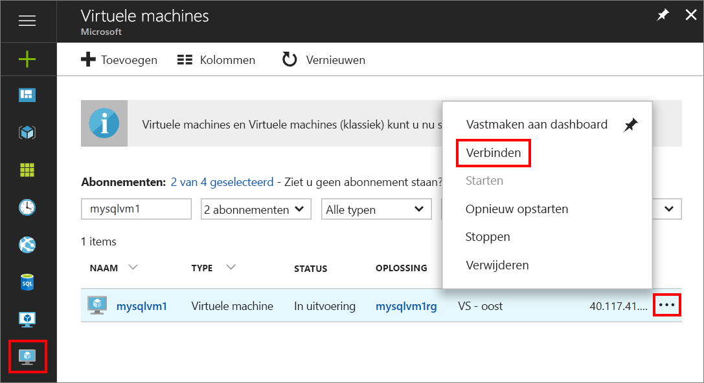
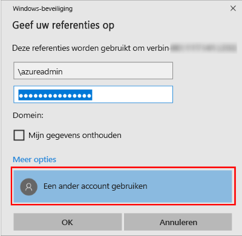

Doorloop de volgende stappen om via Extern bureaublad verbinding te maken met de virtuele SQL Server-machine:

1. Wanneer de virtuele Azure-machine is gemaakt en wordt uitgevoerd, klikt u in Azure Portal op het pictogram Virtuele machines om uw VM's te bekijken.

1. Klik op het beletselteken (**...**) voor de nieuwe virtuele machine.

1. Klik op **Verbinden**.

   

1. Open het **RDP**-bestand dat in de browser is gedownload voor de VM.

1. Verbinding met extern bureaublad meldt dat de uitgever van deze externe verbinding niet kan worden geïdentificeerd. Klik op **Verbinden** om door te gaan.

1. Klik in het dialoogvenster **Windows-beveiliging** op **Een ander account gebruiken**. Mogelijk moet u op **Meer opties** klikken om de optie weer te geven. Geef de gebruikersnaam en het wachtwoord op die u hebt geconfigureerd tijdens het maken van de VM. U moet een backslash toevoegen voor de gebruikersnaam.

   

Nadat u verbinding hebt gemaakt met de virtuele SQL Server-machine, kunt u SQL Server Management Studio starten en verbinding maken met Windows-verificatie met behulp van de lokale beheerdersreferenties. Als u SQL Server-verificatie inschakelt, kunt u ook verbinding maken met SQL-verificatie. Dit kan met behulp van de SQL-aanmeldingsnaam en het wachtwoord die u hebt geconfigureerd tijdens het inrichten.

Met toegang tot de machine kunt u rechtstreeks de instellingen voor de machine en de SQL Server wijzigen op basis van uw vereisten. U kunt bijvoorbeeld de firewallinstellingen configureren of de SQL Server-configuratie-instellingen wijzigen.